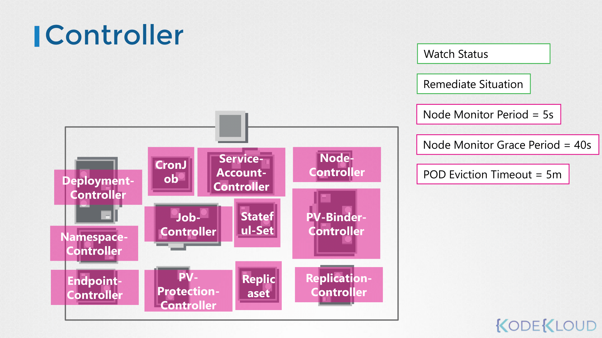
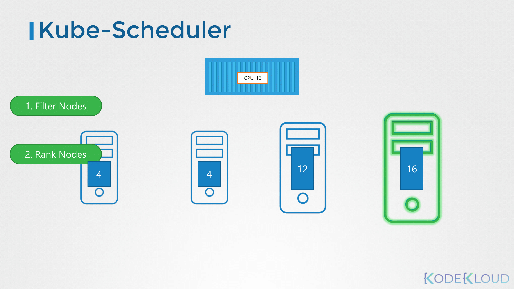
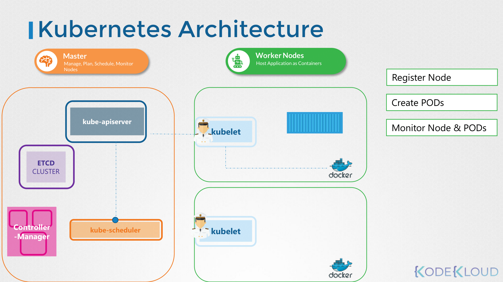
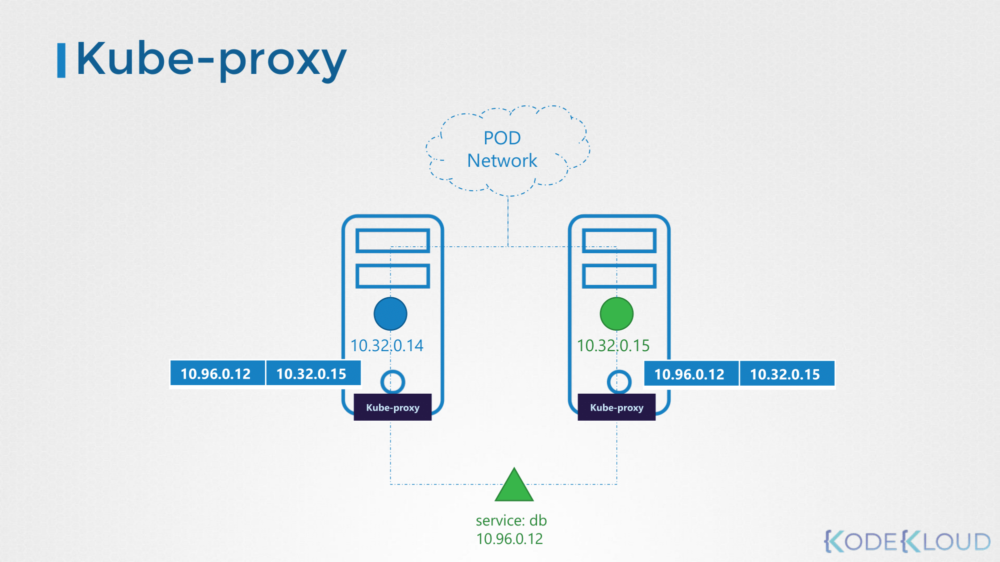
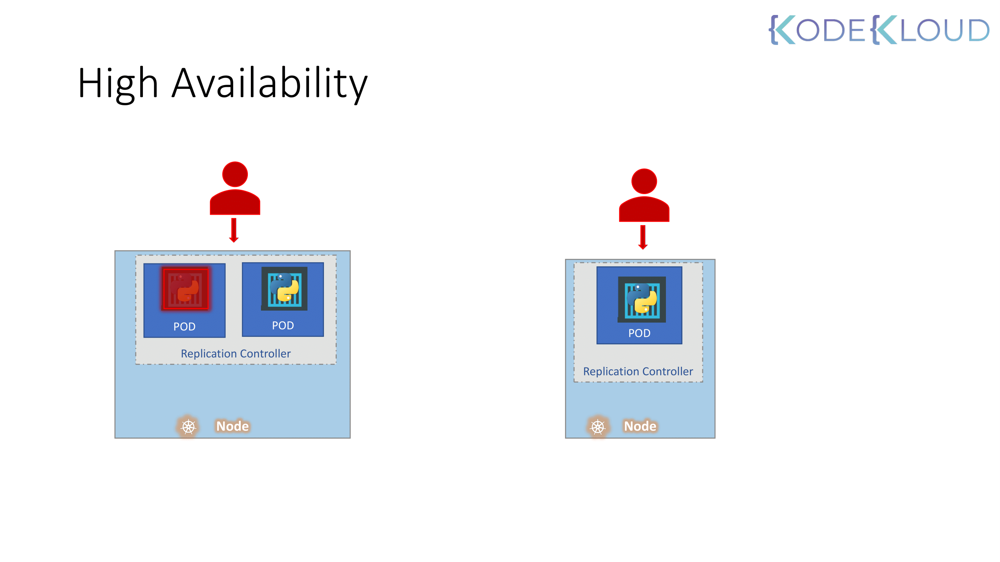
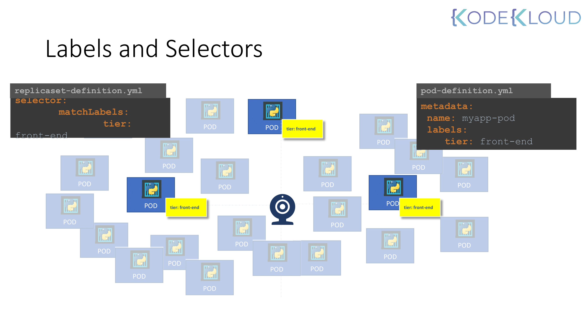
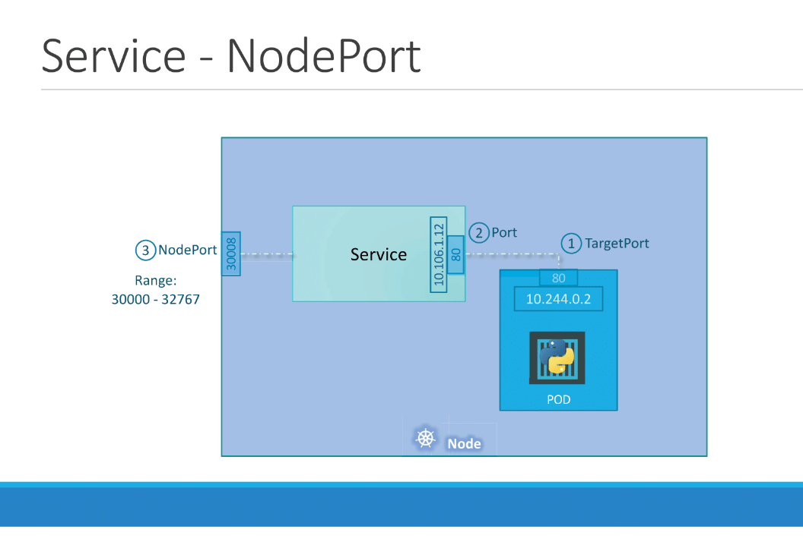
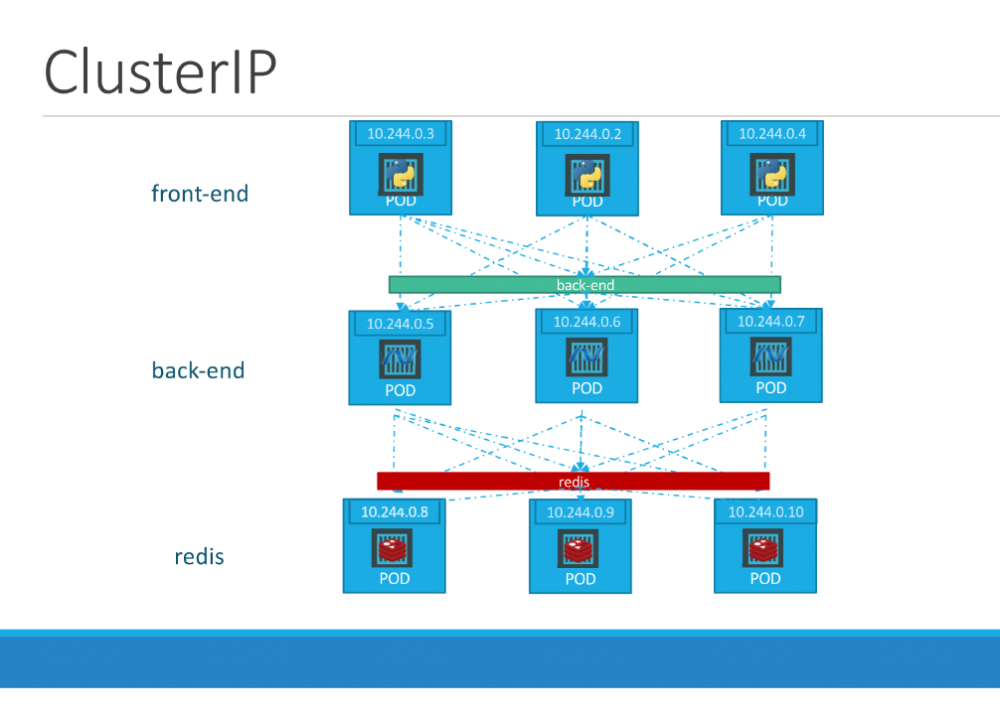
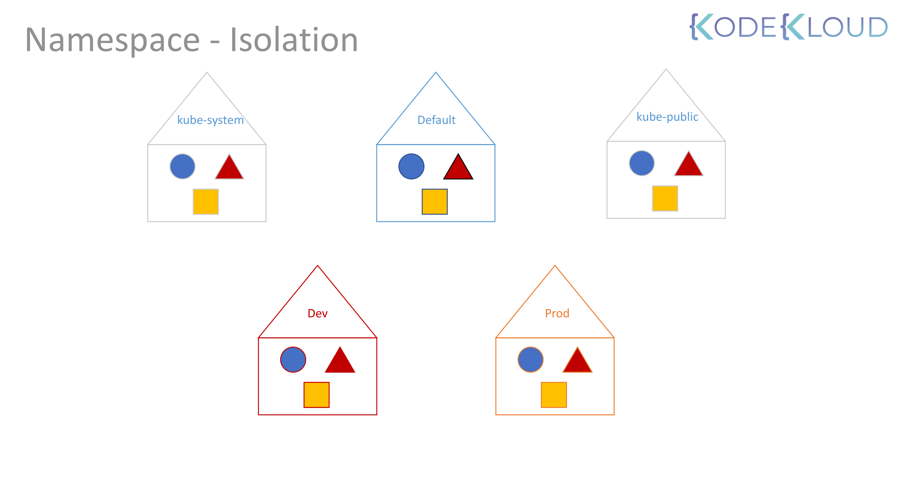

# Core Concepts

**분산 시스템(Distributed System)** 관점에서 쿠버네티스 아키텍처와 핵심 컴포넌트의 역할, 그리고 시험 대비 실습을 공부하면 좋다.


## 0. Introduction: 쿠버네티스와 분산 시스템

쿠버네티스 클러스터는 하나의 거대한 **분산 컴퓨터**이다.

* **Control Plane (Master Node):** 분산 시스템의 두뇌 역할으로, 전체 상태를 관리하고 명령을 내린다.

* **Worker Node:** 실제 워크로드(컨테이너)가 실행되는 곳이다.


쿠버네티스의 목적은 애플리케이션을 컨테이너 형식으로, 자동화된 방식으로 호스팅하는 것이다.
    - 요구에 따라 애플리케이션의 많은 인스턴스를 쉽게 배포할 수 있다.
    - 애플리케이션 내 다양한 서비스 간의 통신이 쉽게 가능하다.

---

## 1. Kubernetes Architecture (Cluster Architecture)

전체 클러스터는 **Control Plane**과 **Worker Node**의 집합으로 구성된다.

### 1-1. Control Plane과 Node

내부 구조에 대해 쉽게 배로 비유할 수 있다.
    - Cargo Ships that Carries Containers.
    - Monitoring / Managing the Cargo Ships.

| 구분 | 역할 (Analogy) | 주요 컴포넌트 |
| --- | --- | --- |
| **Control Plane** | **Management** 클러스터 전체의 결정을 내리고 상태를 감시함 | API Server, etcd, Scheduler, Controller Manager |
| **Worker Node** | **Worker** 실제 화물(App)을 싣고 운영함 | Kubelet, Kube-proxy, Container Runtime |


- 마스터 노드: 컨테이너를 올릴 Cargo Ship(Worker Node)을 관리하는 Control Ship.

    - 어떤 종류의 컨테이너를 올릴 것인지 정의한다.
    - 관리하고 있는 Ship의 정보를 저장한다.
    - 컨테이너의 상태를 모니터링하고 추적한다.

- 워커 노드: 컨테이너를 Loading하기 위한 용도의 Cargo Ship이다.


---

## 2. Container Runtime

쿠버네티스는 컨테이너를 직접 실행하지 않는다. 컨테이너 런타임에게 "실행해달라"고 요청한다.

**Docker vs containerd 비교**
* 과거에는 Docker가 표준이었으나, 현재는 CRI(Container Runtime Interface)를 준수하는 모든 런타임(containerd, CRI-O 등)을 지원한다.
* 최신 환경은 Docker 대신 **containerd**를 기본으로 사용한다.


* **CRI (Container Runtime Interface):** Kubelet이 다양한 런타임과 대화하기 위한 표준 인터페이스를 뜻한다.
* **crictl:** CRI 호환 런타임을 위한 CLI 도구. Docker 명령어(`docker ps`) 대신 `crictl ps`를 사용하여 디버깅하는 경우가 있을수도 있다.

---

## 3. etcd

분산 시스템에서 가장 중요한 데이터 일관성을 보장하는 저장소이다.


* **역할:** 클러스터의 모든 상태 정보(Node 정보, Pod 상태, Config 등)가 저장되는 **Source of Truth**
* **특징:** Key-Value Store 형태.
* **API Server와의 관계:**
* 오직 **API Server**만이 etcd와 통신할 수 있다. (Scheduler나 Kubelet은 etcd에 직접 접근 불가)


* **Tip:** etcd의 백업(Snapshot Save)과 복구(Snapshot Restore)는 시험 필수 유형임

---

## 4. Kubernetes Control Plane Components

### 4-1. Kube API Server (The Front Desk)

* 클러스터의 **중심 통로** 이다. 모든 내/외부 통신은 API Server를 거친다.
* `kubectl` 요청을 받아 유효성을 검사하고(Authentication/Authorization), etcd 데이터를 조회/업데이트한다.


#### 일반적인 순서
1. Authenticate User
2. Validate Request
3. Retrieve data
4. Update ETCD
5. Scheduler
6. Kubelet
    - 다른 형태의 요청도 대부분 위와 같은 절차를 거쳐 이루어진다.
    - 쿠버네티스에서 리소스와 오브젝트를 관리하는 주체는 kube-apiserver이다.
    - etcd에 유일하게 직접 접근할 수 있다.
        - 쿠버네티스의 다른 오브젝트/리소스는 kube-apiserver를 통해 etcd에 접근해야 한다.


### 4-2. Kube Controller Manager (The Controller)

* **상태 유지(State Enforcement)** 담당.
* **Loop:** 끊임없이 `Current State`(현재 상태)를 확인하고 `Desired State`(희망 상태)와 일치시킨다.
* 다양한 관리 목적의 컨트롤러가 있고, 이걸 묶어서 kube-controller-manager로 관리한다.




* 그 중 예시로 노드 컨트롤러와 레플리케이션 컨트롤러의 동작을 볼 수 있다.
    * 노드 컨트롤러는 kube-apiserver를 통해 노드의 상태를 모니터링하고 애플리케이션이 계속 실행되도록 필요한 행동을 한다.
    * 레플리케이션 컨트롤러는 레플리카의 상태를 모니터링하고 원하는 수의 파드가 항상 사용 가능하도록 한다. (파드가 죽으면 재생성까지 맡음)


### 4-3. Kube Scheduler (The Planner)

* **스케줄링:** 새로 생성된 Pod를 감지하고, **어떤 Node에서 실행할지 결정**한다.
* 중요한 것은 스케줄러가 Pod를 실제로 실행하는 것이 아니라, 결정만 하고 실행은 kubelet이 한다는 것이다.




* **Process**
1. **Filtering:** 자원이 부족하거나 조건이 안 맞는 노드 제외
2. **Scoring:** 남은 노드 중 가장 적합한 노드 점수 산정


---

## 5. Kubernetes Node Components

### 5-1. Kubelet (The Agent)

* 각 Node의 **선장 대리인**
* API Server의 지시를 받아 Pod가 Node에서 잘 동작하도록 관리한다.
* 주기적으로 Node와 Pod의 상태를 API Server에 보고한다.





### 5-2. Kube Proxy (The Networker)

* **목표:** Service(IP/Port)로 들어온 트래픽을 실제 Pod IP로 **전달되게 만드는 역할**을 한다.
* **노드별 동작:** 각 노드에서 kube-proxy가 **iptables 또는 IPVS 규칙을 프로그래밍**하여 서비스 로드밸런싱/포워딩을 처리한다.
* **IP 관점 정리**
    - **Pod IP:** 각 Pod가 가지는 고유 IP. 다른 노드의 Pod와도 라우팅 가능한 **클러스터 내부 IP**.
    - **Service IP(ClusterIP):** 고정된 가상 IP. 실제 Pod IP 목록(엔드포인트)에 매핑됨.
    - **Node IP:** 노드 자체의 IP. `NodePort`는 `Node IP:Port`로 외부 진입을 허용.
* **핵심 동작 흐름**
    1. 클라이언트(다른 Pod/노드)가 `Service IP:Port`로 접속.
    2. kube-proxy가 설치한 규칙이 **DNAT**으로 목적지를 **선택된 Pod IP:Port**로 바꿈.
    3. 패킷은 CNI 플러그인의 라우팅/오버레이를 통해 해당 Pod로 전달됨.
* **NodePort/외부 트래픽**
    - 외부에서 `Node IP:NodePort`로 들어온 트래픽도 동일하게 **Pod IP로 NAT**된다.
    - 필요 시 **SNAT/masquerade**가 적용되어 **응답 경로가 정상 유지**되게 한다.
* **포인트:** kube-proxy는 실제 패킷을 프록시로 중계하지 않고, **커널의 네트워크 규칙을 설정**해 고성능으로 동작한다.





---

## 6. Pods

* 쿠버네티스에서 생성하고 관리할 수 있는 배포의 **가장 작은 단위**

* 하나의 Pod 안에는 하나 이상의 컨테이너가 들어갈 수 있다. (보통 1 Pod = 1 Container로 많이 사용)

* 파드 하나에 여러 개의 컨테이너를 생성하는 경우는 보통 애플리케이션의 모니터링이나 health check 기능을 적용하기 위함이다.

* Pod 내부의 컨테이너들은 **동일한 Network(IP), 같은 Storage(Volume)를 공유**한다.


### Pods with YAML
* 쿠버네티스에서는 파드, 레플리카셋, 디플로이먼트, 서비스 등의 생성을 위해 yaml 파일을 사용한다.
* 쿠버네티스의 모든 오브젝트는 기본적으로 4개의 필드를 포함한다.

```yaml
apiVersion: v1
kind: Pod
metadata:
  name: myapp-pod
  labels:
    app: myapp
    type: front-end
spec:
  containers:
    - name: nginx-container
      image: nginx
```

* `apiVersion`: 오브젝트를 생성할 때 사용하는 쿠버네티스 API 버전이다. 생성하려는 것에 따라 올바른 API 버전을 사용해야 한다.

* `kind`: 어떤 종류의 오브젝트를 생성할 것인지 명시한다.

* `metadata`: 오브젝트를 설명하는 기본적인 데이터로, `name` 이나 `labels` 등 키-값 형식으로 데이터를 정의한다.
    * `name` 과 `labels` 는 동일한 line에 있어야 한다. 서로는 siblings 관계이고, `metadata` 의 children 관계이다.
    * 쿠버네티스에서 `metadata` 필드는 쿠버네티스 API에 정의된 필드만 사용할 수 있다.
    * 대신, `labels` 필드에서는 어떤 값이든 키-값 형태로 정의하여 사용할 수 있다.
* `spec`: 생성하려는 오브젝트와 관련된 추가 정보를 명시한다.
* `kubectl create -f pod-definition.yaml` 명령어로 yaml 설정에 맞는 파드를 생성할 수 있다.


---

## 7. ReplicaSets

### High Availability

* 애플리케이션이 만약 어떤 이유로 인해서 충돌이 발생하거나 파드가 fail이 발생했다면 사용자는 애플리케이션에 접근할 수 없게 된다.


* 이러한 일을 예방하기 위해서 동시에 여러 개의 파드를 띄운다.


* 파드 하나에서 문제가 발생하더라도 다른 파드로 여전히 사용자는 접근할 수 있기 때문이다.


* 파드가 하나 뿐이어도 레플리케이션 컨트롤러는 기존의 파드가 fail이 발생해도 자동으로 새로운 파드를 띄운다.


* 레플리케이션 컨트롤러는 특정 파드가 항상 실행되도록 보장한다.





### Load Balancing & Scaling

* 여러 개의 파드 간 로드밸런싱을 수행한다.


* 파드에 들어오는 요청이 많을 경우, 추가로 파드를 생성할 수 있게 지원한다.


* 만약 노드 리소스가 부족할 경우, 다른 노드에서 파드를 생성하고 로드밸런싱을 수행한다.


### 레플리케이션 컨트롤러와 레플리카셋

동일한 목적으로 만들어진 오브젝트이며, 레플리케이션 컨트롤러는 레플리카셋으로 대체되고 있다.

#### 레플리케이션 컨트롤러

```yaml
apiVersion: v1
kind: ReplicationController
metadata:
  name: myapp-rc
  labels:
    app: myapp
    type: front-end
spec:
  template:
    metadata:
      name: myapp-pod
      labels:
        app: myapp
        type: front-end
    spec:
      containers:
        - name: nginx-controller
          image: nginx
  replicas: 3
```

* `spec.template` 하위 항목에 파드에서 사용하던 `metadata`, `spec` 을 그대로 적용한다.

* 몇 개의 파드를 유지할 것인지를 spec.replicas 필드에 명시한다.

* 이 명령어를 통해 레플리케이션 컨트롤러를 확인할 수 있다. `kubectl get replicationcontroller`


#### 레플리카셋

```yaml
apiVersion: apps/v1
kind: ReplicaSet
metadata:
  name: myapp-replicaset
  labels:
    app: myapp
    type: front-end
spec:
  template:
    metadata:
      name: myapp-pod
      labels:
        app: myapp
        type: front-end
    spec:
      containers:
        - name: nginx-controller
          image: nginx
  replicas: 3
  selector:
    matchLabels:
      type: front-end
```

* `apiVersion` 이 `apps/v1`으로 레플리케이션 컨트롤러와 다르다. (레플리케이션 컨트롤러 쪽이 legacy)


### Labels and Selectors





클러스터 내 수많은 파드 중에서 레플리카셋이 모니터링하고 관리해야 할 파드를 식별하기 위한 필드이다.

  - Label: 리소스에 붙이는 “태그”
  - Selector: 그 태그를 기준으로 “대상 고르는 규칙”


### Scale

스케일링을 하는 방법은 대표적으로 아래와 같다.

1. yaml 파일의 replicas를 변경하고, 명령을 실행한다.
    
    `kubectl replace -f replicaset-definition.yaml`

2. kubectl scale 명령어를 사용한다. 
    - 이 방식을 사용할 경우 yaml 파일의 replicas는 자동으로 업데이트되지 않는다는 점을 주의해야 한다.

    `kubectl scale --replicas=6 -f replicaset myapp-replicaset`


---
## 8. Deployment

### Deployment

디플로이먼트는 레플리카셋보다 상위 개념의 오브젝트이다.
아래와 같은 기능이 있다.

* 롤링 업데이트 기능
* 롤백 기능
* 스케일링/모니터링과 같은 기능을 모든 파드에 일괄 적용하기 위한 pause/resume 기능


```yaml
apiVersion: apps/v1
kind: Deployment
metadata:
  name: myapp-deployment
  labels:
    app: myapp
    type: front-end
spec:
  template:
    metadata:
      name: myapp-pod
      labels:
        app: myapp
        type: front-end
    spec:
      containers:
        - name: nginx-container
          image: nginx
  replicas: 3
  selector:
    matchLabels:
      type: front-end
```

Deployment 확인 기본 명령어:
`kubectl get deployments`


---

## 9. Services

### Service

서비스는 애플리케이션 안팎의 다양한 구성 요소간의 통신을 가능하게 한다.

애플리케이션을 다른 애플리케이션 또는 사용자와 연결하는 것을 돕는다.


MSA 환경에서 느슨한 결합(loose coupling)을 가능하게 한다.

* **문제점:** Pod는 휘발성이다(죽으면 재생성되고 IP가 바뀜).
* **해결책:** Service는 변하지 않는 고정된 IP(ClusterIP)와 DNS 이름을 제공하여 Pod 그룹에 대한 안정적인 접근을 보장한다.
* **동작:** Service는 셀렉터로 묶인 파드 목록(엔드포인트)을 추적하고, 요청을 여러 파드로 분산한다.

### Service 종류

* `ClusterIP`: 클러스터 내부 통신용 (기본값).
* `NodePort`: 외부에서 Node의 IP:Port로 접근.
* `LoadBalancer`: 클라우드 공급자의 로드밸런서 사용.

### NodePort

서비스가 노드의 포트에서 내부 파드에 접근할 수 있도록 한다.

* **targetPort:** 실제 웹 서버가 동작하는 포트
* **port:** 서비스 자신의 포트
* **nodePort:** 외부에서 웹 서버에 액세스하는 데 사용하는 노드의 포트 (30,000~32,767)

```yaml
apiVersion: v1
kind: Service
metadata:
  name: myapp-service
spec:
  type: NodePort
  ports:
    - targetPort: 80
      port: 80
      nodePort: 30008
  selector:
    app: myapp
    type: front-end
```

* targetPort 필드는 입력하지 않을 경우 port 필드의 값과 동일하며, nodePort를 입력하지 않은 경우 범위 내에서 사용 가능한 포트가 랜덤 배정된다.

* 어떤 파드와 연결할 것인지는 파드 레이블에 정의한 값을 셀렉터로 불러온다.

* 셀렉터로 식별할 수 있는 파드가 여러 개라면, 여러 개의 파드에 대해 로드밸런싱을 수행한다.

* kube-proxy가 수행한다.
  1. NodeIP: nodePort로 들어옴
  2. 서비스(ClusterIP/port)로 매핑
  3. 선택된 파드의 targetPort로 전달





### ClusterIP

클러스터 안에서 가상 IP를 생성하여 서로 다른 서비스와 상호 통신을 할 수 있게 해준다.

프론트엔드, 백엔드, 데이터베이스와 같이 여러 레이어로 구성된 애플리케이션을 사용할 경우, 여러 파드 간 통신을 원활하게 하기 위한 엔드포인트 역할을 한다.

각 레이어는 다른 레이어에 미칠 영향을 고려할 필요 없이 Scale-out이 가능하다.





```yaml
apiVersion: v1
kind: Service
metadata:
  name: back-end
spec:
  type: ClusterIP
  ports:
    - targetPort: 80
      port: 80
  selector:
    app: myapp
    type: back-end
```


---

## 10. Namespaces

* 네임스페이스로 각 환경을 구분짓고, 자원을 각각 할당할 수 있다.

* 네임스페이스 내에서 리소스들은 이름으로 호출할 수 있다.

* default 네임스페이스는 클러스터가 처음 구성될 때 쿠버네티스에 의해 자동 생성된다.

* 내부 목적으로 사용하는 파드와 서비스 등은 사용자에 의해 실수로 삭제되는 것을 방지하기 위해 kube-system 네임스페이스에 생성된다.

* 모든 사용자들이 리소스를 사용 가능하게 하려면 kube-public 네임스페이스에 생성하면 된다.


### Namespace Isolation





* 기업이나 프로덕션 환경에서는 네임스페이스 사용을 고려해야 한다.
* 예를 들어, 네임스페이스를 통해 dev와 prod 환경에서 리소스를 분리할 수 있다.
* 리소스 쿼터를 통해 네임스페이스별 리소스 사용을 제한할 수 있다.


### DNS

같은 네임스페이스의 리소스 간에는 이름만으로 호출이 가능하다.

```text
mysql.connect("db-service")
```

다른 네임스페이스의 리소스를 호출하려면 서비스의 DNS 전체 이름을 입력해야 한다.

```text
mysql.connect("db-service.dev.svc.cluster.local")
```

yaml 파일에서 metadata.namespace를 명시하면 해당 네임스페이스에 항상 생성된다.

```yaml
metadata:
  name: myapp-pod
  namespace: dev
```

### 네임스페이스 생성

```yaml
apiVersion: v1
kind: Namespace
metadata:
  name: dev
```

또는 아래 명령어를 통해 네임스페이스를 생성할 수 있다.

```bash
kubectl create namespace dev
```

### Resource Quota

리소스 쿼터를 통해 네임스페이스에서 리소스를 제한할 수 있다.

```yaml
apiVersion: v1
kind: ResourceQuota
metadata:
  name: compute-quota
  namespace: dev
spec:
  hard:
    pods: "10"
    requests.cpu: "4"
    requests.memory: 5Gi
    limits.cpu: "10"
    limits.memory: 10Gi
```

아래 명령어를 통해 리소스 쿼터를 생성한다.

```bash
kubectl create -f compute-quota.yaml
```


---

# 실습 (Labs)
CLI의 명령형 & yaml 파일 선언형 둘 중에 상황에 적합한 것을 빠르게 선택하고 대처하는 것이 중요하다.

아래는 CKA에서 가장 많이 나오는 유형 기준으로 묶은 커맨드 모음이다.
반복적으로 사용할 리소스나 복잡한 설정(프로브, 환경변수, 볼륨 등)은 YAML이 더 안전하다.


## 1. 기본 리소스 생성/조회/수정/삭제 (core)

```bash
# 리소스 조회
kubectl get pods
kubectl get all

# 리소스 상세 확인
kubectl describe pod <pod-name>

# 즉시 생성 (간단한 경우)
kubectl run nginx --image=nginx
kubectl create deployment web --image=nginx

# YAML 템플릿 추출 (자주 사용)
kubectl run web --image=nginx --dry-run=client -o yaml > pod.yaml
kubectl create deployment web --image=nginx --dry-run=client -o yaml > deploy.yaml

# 선언형 적용/갱신
kubectl apply -f app.yaml
kubectl replace -f app.yaml

# 리소스 수정
kubectl edit deployment web
kubectl label pod web tier=frontend
kubectl annotate pod web owner=team-a

# 삭제
kubectl delete pod <pod-name>
```

## 2. Pod 문제 해결/디버깅 (troubleshooting)

```bash
# 상태/스케줄 확인
kubectl get pods -o wide
kubectl describe pod <pod-name>

# 로그 확인
kubectl logs <pod-name>
kubectl logs -f <pod-name>

# 컨테이너 내부 명령 실행
kubectl exec -it <pod-name> -- /bin/sh

# 이벤트 확인 (원인 추적에 유용)
kubectl get events --sort-by=.metadata.creationTimestamp
```

## 3. Deployment/ReplicaSet/Rollout (workloads)

```bash
# 상태 확인
kubectl get deployments
kubectl get rs

# 스케일링
kubectl scale deployment web --replicas=5

# 이미지 업데이트 및 롤아웃 확인
# rollout: deployment가 새 버전으로 업데이트 될 때 파드가 교체되는 "배포 진행 과정"을 의미
kubectl set image deployment/web nginx=nginx:1.25
kubectl rollout status deployment/web
kubectl rollout history deployment/web

# rollout 롤백/중지/재개
kubectl rollout undo deployment/web
kubectl rollout pause deployment/web
kubectl rollout resume deployment/web
```

복수 컨테이너, 헬스체크, 리소스 제한이 들어가면 YAML로 정의하는 것이 안전하다.

## 4. Service/Networking (service & expose)

```bash
# 내부 서비스 생성 (ClusterIP)
kubectl expose pod web --port=80 --name=web-svc

# NodePort YAML 템플릿 생성
kubectl expose pod web --type=NodePort --port=80 --name=web-nodeport --dry-run=client -o yaml > service.yaml

# 서비스/엔드포인트 확인
kubectl get svc
kubectl describe svc web-svc
kubectl get endpoints web-svc

# 포트 포워딩 (로컬에서 테스트할 때)
kubectl port-forward pod/web 8080:80
```

정확한 nodePort 지정이나 selector 커스터마이징은 YAML로 작성하는 것이 안전하다.

## 5. Namespace & Context (multi-namespace 운영)

```bash
# 네임스페이스 확인/생성
kubectl get ns
kubectl create ns dev

# 특정 네임스페이스 조회
kubectl get pods -n dev
kubectl get pods --all-namespaces

# 현재 컨텍스트 네임스페이스 변경
kubectl config set-context --current --namespace=dev
```

YAML에서 metadata.namespace를 지정하면 항상 해당 네임스페이스에 생성된다.
