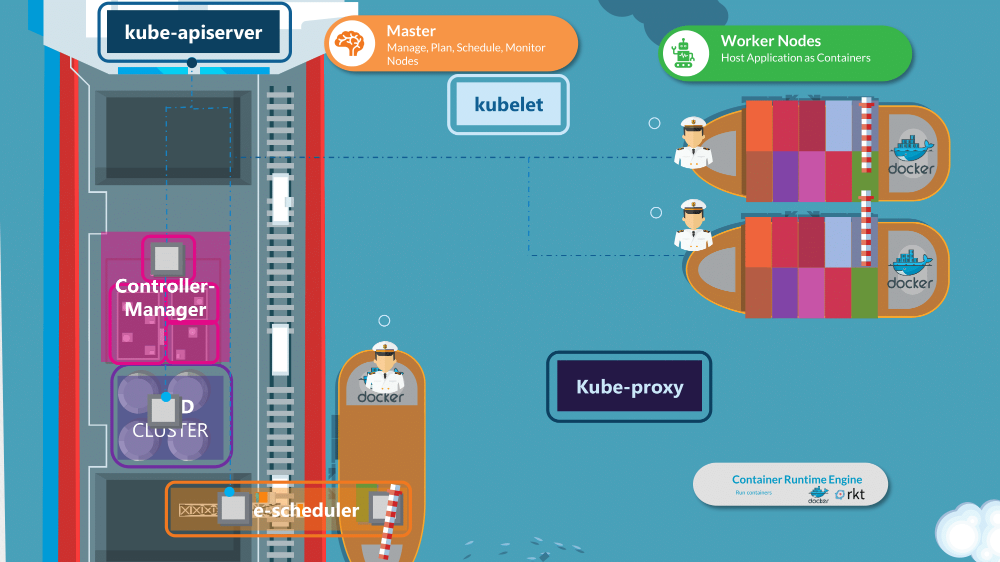
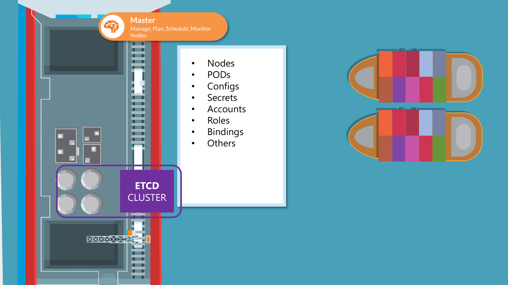
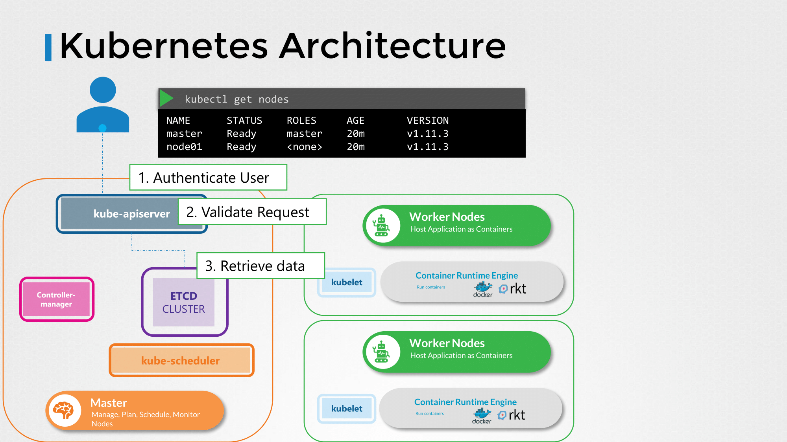

# Core Concepts

**분산 시스템(Distributed System)** 관점에서 쿠버네티스 아키텍처와 핵심 컴포넌트의 역할, 그리고 시험 대비 실습을 공부하면 좋다.


## 0. Introduction: 쿠버네티스와 분산 시스템

쿠버네티스 클러스터는 하나의 거대한 **분산 컴퓨터**이다.

* **Control Plane (Master Node):** 분산 시스템의 두뇌 역할으로, 전체 상태를 관리하고 명령을 내린다.

* **Worker Node:** 실제 워크로드(컨테이너)가 실행되는 곳이다.


쿠버네티스의 목적은 애플리케이션을 컨테이너 형식으로, 자동화된 방식으로 호스팅하는 것이다.
    - 요구에 따라 애플리케이션의 많은 인스턴스를 쉽게 배포할 수 있다.
    - 애플리케이션 내 다양한 서비스 간의 통신이 쉽게 가능하다.

---

## 1. Kubernetes Architecture (Cluster Architecture)

전체 클러스터는 **Control Plane**과 **Worker Node**의 집합으로 구성된다.

### 1-1. Control Plane과 Node

내부 구조에 대해 쉽게 배로 비유할 수 있다.
    - Cargo Ships that Carries Containers.
    - Monitoring / Managing the Cargo Ships.

| 구분 | 역할 (Analogy) | 주요 컴포넌트 |
| --- | --- | --- |
| **Control Plane** | **Management** 클러스터 전체의 결정을 내리고 상태를 감시함 | API Server, etcd, Scheduler, Controller Manager |
| **Worker Node** | **Worker** 실제 화물(App)을 싣고 운영함 | Kubelet, Kube-proxy, Container Runtime |


- 마스터 노드: 컨테이너를 올릴 Cargo Ship(Worker Node)을 관리하는 Control Ship.

    - 어떤 종류의 컨테이너를 올릴 것인지 정의한다.
    - 관리하고 있는 Ship의 정보를 저장한다.
    - 컨테이너의 상태를 모니터링하고 추적한다.

- 워커 노드: 컨테이너를 Loading하기 위한 용도의 Cargo Ship이다.





---

## 2. Container Runtime

쿠버네티스는 컨테이너를 직접 실행하지 않는다. 컨테이너 런타임에게 "실행해달라"고 요청한다.

**Docker vs containerd 비교**
* 과거에는 Docker가 표준이었으나, 현재는 CRI(Container Runtime Interface)를 준수하는 모든 런타임(containerd, CRI-O 등)을 지원한다.
* 최신 환경은 Docker 대신 **containerd**를 기본으로 사용한다.


* **CRI (Container Runtime Interface):** Kubelet이 다양한 런타임과 대화하기 위한 표준 인터페이스를 뜻한다.
* **crictl:** CRI 호환 런타임을 위한 CLI 도구. Docker 명령어(`docker ps`) 대신 `crictl ps`를 사용하여 디버깅하는 경우가 있을수도 있다.

---

## 3. etcd

분산 시스템에서 가장 중요한 데이터 일관성을 보장하는 저장소이다.



* **역할:** 클러스터의 모든 상태 정보(Node 정보, Pod 상태, Config 등)가 저장되는 **Source of Truth**
* **특징:** Key-Value Store 형태.
* **API Server와의 관계:**
* 오직 **API Server**만이 etcd와 통신할 수 있다. (Scheduler나 Kubelet은 etcd에 직접 접근 불가)


* **Tip:** etcd의 백업(Snapshot Save)과 복구(Snapshot Restore)는 시험 필수 유형임

---

## 4. Kubernetes Control Plane Components

### 4-1. Kube API Server (The Front Desk)

* 클러스터의 **중심 통로** 이다. 모든 내/외부 통신은 API Server를 거친다.
* `kubectl` 요청을 받아 유효성을 검사하고(Authentication/Authorization), etcd 데이터를 조회/업데이트한다.





#### 일반적인 순서
1. Authenticate User
2. Validate Request
3. Retrieve data
4. Update ETCD
5. Scheduler
6. Kubelet
    - 다른 형태의 요청도 대부분 위와 같은 절차를 거쳐 이루어진다.
    - 쿠버네티스에서 리소스와 오브젝트를 관리하는 주체는 kube-apiserver이다.
    - etcd에 유일하게 직접 접근할 수 있다.
        - 쿠버네티스의 다른 오브젝트/리소스는 kube-apiserver를 통해 etcd에 접근해야 한다.


### 4-2. Kube Controller Manager (The Controller)

* **상태 유지(State Enforcement)** 담당.
* **Loop:** 끊임없이 `Current State`(현재 상태)를 확인하고 `Desired State`(희망 상태)와 일치시킨다.
* 노드 컨트롤러와 레플리케이션 컨트롤러가 있다.
    * 노드 컨트롤러는 kube-apiserver를 통해 노드의 상태를 모니터링하고 애플리케이션이 계속 실행되도록 필요한 행동을 한다.
    * 레플리케이션 컨트롤러는 레플리카의 상태를 모니터링하고 원하는 수의 파드가 항상 사용 가능하도록 한다. (파드가 죽으면 재생성까지0


### 4-3. Kube Scheduler (The Planner)

* **스케줄링:** 새로 생성된 Pod를 감지하고, **어떤 Node에서 실행할지 결정(Assign)**한다.


* **Process**
1. **Filtering:** 자원이 부족하거나 조건이 안 맞는 노드 제외.
2. **Scoring:** 남은 노드 중 가장 적합한 노드 점수 매김.


* *주의:* Pod를 실제로 "실행"하는 것은 아님. (실행은 Kubelet이 함)

---

## 5. Kubernetes Node Components

### 5-1. Kubelet (The Agent)

* 각 Node의 **선장 대리인**.
* API Server의 지시를 받아 Pod가 Node에서 잘 동작하도록 관리한다.
* 주기적으로 Node와 Pod의 상태를 API Server에 보고한다.

### 5-2. Kube Proxy (The Networker)

* 클러스터 내부의 네트워크 규칙(iptables/IPVS)을 유지 관리한다.
* Service가 Pod로 트래픽을 전달할 수 있게 해주는 핵심 네트워크 컴포넌트.
* 서로 다른 노드에 있는 Pod 간의 통신을 가능하게 한다.

---

## 6. Pods

* **정의:** 쿠버네티스에서 생성하고 관리할 수 있는 배포의 **가장 작은 단위**.
* **특징:**
* 하나의 Pod 안에는 하나 이상의 컨테이너가 들어갈 수 있다. (보통 1 Pod = 1 Container)
* Pod 내부의 컨테이너들은 **Network(IP), Storage(Volume)를 공유**한다.


* **분산 시스템 관점:** "프로세스"가 아니라 "논리 호스트(작은 서버)"의 개념으로 이해해야 한다.

---

## 7. Services

* **문제점:** Pod는 휘발성이다(죽으면 재생성되고 IP가 바뀜).
* **해결책:** Service는 변하지 않는 고정된 IP(ClusterIP)와 DNS 이름을 제공하여 Pod 그룹에 대한 안정적인 접근을 보장한다.
* **종류:**
* `ClusterIP`: 클러스터 내부 통신용 (기본값).
* `NodePort`: 외부에서 Node의 IP:Port로 접근.
* `LoadBalancer`: 클라우드 공급자의 로드밸런서 사용.


---

## 8. Namespaces

* **정의:** 하나의 물리적 클러스터를 여러 개의 **논리적 클러스터**로 나누는 개념.
* **용도:** 개발(Dev), 운영(Prod) 환경 분리 또는 팀별 리소스 격리.
* **특징:**
* 리소스 할당량(Resource Quota) 설정 가능.
* DNS 이름은 `<service-name>.<namespace>.svc.cluster.local` 형식을 따른다.


---

# 실습 (Hands-on Labs)
CLI의 명령형 & yaml 파일 선언형 둘 중에 상황에 적합한 것을 빠르게 선택하고 대처하는 것이 중요하다.

## 9. Kubectl Command & Tips (CKA 필수)

### 9-1. Pods 관련 실습

YAML 없이 즉시 Pod 생성하기:

```bash
# Pod 목록 보기
kubectl get pods

# Pod 이름에 특정 머릿말이 들어가는걸 검색할 때
kubectl get pods | grep newpods-

# nginx 이미지를 사용하는 'nginx'이라는 Pod 생성
kubectl run nginx --image=nginx

# Pod 삭제
kubectl delete pod <pod-name>

# Pod 생성용 YAML 템플릿만 뽑아내기
kubectl run web --image=nginx --dry-run=client -o yaml > pod.yaml
```

### 9-2. Service 관련 실습

Pod를 외부/내부에 노출하기

```bash
# 'web' Pod를 80 포트로 노출하는 Service 생성 (ClusterIP)
kubectl expose pod web --port=80 --name=web-service

# NodePort 타입으로 서비스 생성 (외부 노출) --dry-run 활용
kubectl expose pod web --type=NodePort --port=80 --name=web-nodeport --dry-run=client -o yaml > service.yaml

```

### 9-3. Namespaces 관련 실습

```bash
# namespace 생성
kubectl create ns dev

# 특정 namespace에 pod 생성
kubectl run db --image=redis -n dev

# 현재 namespace 변경 (매번 -n 치기 귀찮을 때)
kubectl config set-context --current --namespace=dev
```

### 9-4. 디버깅 및 확인

```bash
# 현재 실행 중인 모든 파드 상세 정보 확인 (-o wide: IP, Node 정보 포함)
kubectl get pods -o wide

# 특정 파드의 로그 확인 (문제 해결 시 필수)
kubectl logs web

# 파드 내부로 진입하지 않고 명령 실행 확인
kubectl exec -it web -- ls /
```