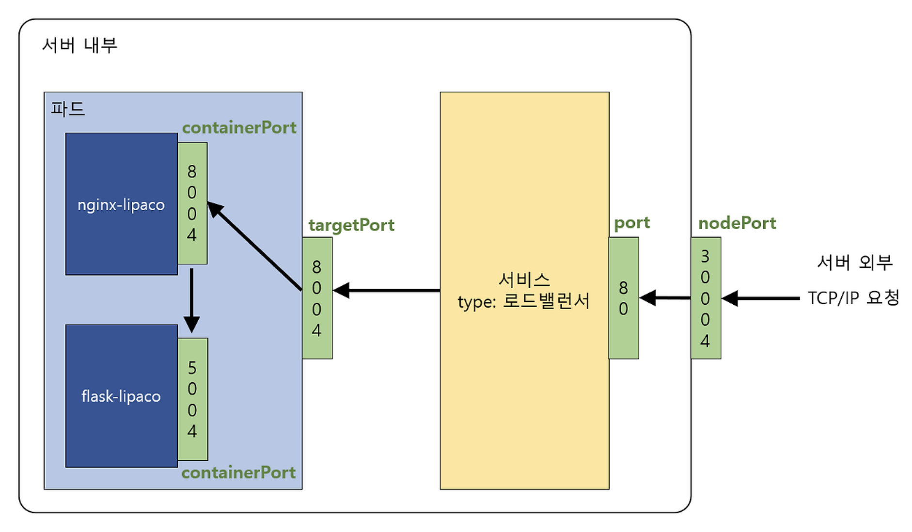

# 📑 개념
> 시간 날 때 틈틈이 정리해두겠습니다! 

# 🧪 실습
> Lab 문제를 풀면서 헷갈리는 개념을 정리하는 방식(오답노트)으로 작성하였습니다!

### Practice Test - PODs

<details>
<summary>2. Create a new pod using the nginx image.</summary>

kubectl run: 명령형(imperative) 방식으로 Pod를 빠르게 직접 생성 (kubectl run [이름] --image=[이미지])  
kubectl create: 선언적 파일(-f) 또는 리소스 타입을 지정하여 다양한 리소스 생성 (deployment, service 등) 

=> 정답: kubectl run nginx --image=nginx   

</details>

<details>
<summary>4. Which image is specified for the pods whose names begin with the newpods- prefix?</summary>

kubectl describe: 쿠버네티스(K8s) 입장의 정보 <- 리소스 설정, 상태, 시스템 이벤트(Events)   
kubectl logs: 컨테이너 내부 앱 입장의 정보 <- 애플리케이션의 실행 기록 (stdout, stderr)   

=> 정답: kubectl describe pods newpods-2jw47    

</details>

<details>
<summary>5. Which nodes are these pods placed on?</summary>

`-o wide`를 붙였을 때, 더 볼 수 있는 항목들 정리   

| 항목 (Column)        | kubectl get pods | kubectl get pods -o wide | 설명 |
|--------------------|------------------|--------------------------|------|
| NAME               | ✅               | ✅                       | 포드 이름 |
| READY              | ✅               | ✅                       | 준비된 컨테이너 수 / 전체 컨테이너 수 |
| STATUS             | ✅               | ✅                       | 현재 상태 (Running, Pending 등) |
| RESTARTS           | ✅               | ✅                       | 재시작 횟수 |
| AGE                | ✅               | ✅                       | 생성 후 경과 시간 |
| IP                 | ❌               | ✅                       | 포드에 할당된 가상 IP 주소 |
| NODE               | ❌               | ✅                       | 포드가 실행 중인 워커 노드 이름 |
| NOMINATED NODE     | ❌               | ✅                       | 예약된 노드 (보통 빈칸) |
| READINESS GATES    | ❌               | ✅                       | 추가적인 준비 상태 확인 조건 |

=> 정답: kubectl get pods -o wide

</details>

<details>
<summary>10. What does the READY column in the output of the kubectl get pods command indicate?</summary>

pods의 READY 칼럼은 container에 관한 개수 (o) pod에 관한 개수 (x)    

=> 정답: Ready containers in pod / Total containers in pod    

</details>

<details>
<summary>12. Now change the image on this pod to redis.</summary>

kubectl edit pod redis => vim 에디터처럼 수정    
kubectl set image pod/redis redis=redis => 한번에 수정     

=> 정답: kubectl edit pod redis     

</details>

### Practice Test - ReplicaSets

<details>
<summary>11. Create a ReplicaSet using the replicaset-definition-1.yaml file located at /root/. There is an issue with the file, so try to fix it.</summary>

### kubectl create vs kubectl apply
kubectl create: 리소스를 최초 생성할 때 사용. 이미 존재하는 리소스에 대해 실행하면 에러 발생 (Imperative 방식)   
kubectl apply: 리소스가 없으면 생성하고, 이미 있으면 변경사항을 적용 (Declarative 방식). 변경 이력 추적 가능    

++ 해당 문제는 최초 생성이기에 create를 사용하든, apply를 사용하든 상관 없지만 뒤에 꼭 리소스 타입(ex. -f)를 명시해줘야 한다.     

### apiVersion
apiVersion이 v1인 오브젝트: (Core 그룹) Pod, Service, ConfigMap, Namespace 등 아주 기초적인 리소스들    
apiVersion이 apps/v1인 오브젝트: (Apps 그룹) ReplicaSet, Deployment, StatefulSet 등 애플리케이션 관리를 위한 리소스들     

++ 어떤 리소스가 어떤 apiVersion을 쓰는지 헷갈릴 때: kubectl explain replicaset

=> 정답      
1) vim replicaset-definition-1.yaml으로 apiVersion 수정     
2) kubectl create -f replicaset-definition-1.yaml    

```yaml
controlplane ~ ➜  cat replicaset-definition-1.yaml
apiVersion: v1 # apps/v1으로 수정
kind: ReplicaSet
metadata:
  name: replicaset-1
spec:
  replicas: 2
  selector:
    matchLabels:
      tier: frontend
  template:
    metadata:
      labels:
        tier: frontend
    spec:
      containers:
      - name: nginx
        image: nginx
```

</details>

<details>
<summary>12. Fix the issue in the replicaset-definition-2.yaml file and create a ReplicaSet using it.</summary>

yaml에서 selector의 라벨과 template의 라벨을 맞춰줘야 한다.    

```yaml
controlplane ~ ➜  cat replicaset-definition-2.yaml
apiVersion: apps/v1
kind: ReplicaSet
metadata:
  name: replicaset-2
spec:
  replicas: 2
  selector:
    matchLabels:
      tier: frontend
  template:
    metadata:
      labels:
        tier: nginx # nginx -> frontend로 수정
    spec:
      containers:
      - name: nginx
        image: nginx
```

</details>

### Practice Test - Deployments

<details>
<summary>10. Create a new Deployment using the deployment-definition-1.yaml file located at /root/.</summary>

k8s yaml에서 kind 필드 값은 항상 대문자로 작성한다.   

```yaml
controlplane ~ ➜  cat deployment-definition-1.yaml
---
apiVersion: apps/v1
kind: deployment # Deployment로 수정
metadata:
  name: deployment-1
spec:
  replicas: 2
  selector:
    matchLabels:
      name: busybox-pod
  template:
    metadata:
      labels:
        name: busybox-pod
    spec:
      containers:
      - name: busybox-container
        image: busybox
        command:
        - sh
        - "-c"
        - echo Hello Kubernetes! && sleep 3600
```

</details>

### Practice Test - Namespaces

<details>
<summary>2. How many pods exist in the research namespace?</summary>

kubectl get pods --ns=research (x)    

kubectl get pods -n research (o)    
kubectl get pods --namespace=research (o)  

</details>

<details>
<summary>4. Which namespace has the blue pod in it?</summary>

모든 네임스페이스의 리소스를 한꺼번에 확인하는 옵션은 --all-namespaces   

</details>

<details>
<summary>7. What DNS name should the Blue application use to access the database db-service in the dev namespace?</summary>

k8s DNS 순서: **서비스명.네임스페이스.서비스타입.클러스터도메인** (service-name.namespace.svc.cluster.local)   

=> 정답: db-service.dev.svc.cluster.local    

</details>

### Practice Test - Services

<details>
<summary>3. What is the type of the default kubernetes service?</summary>

### Service 타입 비교 정리: ClusterIP, NodePort, LoadBalancer, External

| Service 타입 | 접근 범위 | 포트 범위 | 사용 목적 | 특징 |
|-------------|----------|----------|----------|------|
| **ClusterIP** | 클러스터 내부에서만 | - | 내부 통신 | 기본값. Pod 간 통신용. 외부 노출 불가 |
| **NodePort** | 클러스터 외부에서도 | 30000-32767 | 개발/테스트 환경 | 모든 노드의 특정 포트로 외부 접근 가능 |
| **LoadBalancer** | 클러스터 외부에서도 | - | 프로덕션 환경 | 클라우드 제공자의 로드밸런서 자동 생성 (AWS ELB, GCP LB 등) |
| **ExternalName** | DNS 매핑 | - | 외부 서비스 연결 | 클러스터 내부에서 외부 DNS 이름으로 접근 (셀렉터 없음) |

=> 정답: ClusterIP

</details>

<details>
<summary>5. How many labels are configured on the kubernetes service?</summary>

### nodePort vs port vs targetPort vs containerPort   



| 포트 이름 | 정의 위치 | 설명 | 트래픽 흐름 순서 |
|----------|----------|------|----------------|
| **nodePort** | Service YAML (NodePort 타입) | 클러스터 **외부**에서 노드의 IP로 접근할 때 사용 (범위: 30000-32767) | 1️⃣ 외부 → Node |
| **port** | Service YAML | Service가 클러스터 **내부**에 노출하는 포트 (다른 Pod가 이 Service 접근 시 사용) | 2️⃣ Pod → Service |
| **targetPort** | Service YAML | Service가 트래픽을 Pod의 어느 포트로 **전달**할지 지정 (미지정 시 `port`와 동일) | 3️⃣ Service → Pod |
| **containerPort** | Pod/Deployment YAML | 컨테이너가 실제로 리스닝하는 포트를 **문서화**하는 용도 (선택사항, 생략 가능) | 4️⃣ 최종 도착지 |

</details>

### Practice Test - Imperative Commands

<details>
<summary>4. Create a service redis-service to expose the redis application within the cluster on port 6379.</summary>

> expose 명령어를 모르면 못푸는 문제라고 생각   

kubectl expose pod redis --port=6379 --name=redis-service
- pod redis: redis라는 이름의 포드를 찾아서 노출
- --port=6379: 서비스가 사용할 포트 번호
- --name=redis-service: 생성될 서비스의 이름 지정

=> 정답: kubectl expose pod redis --port=6379 --name=redis-service

</details>

<details>
<summary>9. Which command would you use to display a list of all available API resources in your cluster?</summary>

kubectl api-resources: 현재 k8s 클러스터가 지원하는 API 리소스 목록 출력

=> 정답: kubectl api-resources

</details>

<details>
<summary>12. Which command would you use to get a description and details of the Pod resource?</summary>

kubectl explain pod VS kubectl api-resources       
- **kubectl explain pod**: Pod 리소스의 **상세한 필드 구조와 설명**을 보여줌 (YAML 작성 시 어떤 필드를 사용할 수 있는지)   
- **kubectl api-resources**: 클러스터의 **모든 리소스 목록**과 약어를 보여줌 (특정 리소스 하나만 조회 불가)   

=> kubectl explain pod

</details>

<details>
<summary>15.Let's explore the Deployment resource. What is the TYPE of the replicas field?</summary>

```bash
controlplane ~ ✖ kubectl explain deployment.spec.replicas
GROUP:      apps
KIND:       Deployment
VERSION:    v1

FIELD: replicas <integer>

DESCRIPTION:
    Number of desired pods. This is a pointer to distinguish between explicit
    zero and not specified. Defaults to 1.
```

++ 특정 오브젝트의 필드 트리구조를 보려면 16번 문제처럼 --recursive 플래그를 활용하면 된다.

=> integer

</details>

<details>
<summary>16. What does the --recursive flag do when used with kubectl explain?</summary>

kubectl explain 명령어와 함께 사용하는 --recursive 플래그는 해당 필드뿐만 아니라 그 하위에 존재하는 모든 중첩된 필드(Nested fields)를 트리 구조로 한 번에 보여주는 역할을 합다.

++ 어떤 옵선인지 헷갈리는 경우 -h 옵션 활용 가능

=> 정답: Shows all nested fields recursively in a single output

</details>
