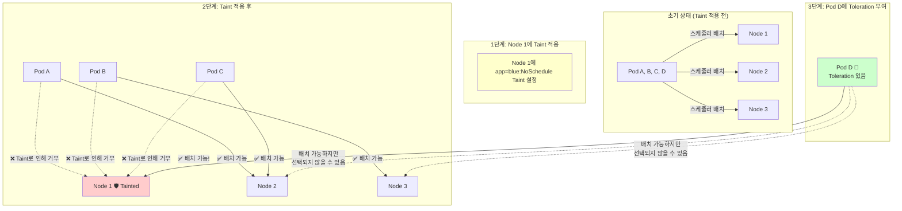
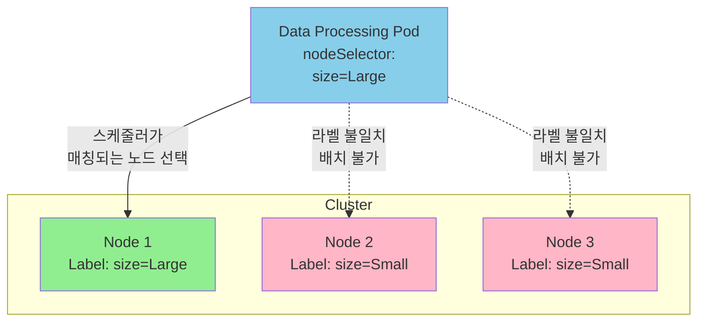

# 1. 스케줄링

## 1. nodeName

우리가 평소에 작성하는 파드(Pod) 매니페스트 파일(YAML)에는 보이지 않지만 쿠버네티스 내부적으로는 모든 파드에 `nodeName`이라는 필드가 존재합니다.

```sql
apiVersion: v1
kind: Pod
metadata:
  name: nginx
spec:
  containers:
  -  name: nginx
     image: nginx
  nodeName: "" # 기본적으로는 비어 있음!
```

일반적으로 파드를 생성할 때 우리는 이 필드를 비워둡니다. 그러면 쿠버네티스가 생성 시점에 자동으로 이 필드를 추가합니다.

### **scheduler가 하는 일**

1. 모든 파드를 모니터링합니다.
2. `nodeName` 속성이 설정되지 않은(비어 있는) 파드를 찾습니다. (**스케줄링 후보**)
3. 스케줄링 알고리즘을 실행하여 해당 파드에 가장 적합한 노드를 식별합니다.
4. 노드가 식별되면 **바인딩(Binding) 오브젝트**를 생성하여 파드의 `nodeName` 속성을 해당 노드의 이름으로 설정합니다.

과정이 완료되면 비로소 파드가 해당 노드에 배치되어 실행됩니다.

## 2. 만약 스케줄러가 없다면?

그렇다면, 클러스터에 스케줄러가 실행 중이지 않거나 고장 난 상태에서 파드를 생성하면 어떻게 될까요?

- 파드는 생성되지만 **`Pending` (보류)** 상태로 계속 남게 됩니다.
- **`nodeName`을 채워줄 주체가 없기 때문입니다.**

이 상황에서 파드를 실행시키려면 우리가 직접 스케줄러의 역할을 대신해야 합니다. 이것이 바로 수동 스케줄링 **Manual Scheduling**입니다.

## 3. 수동 스케줄링 (Manual Scheduling) 방법

수동으로 파드를 노드에 할당하는 방법은 크게 두 가지 상황으로 나뉩니다.

### **3.1 방법1 : 파드 생성 시점에 지정하기**

파드를 생성하기 전이라면 매니페스트 파일의 `spec`에 `nodeName` 필드를 직접 명시하면 됩니다.

```
apiVersion: v1
kind: Pod
metadata:
  name: nginx
spec:
  containers:
  -  name: nginx
     image: nginx
  nodeName: worker-node-01 # 파드가 배치될 노드 이름을 직접 지정
```

이렇게 하면 스케줄러가 없더라도 파드는 `worker-node-01`에 바로 할당되어 실행됩니다.

### **3.2 방법 2. 이미 생성된 파드에 할당하기 (Binding Object)**

→ 파드는 “입주민”, 노드는 “아파트”라면
Binding Object는 입주민이 어느 아파트에 살지 확정 짓는 입주 계약서입니다. 
- 입주민이 이미 태어난 상태에서는 이름을 마음대로 못 바꾸니 계약서(binding)을 제출해서 관송서(API Server)가 승인하게 만드는 과정이라고 이해하면 편합니다.

만약 파드가 이미 생성되어 `Pending` 상태에 빠져 있다면 어떻게 해야 할까요?

쿠버네티스는 **이미 생성된 파드의 `nodeName` 속성을 수정하는 것을 허용하지 않습니다.** 그래서 이때 필요한 것이 바로 **바인딩(Binding) 오브젝트**입니다. 실제 스케줄러도 내부적으로는 이 방식을 사용합니다.

우리는 스케줄러가 하는 작업을 흉내 내야 합니다. **Binding API**에 POST 요청을 보내서 파드와 노드를 묶어줍니다.

1. **Binding 객체 정의 (YAML)**
    
    ```
    apiVersion: v1
    kind: Binding
    metadata:
      name: nginx # 대상 파드 이름
    target:
      apiVersion: v1
      kind: Node
      name: worker-node-01 # 대상 노드 이름
    
    ```
    
2. **API 전송 (YAML -> JSON 변환)**
    
    실제로 API 서버에 요청을 보낼 때는 데이터 페이로드를 JSON 형식으로 보내야 합니다!
    

이렇게 하면 스케줄러 없이도 `Pending` 상태였던 파드가 `Running` 상태로 바뀌는 것을 확인할 수 있습니다

# 2. 수천 개의 파드, 어떻게 관리할까? : Labels & Selectors

쿠버네티스를 운영하다 보면 수많은 오브젝트가 생성됩니다. 시간이 지나면 이 오브젝트들은 수백, 수천 개로 늘어나게 됩니다.

이 거대한 오브젝트의 바다에서 **"내가 원하는 특정 파드들"**만 쏙쏙 골라내거나 그룹화하려면 어떻게 해야 할까요?
이때 사용하는 것이 바로 **레이블(Labels)**과 **셀렉터(Selectors)**입니다.

## 1. Labels란?

레이블은 쿠버네티스 오브젝트에 붙이는 **"이름표"** 또는 **"태그"**와 같습니다.
애플리케이션 종류(app), 기능(function), 환경(env) 등 사용자가 원하는 기준대로 오브젝트를 분류할 수 있게 해줍니다.

레이블 설정 방법

레이블은 YAML 파일의 `metadata` 섹션 아래에 `labels`라는 항목을 만들어서 정의합니다. 키-값(Key-Value) 쌍으로 이루어져 있으며, 원하는 만큼 추가할 수 있습니다.

```yaml
apiVersion: v1
kind: Pod
metadata:
  name: simple-webapp
  labels:        # 여기에 이름표를 붙입니다
    app: App1
    function: Front-end
spec:
  containers:
  - name: simple-webapp
    image: simple-webapp
```

## 2. Selector란?

레이블이 이름표를 붙이는 것이라면 **셀렉터**는 그 이름표를 이용해 **"오브젝트를 필터링"**하는 기능입니다.

### 2.1 CLI에서 필터링하기

수많은 파드 중에서 `app=App1`이라는 레이블을 가진 파드만 조회하고 싶다면 다음과 같이 명령어를 사용합니다.

```yaml
# --selector 옵션 사용
kubectl get pods --selector app=App1
```

이렇게 하면 수천 개의 파드 중 조건에 맞는 파드만 깔끔하게 필터링되어 보입니다. 

## 3. 쿠버네티스 내부에서의 활용 (오브젝트 연결)

사실 레이블과 셀렉터가 가장 중요하게 쓰이는 곳은 쿠버네티스 내부 동작입니다.
**쿠버네티스 오브젝트들은 서로를 연결할 때 바로 이 레이블과 셀렉터를 사용합니다.**

### 3.1 레플리카셋(ReplicaSet)의 예시

레플리카셋은 정해진 수만큼의 파드를 유지하는 역할을 합니다. 그런데 레플리카셋은 **어떤 파드가 자신의 관리 대상인지 어떻게 알까요?**

바로 **Selector**를 통해 자신의 관리 대상을 찾습니다.

### ⚠️ 가장 많이 실수하는 부분!

레플리카셋의 YAML 파일을 보면 `labels`가 두 군데 등장해서 매우 헷갈립니다.

```yaml
apiVersion: apps/v1
kind: ReplicaSet
metadata:
  name: simple-webapp-replicaset
  labels:    # [1] 레플리카셋 자체의 레이블
    app: App1
    function: Manager
spec:
  replicas: 3
  selector:  # [2] 어떤 파드를 찾을 것인가? (검색 조건)
    matchLabels:
      app: App1
  template:  # [3] 파드 생성 템플릿
    metadata:
      labels:  # [4] 생성될 파드에 붙을 레이블
        app: App1
    spec:
      containers:
      - name: simple-webapp
        image: simple-webapp

```

- **[1] 상단의 labels:** 이건 **레플리카셋 오브젝트 자체**에 붙는 이름표입니다. 파드 관리와는 직접적인 상관이 없습니다.
- **[4] template 섹션 안의 labels:** 레플리카셋이 생성할 **파드(Pod)에 붙을 이름표**입니다.
- **[2] spec 섹션 안의 selector:** 여기가 핵심입니다. 레플리카셋은 이 조건(`app: App1`)과 일치하는 레이블을 가진 파드를 찾아서 자신의 관리 하에 둡니다.

**핵심 포인트:**
레플리카셋이 파드를 제대로 관리하려면, `spec.selector.matchLabels`([2])에 정의된 내용이 `template.metadata.labels`([4])와 반드시 일치해야 합니다.

### 3.2 다중 레이블 매칭

만약 레이블은 같지만 기능이 다른 파드가 섞여 있다면 어떻게 할까요? 셀렉터에 여러 개의 레이블을 지정하면 됩니다.

```
selector:
  matchLabels:
    app: App1
    function: Front-end

```

이렇게 하면 `app: App1` 이면서 **동시에** `function: Front-end`인 파드만 찾아서 관리합니다. 

# 3. 노드에 '출입 금지' 구역 만들기: Taints & Tolerations

## 1. 벌레 기피제(Bug Spray)와 내성

이 개념을 이해하는 가장 좋은 방법은 **'벌레 기피제'**입니다.

- **사람 (Node):** 벌레가 꼬이지 않게 강력한 기피제**(Taint)**를 몸에 뿌립니다.
- **벌레 (Pod):** 냄새를 견디지 못하고 도망갑니다. 노드에 안착(스케줄링)할 수 없습니다.
- **내성이 있는 벌레 (Pod with Toleration):** 이 기피제 냄새에 **내성(Toleration)**이 있어서, 기피제를 뿌린 사람에게도 다가갈 수 있습니다.

즉, **Taints**는 노드(Node)에 설정하여 파드가 오지 못하게 막는 자물쇠이고, **Tolerations**는 그 자물쇠를 열 수 있는 파드(Pod)의 열쇠입니다.
(주의!!! 이는 보안/침입과는 관련이 없으며 오직 **스케줄링 제한**을 위한 기능입니다.)

## 2. 동작 시나리오 (예제)

상황을 가정해 봅시다.

- **워커 노드:** Node 1, Node 2, Node 3
- **파드:** A, B, C, D

기본적으로 아무런 설정이 없다면 스케줄러는 부하 분산을 위해 A, B, C, D를 모든 노드에 골고루 배치합니다.

하지만, "Node 1은 'Blue' 애플리케이션 전용으로 쓰고 싶다"는 요구사항이 생겼습니다.

### 2.1 1단계: 노드 오염시키기 (Taint)

Node 1에 'Blue'라는 냄새가 나는 **기피제(Taint)**를 뿌립니다.
이제 일반 파드(A, B, C)는 냄새를 견딜 수 없어서(Toleration이 없어서) Node 1에 배치되지 못하고 Node 2, 3으로 쫓겨납니다.

### 2.2 2단계: 파드에 내성 주기 (Toleration)

우리가 Node 1에 배치하고 싶은 파드 D에게 'Blue' 냄새를 견딜 수 있는 **Toleration**을 부여합니다.
이제 스케줄러가 파드를 배치할 때 다음과 같이 동작합니다.

1. **Pod A, B, C:** Node 1 접근 시도 -> Taint 때문에 실패 -> Node 2 또는 3에 배치.
2. **Pod D:** Node 1 접근 시도 -> Toleration(내성)이 있음 -> **Node 1에 배치 가능!**



## 3. 설정 방법 및 옵션

### 3.1 Taint (노드 설정)

노드에 Taint를 설정할 때는 `Key=Value:Effect` 형식을 사용합니다.

```
# 형식: kubectl taint nodes [노드이름] [키]=[값]:[효과]
kubectl taint nodes node1 app=blue:NoSchedule
```

**Taint Effect (효과) 3가지**

1. **NoSchedule:** (가장 일반적) 톨러레이션이 없으면 이 노드에 **배치되지 않습니다.** (기존 파드는 영향 없음)
2. **PreferNoSchedule:** 최대한 배치하지 않으려 노력하지만, 다른 대안이 없으면 배치할 수도 있습니다. (Soft restriction)
3. **NoExecute:** **가장 강력합니다.** 톨러레이션이 없으면 배치되지 않을 뿐만 아니라, **이미 실행 중인 파드도 톨러레이션이 없으면 쫓아냅니다(Evict/Terminate).**

### 3.2 Toleration (파드 설정)

파드 YAML 파일의 `spec` 섹션에 `tolerations`를 추가합니다. (모든 값은 쌍따옴표로 감싸는 것이 좋습니다.)

```
apiVersion: v1
kind: Pod
metadata:
  name: my-pod
spec:
  containers:
  - name: nginx
    image: nginx
  tolerations: # 여기에 내성을 추가
  - key: "app"
    operator: "Equal"
    value: "blue"
    effect: "NoSchedule"

```

## 4. NoExecute (실행 중인 파드 퇴거)

만약 노드들이 이미 파드들을 실행 중인 상태에서 뒤늦게 Taint를 적용하면 어떻게 될까요?

- `NoSchedule`을 적용하면? -> 기존에 돌고 있던 파드들은 그대로 유지됩니다. 새로운 파드만 못 들어옵니다.
- **`NoExecute`를 적용하면?** -> 기존에 돌고 있던 파드 중 내성(Toleration)이 없는 파드들은 즉시 Terminated되어 쫓겨납니다.

예를 들어, Node 1에 `app=blue:NoExecute`를 걸면, 내성이 없는 파드 C는 즉시 죽고, 내성이 있는 파드 D만 살아남게 됩니다.

## 5. 주의할 점 (핵심!)

가장 많이 하는 오해가 있습니다.

> "Taints & Tolerations를 쓰면 파드 D가 무조건 Node 1로 가겠지?"
> 

**정답은 NO입니다.**

Taint는 **"들어오지 마!"(Repel)** 하는 기능이지, **"여기로 와!"(Attract)** 하는 기능이 아닙니다.
위 예제에서 파드 D는 Node 1의 Taint를 견딜 수 있을 뿐입니다. 스케줄러가 판단하기에 Node 2나 Node 3가 더 널널하다면 파드 D를 Node 2에 배치할 수도 있습니다.

- **Taints:** 자격 없는 파드를 **밀어냅**
- **Node Affinity:** 특정 파드를 특정 노드로 **끌어당김**

따라서, "특정 파드를 오직 특정 노드에만 배치하고 싶다"면 Taints와 함께 **Node Affinity**를 조합해서 사용해야 합니다.

## 6. 마스터 노드에는 왜 파드가 안 생길까?

쿠버네티스 클러스터를 구축하면 마스터 노드(Control Plane)에는 우리가 만든 파드가 배치되지 않습니다. 그 이유가 바로 **Taint** 때문입니다.

쿠버네티스는 클러스터 생성 시 자동으로 마스터 노드에 Taint를 걸어둡니다.
(사용자의 워크로드가 중요 시스템 컴포넌트를 방해하지 않게 하기 위함입니다.)

```
# 마스터 노드의 Taint 확인
kubectl describe node master | grep Taint

```

# 4. Node Selectors & Affinity

**Taints & Tolerations**가 노드 입장에서 파드를 "거부"하는 기능이었다면 **Node Selector**와 **Node Affinity**는 파드 입장에서 특정 노드를 "선택"하여 들어가는 기능입니다.

## 1. 시나리오: 덩치 큰 녀석은 큰 집으로!

다음과 같은 클러스터 환경을 가정해 봅시다.

- **노드 구성:** 3개의 노드 중 2개는 사양이 낮은 노드(Small), 1개는 사양이 높은 대형 노드(Large)입니다.
- **워크로드:** 일반적인 웹 서버 파드와 고성능 연산이 필요한 데이터 처리 파드가 있습니다.

우리는 당연히 **데이터 처리 파드(Data Processing Pod)**를 리소스가 넉넉한 **대형 노드**에 배치하고 싶을 것입니다. 하지만 기본 설정 상태라면 스케줄러는 랜덤하게 → 부하 분산 규칙에 따라 파드를 아무 노드에나 배치할 수 있습니다. 만약 무거운 파드가 작은 노드에 배치된다면 리소스 부족 문제가 발생하겠죠!!

이 문제를 해결하는 가장 간단하고 직관적인 방법이 바로 **Node Selector**입니다.

## 2. 적용 방법

Node Selector가 작동하는 원리는 아주 단순합니다. **"노드에 라벨을 붙이고, 파드가 그 라벨을 선택하게 한다"**입니다.

### Step 1: 노드에 라벨 붙이기 (Label Nodes)

먼저, 쿠버네티스가 어떤 노드가 '대형 노드'인지 알 수 있도록 이름표(Label)를 붙여야 합니다.

```powershell
# 형식: kubectl label nodes [노드이름] [키]=[값]
kubectl label nodes node-1 size=Large
```

이렇게 하면 `node-1`에는 `size=Large`라는 라벨이 붙게 됩니다.



### Step 2: 파드 정의에 Node Selector 추가

이제 파드를 생성할 때, "나는 `size=Large`인 노드에만 갈 거야"라고 명시해 줍니다. 파드 정의 YAML 파일의 `spec` 섹션에 `nodeSelector`를 추가하면 됩니다.

```
apiVersion: v1
kind: Pod
metadata:
  name: data-processing-pod
spec:
  containers:
  - name: data-processor
    image: data-processor
  nodeSelector:  # 여기가 핵심!
    size: Large

```

이제 이 파드를 생성하면 스케줄러는 `size=Large` 라벨이 붙은 노드(node-1)를 찾아 그곳에 파드를 배치합니다.

## 3. Node Selector의 한계

Node Selector는 사용하기 매우 쉽고 간단하지만, 조건이 단순할 때만 유용합니다. 요구사항이 복잡해지면 한계에 부딪힙니다.

**예시 상황:**

1. **"Large 또는 Medium 노드 중 아무 데나 보내줘."** (OR 조건 불가)
2. **"Small 노드만 아니면 다 괜찮아."** (NOT 조건 불가)
3. **"가능하면 Large에 보내고, 자리 없으면 아무 데나 보내줘."** (선호도/Soft Rule 설정 불가)

`nodeSelector`는 오직 정확히 일치(Exact Match)하는 키-값 쌍만 찾을 수 있습니다.

이러한 한계를 극복하고 더 복잡하고 유연한 규칙을 설정하기 위해 등장한 것이 바로 **Node Affinity(노드 선호도)**입니다.

## 4. Node Affinity (노드 선호도)

Node Affinity는 특정 노드에 파드를 배치하기 위한 고급 기능을 제공합니다. "큰 힘에는 큰 복잡성이 따른다"는 말처럼, 설정이 Node Selector보다 복잡하지만 훨씬 강력합니다.

### YAML 구조 및 연산자

`nodeSelector` 대신 `affinity` 섹션을 사용합니다.

```
apiVersion: v1
kind: Pod
metadata:
  name: with-node-affinity
spec:
  affinity:
    nodeAffinity:
      requiredDuringSchedulingIgnoredDuringExecution:
        nodeSelectorTerms:
        - matchExpressions:
          - key: size
            operator: In
            values:
            - Large
            - Medium
  containers:
  - name: with-node-affinity
    image: k8s.gcr.io/pause:2.0

```

Node Affinity의 가장 큰 장점은 **다양한 연산자(Operator)**를 지원한다는 점입니다.

- `In`: 라벨 값이 지정된 목록 중 하나와 일치 (예: Large OR Medium)
- `NotIn`: 라벨 값이 지정된 목록에 없음 (예: Small이 아닌 곳)
- `Exists`: 라벨의 키가 존재함 (값은 상관없음)
- `DoesNotExist`, `Gt`, `Lt` 등

## 5. Node Affinity Types

Node Affinity에는 파드의 스케줄링 및 실행 단계에 따라 두 가지 주요 유형이 있습니다. 이름이 길지만 끊어서 읽으면 이해하기 쉽습니다.

### 1) Required (필수 조건) - Hard Rule

- **속성명:** `requiredDuringSchedulingIgnoredDuringExecution`
- **의미:** "스케줄링하는 동안에는 반드시 필요하다."
- **동작:** 스케줄러가 이 규칙을 만족하는 노드를 찾지 못하면 파드를 **스케줄링하지 않습니다.** (파드는 `Pending` 상태로 남습니다.)
- **사용처:** 워크로드가 반드시 특정 하드웨어에서만 돌아가야 할 때 사용합니다.

### 2) Preferred (선호 조건) - Soft Rule

- **속성명:** `preferredDuringSchedulingIgnoredDuringExecution`
- **의미:** "스케줄링하는 동안 선호하지만, 필수는 아니다."
- **동작:** 스케줄러가 규칙을 만족하는 노드를 찾으려 노력합니다. 하지만 만약 **조건에 맞는 노드가 없다면, 그냥 다른 노드에 배치합니다.**
- **사용처:** "가능하면 빠른 노드에 넣고 싶지만, 자리가 없으면 파드가 안 뜨는 것보단 느린 노드라도 뜨는 게 낫다"는 경우에 사용합니다.

## 6. 실행 중 무시(IgnoredDuringExecution)의 의미

속성 이름 뒤에 붙은 `IgnoredDuringExecution`은 무엇을 의미할까요?

- **상황:** 파드가 이미 노드에 배치되어 **실행 중(Running)**인 상태입니다.
- **변화:** 관리자가 갑자기 해당 노드의 라벨을 변경해서(예: `size=Large` 삭제), 더 이상 Affinity 규칙을 만족하지 않게 되었습니다.
- **결과:** `Ignored...`이기 때문에 **무시합니다.** 즉, 파드는 쫓겨나지 않고 계속 해당 노드에서 실행됩니다.

> 참고: 향후에는 requiredDuringSchedulingRequiredDuringExecution과 같이 실행 중에도 조건을 만족하지 않으면 파드를 퇴출(Evict)시키는 옵션도 계획되어 있습니다!
> 

# 5. Taints vs Affinity

쿠버네티스 클러스터를 다른 팀과 공유해서 쓰고 있다고 가정해 봅시다.
우리 팀은 **Blue, Red, Green**이라는 세 가지 종류의 애플리케이션을 운영 중이고 이를 위해 각각 전용 노드(Blue Node, Red Node, Green Node)를 마련했습니다.

우리의 목표는 두 가지입니다.

1. **Blue 파드는 무조건 Blue 노드에 가야 한다.** (다른 노드 금지)
2. **Blue 노드에는 Blue 파드만 와야 한다.** (다른 팀 파드 금지)

이 목표를 달성하기 위해 **Taints & Tolerations**와 **Node Affinity**를 각각 사용해 보고 왜 이 둘을 함께 써야 하는지 알아보겠습니다.

## 1. 시도 1: Taints & Tolerations만 사용했을 때

가장 먼저 떠오르는 방법은 노드에 Taint(기피제)를 뿌리는 것입니다.

- **설정:**
    - Blue 노드에 `color=blue:NoSchedule` Taint 설정.
    - Blue 파드에 `color=blue` Toleration 설정.
- **결과:**
    - 다른 팀의 파드(Other Pods)는 톨러레이션이 없으므로 Blue 노드에 들어올 수 없습니다. **(목표 2 달성: 외부 침입 차단 성공)**
- **문제점:**
    - 하지만 Blue 파드는?
    - Blue 파드는 Blue 노드에 들어갈 자격(Toleration)이 있지만 **꼭 Blue 노드에 가야 한다는 강제성은 없습니다.**
    - 만약 클러스터에 Taint가 걸려있지 않은 **'공용 노드(Grey Node)'**가 있다면? 스케줄러는 Blue 파드를 공용 노드에 배치해 버릴 수도 있습니다.

> 결론: Taints는 "나쁜 녀석들을 막는 것"은 잘하지만 "내 녀석들을 올바른 곳으로 보내는 것"은 보장하지 못합니다.
> 

## 2. 시도 2: Node Affinity만 사용했을 때

이번에는 **Node Affinity(노드 선호도)**를 사용해 봅니다.

- **설정:**
    - Blue 노드에 `color=blue` 라벨(Label) 부착.
    - Blue 파드에 `nodeAffinity`를 설정하여 `color=blue`인 노드를 찾도록 함.
- **결과:**
    - Blue 파드는 라벨을 보고 정확히 Blue 노드를 찾아갑니다. **(목표 1 달성: 올바른 배치 성공)**
- **문제점:**
    - 하지만 다른 팀의 파드(Other Pods)는?
    - 다른 팀 파드에 별다른 제약 조건이 없다면, 스케줄러는 부하 분산을 위해 **아무 생각 없이 다른 팀 파드를 Blue 노드에 배치**할 수 있습니다.
    - Node Affinity는 "여기로 와"라고 손짓할 뿐 "너는 오지 마"라고 막는 문지기가 없기 때문입니다.

> 결론: Node Affinity는 "내 녀석들을 올바른 곳으로 보내는 것"은 잘하지만, "나쁜 녀석들이 들어오는 것"은 막지 못합니다.
> 

## 3. 최종 솔루션: Taints + Affinity 함께 사용하기

완벽하게 **특정 노드를 특정 파드 전용(Dedicated)으로** 만들기 위해서는 두 기능을 모두 사용해야 합니다.

### 전략

1. **Taints & Tolerations 사용:** 다른 파드들이 우리 노드에 얼씬도 못 하게 막습니다. (출입 통제)
2. **Node Affinity 사용:** 우리 파드들이 다른 엉뚱한 노드로 새나가지 않고 우리 노드로만 오게 합니다. (좌석 지정)

### 적용 예시

**1. 노드 설정 (Taint + Label)**

```powershell
# 1) Taint로 외부인 출입 금지
kubectl taint nodes node-blue app=blue:NoSchedule

# 2) Label로 우리 편에게 위치 알림
kubectl label nodes node-blue app=blue
```

**2. 파드 설정 (Toleration + Affinity)**

```
apiVersion: v1
kind: Pod
metadata:
  name: blue-pod
spec:
  containers:
  - name: blue-app
    image: blue-app

  # 1) Toleration: Taint가 걸린 노드에 들어갈 수 있는 '출입증' 제시
  tolerations:
  - key: "app"
    operator: "Equal"
    value: "blue"
    effect: "NoSchedule"

  # 2) Affinity: 라벨을 보고 정확한 '목적지' 찾아가기
  affinity:
    nodeAffinity:
      requiredDuringSchedulingIgnoredDuringExecution:
        nodeSelectorTerms:
        - matchExpressions:
          - key: app
            operator: In
            values:
            - blue
```

그래서 특정 워크로드를 위한 전용 노드(Dedicated Node)를 구축하고 싶다면 반드시 **Taints**와 **Affinity**를 함께 사용해야 합니다. 

# 7. DaemonSet

지금까지 우리는 **ReplicaSet**과 **Deployment**를 통해 클러스터 내의 여러 노드에 파드를 배포해 왔습니다. 이들의 주 목적은 "사용자가 원하는 **파드의 개수(Replicas)**를 유지하는 것"이었습니다.

하지만 운영을 하다 보면 이런 요구사항이 생길 때가 있습니다.

> "파드 개수는 상관없고, 그냥 우리 클러스터의 모든 노드에 딱 하나씩만 실행되면 좋겠어!"
> 

예를 들어, 로그 수집기나 모니터링 에이전트 같은 것들 말이죠. 이때 사용하는 것이 바로 **DaemonSet(데몬셋)**입니다.

## 1. DaemonSet이란?

**DaemonSet**은 클러스터의 **모든 노드(또는 특정 노드들)에 파드 사본이 정확히 하나씩 실행되도록 보장**하는 컨트롤러입니다.

### ReplicaSet vs DaemonSet

- **ReplicaSet:** "클러스터 전체에 파드 **N개**를 유지해 줘." (어디에 몇 개가 있든 총 개수가 중요)
- **DaemonSet:** "각 노드마다 파드 **1개**씩을 심어 줘." (노드당 1개가 중요)

### 동적 스케줄링 (Dynamic Scaling)

DaemonSet의 가장 큰 장점은 클러스터의 노드 변화에 자동으로 대응한다는 점입니다.

- **노드 추가:** 클러스터에 새로운 노드가 Join하면, DaemonSet이 이를 감지하고 자동으로 해당 노드에 파드를 생성합니다.
- **노드 제거:** 노드가 클러스터에서 제거되면 해당 파드는 자동으로 정리( → Garbage Collected)됩니다.

## 2. 주요 사용 사례 (Use Cases)

왜 모든 노드에 파드를 하나씩 띄워야 할까요? 주로 **인프라 레벨의 작업**을 수행할 때 필수적입니다.

### 1) 로그 수집 (Logs Collection)

각 노드에서 발생하는 로그를 중앙 서버(Elasticsearch 등)로 보내야 할 때 모든 노드에 로그 수집기가 실행되어 있어야 합니다.

### 2) 모니터링 (Monitoring Agents)

각 노드의 CPU, 메모리, 디스크 상태를 감시하려면 모든 노드에 모니터링 에이전트가 설치되어 있어야 합니다. DaemonSet은 이를 위한 완벽한 솔루션입니다.

### 3) 클러스터 네트워킹 (Networking)

**kube-proxy** 같은 네트워크 프록시도 각 노드의 네트워크 통신을 담당해야 하므로 DaemonSet으로 배포됩니다.

## 3. DaemonSet 정의하기 (YAML)

DaemonSet의 정의 파일은 ReplicaSet과 매우 유사합니다. `replicas` 필드가 없다는 점 정도가 차이점입니다. (개수를 지정할 필요가 없으니까요!)

```
apiVersion: apps/v1
kind: DaemonSet  # 종류는 DaemonSet
metadata:
  name: monitoring-daemon
spec:
  selector:
    matchLabels:
      app: monitoring-agent
  template:
    metadata:
      labels:
        app: monitoring-agent
    spec:
      containers:
      - name: monitoring-agent
        image: monitoring-agent:v1

```

- **`kind`**: `ReplicaSet` 대신 `DaemonSet`을 사용합니다.
- **`selector` & `template`**: ReplicaSet과 마찬가지로, `selector`의 레이블이 파드 `template`의 레이블과 일치해야 합니다.
- **생성 및 조회:**
    
    ```
    kubectl apply -f daemonset-definition.yaml
    kubectl get daemonsets
    kubectl describe daemonsets monitoring-daemon
    
    ```
    

## 4. DaemonSet의 동작 원리

"어떻게 스케줄러를 거치지 않고 모든 노드에 파드를 꽂아 넣을까?" 이 질문에 대한 답은 쿠버네티스 버전에 따라 달라졌습니다.

### (Kubernetes v1.11 이하)

과거의 DaemonSet 컨트롤러는 **스케줄러를 우회**했습니다.
파드를 생성할 때 `spec.nodeName` 필드를 특정 노드 이름으로 직접 지정해버리는 방식을 사용했습니다. 이렇게 하면 스케줄러가 개입할 틈 없이 바로 해당 노드에 파드가 할당되었습니다.

### (Kubernetes v1.12 이후)

현재는 기본 스케줄러(Default Scheduler)와 **Node Affinity(노드 선호도)** 규칙을 사용합니다.

1. DaemonSet 컨트롤러가 파드를 생성할 때, 각 노드에 맞는 **Node Affinity** 규칙을 파드에 추가합니다.
2. 스케줄러는 이 Affinity 규칙을 보고 해당 노드에 파드를 스케줄링합니다.

이 방식의 장점은 스케줄러가 관리하는 **Taints & Tolerations**, 파드 우선순위등의 정책을 DaemonSet 파드에도 일관성 있게 적용할 수 있다는 점입니다.

# 8. Static Pods

쿠버네티스의 동작은 스케줄러가 노드를 정해주면 API 서버가 Kubelet에게 지시를 내리고 Kubelet이 파드를 생성하는 식으로 이루어집니다. 

그런데 만약... **API 서버가 죽어버리면 어떻게 될까요?**
혹은 아예 마스터 노드가 없는 외딴섬 같은 노드라면 파드를 실행할 수 없을까요?

여기서 Static Pods(정적 파드)라는 개념이 등장합니다.

## 1. Kubelet의 독자 행동

비유를 하나 들어보겠습니다.

- **API 서버/스케줄러:** 본부 (지시를 내리는 곳)
- **Kubelet:** 배의 선장 (실제로 배를 관리하는 사람)
- **노드:** 배

평소에 선장(Kubelet)은 본부(API Server)의 지시를 기다립니다. 하지만 본부와 연락이 끊기거나(마스터 노드 장애), 애초에 본부가 없는 상황이라면?
선장은 손 놓고 있는 것이 아니라 **배 안에 있는 매뉴얼(로컬 파일)을 보고 독자적으로 파드를 띄울 수 있어야 합니다.** 이것이 바로 **Static Pod**입니다.

### Static Pod 정의

- **API 서버의 개입 없이**, 특정 노드의 **Kubelet이 직접 관리**하는 파드입니다.
- 오직 **Pod** 형태만 가능합니다. (ReplicaSet, Deployment, Service 등은 사용 불가!!)

## 2. 어떻게 만드나요? (설정 방법)

Static Pod를 만드는 방법은 아주 간단합니다. "파일을 특정 폴더에 넣기만 하면" 됩니다.

### 1) 매니페스트 폴더 위치 찾기

Kubelet은 주기적으로 특정 디렉터리를 감시합니다. 이 디렉터리 경로는 `kubelet` 설정 파일(`config.yaml`)의 `staticPodPath` 옵션에 정의되어 있습니다.

- **Kubeadm으로 설치한 경우 기본 경로:** `/etc/kubernetes/manifests`

### 2) YAML 파일 넣기

이 폴더 안에 `my-pod.yaml` 파일을 툭 던져 넣으면?

- **생성:** Kubelet이 파일을 감지하고 즉시 파드를 생성합니다.
- **수정:** 파일 내용을 수정하면 파드를 재시작하여 반영합니다.
- **삭제:** 파일을 폴더에서 지우면 파드도 삭제됩니다.
- **복구:** 만약 파드가 죽으면? Kubelet이 파일이 존재하는 한 계속 되살립니다.

## 3. 미러 파드 (Mirror Pods)

Static Pod는 Kubelet이 혼자 몰래 만든 것인데 `kubectl get pods` 명령어를 치면 **조회가 됩니다!**

> "API 서버 없이 만들었다면서 API 서버가 어떻게 알고 리스트에 보여주죠?"
> 
1. Kubelet이 Static Pod를 생성합니다.
2. 만약 노드가 클러스터에 연결되어 있다면 Kubelet은 API 서버에게 "나 이거 하나 띄웠어"라고 알려줍니다.
3. API 서버는 이를 인지하고 **읽기 전용(Read-Only) 복제본**인 **Mirror Pod**를 생성합니다.

**주의할 점:**`kubectl delete pod` 명령어로 Mirror Pod를 삭제해 봤자 소용없습니다. 원본 파일이 노드에 남아있는 한, Kubelet은 **"어? 파드가 없어졌네?"** 하고 다시 만들어버립니다. (지우려면 해당 노드에 접속해서 파일을 지워야 합니다.)

## 4. 왜 이런 기능을 쓸까? (Use Cases)

도대체 왜 API 서버를 거치지 않는 파드가 필요할까요?
정답은 "API 서버 그 자체를 띄우기 위해서"입니다.

### Control Plane 부트스트래핑

쿠버네티스 마스터 노드도 결국은 서버입니다. 

1. 마스터 노드에 `Docker(Container Runtime)`와 `Kubelet`을 설치합니다.
2. `/etc/kubernetes/manifests` 폴더에 `kube-apiserver.yaml`, `kube-scheduler.yaml` 등을 넣습니다.
3. Kubelet이 이 파일들을 보고 컨트롤 플레인 컴포넌트들을 **Static Pod**로 실행합니다.

이것이 바로 `kubeadm`이 클러스터를 구축하는 방식입니다. `kube-system` 네임스페이스에 있는 핵심 컴포넌트들은 대부분 Static Pod로 동작합니다.

## 5. Static Pods vs DaemonSets

"모든 노드(혹은 특정 노드)에 파드를 띄운다"는 점에서 데몬셋과 헷갈릴 수 있습니다.

| 특징 | Static Pods (정적 파드) | DaemonSets (데몬셋) |
| --- | --- | --- |
| **생성 주체** | **Kubelet** (로컬 파일 기반) | **API Server** (데몬셋 컨트롤러) |
| **관리 방식** | 노드의 특정 폴더에 YAML 파일 저장 | `kubectl`로 YAML 적용 (클러스터 레벨) |
| **스케줄러 개입** | 무시됨 (Ignored) | 스케줄러 & Node Affinity 사용 |
| **주요 용도** | **Control Plane 컴포넌트 실행** (Bootstrap) | 로그 수집기, 모니터링 에이전트 배포 |
| **수정/삭제** | 노드 접속 후 파일 직접 수정/삭제 | `kubectl` 명령어로 제어 가능 |

# 9. Priority Class

그런데 만약 **클러스터 리소스가 꽉 찬 상태**에서 갑자기 **파드**를 실행해야 한다면 어떻게 될까요? 이때 필요한 것이 바로 Priority Class(우선순위 클래스)입니다.

## 1. Priority Class란?

Priority Class는 말 그대로 **파드의 우선순위를 정의하는 객체**입니다.

- **역할:** 스케줄링 시 우선순위를 결정하고, 자원이 부족할 때 **누구를 살리고 누구를 희생시킬지** 결정합니다.
- **특징:** **Non-namespaced** 객체입니다. 즉, 특정 네임스페이스에 묶이지 않고 클러스터 전체에서 전역적으로 사용됩니다.

## 2. 우선순위 점수 (Priority Value)

우선순위는 **숫자**로 표현됩니다. 숫자가 클수록 계급이 높습니다.

- **사용자 정의 범위:** 약 `20억` ~ `10억` 사이의 정수.
    - 일반적으로 애플리케이션 워크로드에 사용됩니다.
- **시스템 중요 범위:** `20억` 이상.
    - 쿠버네티스*Control Plane 컴포넌트(API 서버, 스케줄러 등)나 핵심 노드 데몬들이 사용하는 영역입니다. 이들은 절대 죽으면 안 되기 때문에 압도적인 우선순위를 가집니다.

### 기존 클래스 확인하기

클러스터를 처음 설치하면 기본적으로 시스템이 사용하는 클래스들이 있습니다.

```
kubectl get priorityclass
# 출력 예시:
# NAME                      VALUE        GLOBAL-DEFAULT   AGE
# system-cluster-critical   2000000000   false            2d
# system-node-critical      2000001000   false            2d
```

## 3. Priority Class 만들기 및 사용

### 1) Priority Class 생성 (YAML)

```
apiVersion: scheduling.k8s.io/v1
kind: PriorityClass
metadata:
  name: high-priority
value: 1000000              # 1. 우선순위 점수 (100만)
globalDefault: false        # 2. 기본값 여부
description: "이 클래스는 중요한 앱을 위한 것입니다."
preemptionPolicy: PreemptLowerPriority # 3. 선점 정책 (뒤에서 설명)

```

- **`value`**: 임의의 정수값을 지정합니다.
- **`globalDefault`**: `true`로 설정하면, 우선순위가 명시되지 않은 파드들은 자동으로 이 클래스를 사용하게 됩니다. (단, 클러스터 내에서 `true`인 클래스는 딱 하나만 존재해야 합니다. 기본값은 0입니다.)

### 2) 파드에 할당하기

파드 정의 파일에 `priorityClassName` 필드를 추가하면 됩니다.

```
apiVersion: v1
kind: Pod
metadata:
  name: critical-pod
spec:
  containers:
  - name: nginx
    image: nginx
  priorityClassName: high-priority  # 방금 만든 클래스 이름 지정

```

## 4. Preemption

Preemption은 자원이 부족할 때 스케줄러가 어떻게 행동하는지를 결정합니다.

### 상황 가정

1. 클러스터가 꽉 찼습니다.
2. 우선순위 **5**인 `Low-App`이 실행 중입니다.
3. 우선순위 **7**인 `Critical-App`이 들어오려고 합니다.

이때 **`preemptionPolicy`** 설정에 따라 달라집니다.

### 정책 1: PreemptLowerPriority (기본값)

> "비켜! 나 급해!"
> 
- **동작:** 스케줄러는 자원을 확보하기 위해 우선순위가 낮은 `Low-App`을 **죽여버립니다(Evict/Terminate).**
- **결과:** `Low-App`은 쫓겨나고 그 빈자리에 `Critical-App`이 즉시 스케줄링됩니다.
- **용도:** 반드시 실행되어야 하는 중요 워크로드에 적합합니다.

### 정책 2: Never (절대 안 뺏음)

> "급하긴 한데... 남을 죽이진 않을게. 줄 서서 기다리자."
> 
- **동작:** 아무리 우선순위가 높아도, 실행 중인 파드를 쫓아내지 않습니다. 대신 **스케줄링 대기열(Queue)의 맨 앞**으로 갑니다.
- **결과:** 누군가 스스로 종료되어 자원이 생길 때까지 기다립니다. 단, 대기열에 있는 다른 낮은 우선순위 파드들보다는 먼저 들어갑니다.
- **용도:** 중요하긴 하지만, 실행 중인 다른 작업을 강제로 중단시키면 데이터 손상 등이 우려될 때 사용합니다. (배치 작업 등)