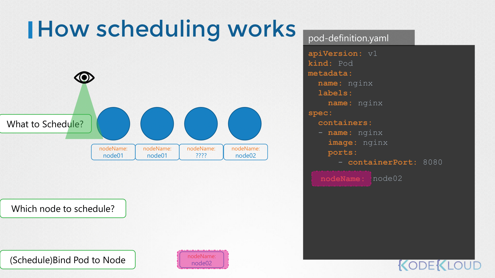
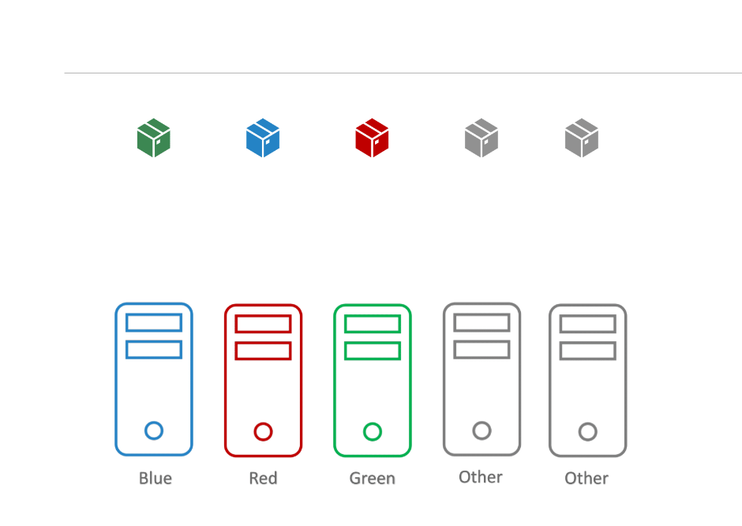
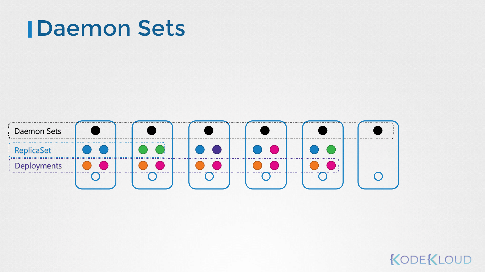
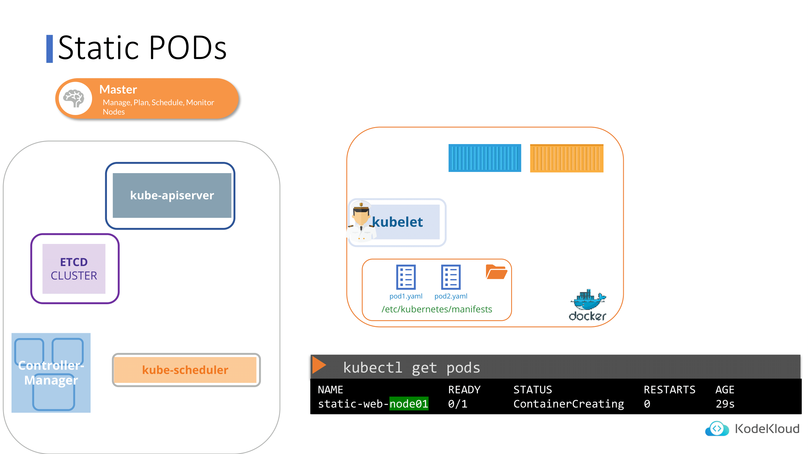

# Scheduling
## 1. Manual Scheduling
- 일반적으로는 쿠버네티스가 nodeName 필드를 자동으로 추가
- 스케줄러는 모든 파드를 보며 nodeName 필드가 설정되지 않은 파드를 탐색
- 이후 스케줄링 알고리즘을 실행하여 파드에 적합한 노드를 식별
- 식별되면 nodeName을 해당 노드의 이름으로 설정하여 노드에 파드를 예약





### 만약에 스케줄러가 없다면?
- 파드는 계속 Pending 상태
- Manual Scheduling: 쿠버네티스 스케줄러(kube-scheduler)를 우회해서, Pod를 특정 Node에 직접 바인딩하는 것을 말한다.
- 주의점
    - 파드 생성 시에만 nodeName을 직접 지정 가능
    - 파드가 이미 생성된 경우, nodeName을 수정하는 것은 허용되지 않음


### Manual Scheduling 사용하는 경우?
- 흔하지 않다. 특수 상황용이라고 생각하면 된다.
    - 장애 격리, 디버깅 등 노드를 수동으로 긴급하게 변경해야하는 경우에 사용
    - 이는 스케줄러를 우회해서 하는 방법이라 실무에서 피하는 방식 (실무에서는 대신 **label + affinity**를 씀)


## 2. Label and Selectors
- 하나의 기준이 아니라, 여러 개의 기준이나 특징을 가지고 그룹핑하고 싶은 경우가 있다.
- 이렇게 그룹화를 하고 싶을 때 사용하는 표준 방법이다.

### 어떻게 사용될까?
- 쿠버네티스에서 파드, 서비스, 디플로이먼트 등 다양한 다른 타입의 리소스를 생성할 수 있다.
- 다양한 오브젝트 사이에서 효율적으로 원하는 오브젝트를 선택하기 위해서는 여러 카테고리에 따라 그룹화 해야 한다.
- 레이블과 셀렉터를 사용하여 그룹화되어 있는 오브젝트를 필요에 따라 구분지어 찾을 수 있다.
    - app, function, 등에 따라서 object를 나눠서 관리 가능
    - KV format으로 yaml 파일에 저장

### 사용 예시
- 이전에 KV format으로 manifest 파일에 저장된 값을 커맨드를 통해 찾으면 된다.
- `kubectl get pods --selector app=App1` 를 통해 App1을 찾을 수 있다.


### 레플리카 셋에서 라벨 설정할 때 주의점!!

> ReplicaSet에서 label / selector는 “그냥 메타데이터”가 아니라 Pod 소유권(ownership)을 결정하는 핵심 제어 장치다.
> 
> “내 selector에 매칭되는 Pod 개수가 `spec.replicas` 와 같은가?”  ⇒ selector로 잡히는 Pod”를 **소유하는 것임**


## 3. Taints and Tolerations
Kubernetes 스케줄러는 기본적으로 **“파드가 실행 가능한 노드 후보를 먼저 고른 뒤, 그 중 최적 노드”**를 선택하는 구조이다.

- Taint: “이 노드는 특정 조건을 만족하는 파드만 받겠다” (노드가 파드를 거부하는 장치)

- Toleration: “이 파드는 그 거부 조건을 감수할 수 있다” (파드가 노드의 거부 조건을 ‘무시/허용’하는 장치)

즉, Taint는 노드 쪽에 설정된 필터, Toleration은 그 필터를 파드가 통과하기 위한 열쇠(조건)으로 보면 된다.


- 어떤 pod가 particular taint 에 내성이 있는지를 체크해서 스케줄러가 assign 하면 된다.
    - taint는 node에 설정
    - tolerations는 pod에 설정
    - 이렇게 설정 값이 들어있는 주체가 나뉘어져 있다는 걸 잘 기억해야한다.


### Taint 구성요소 (key/value/effect)
테인트는 보통 이런 형태: `key=value:effect`

- 예: `dedicated=gpu:NoSchedule`

#### effect(= taint-effect) 3종의 실제 동작 차이
1. NoSchedule
    - 새로 스케줄링되는 파드: 톨러레이션 없으면 해당 노드에 배치 불가
    - 이미 그 노드에서 실행 중인 파드: 그대로 둠 (추방하지 않음)
    - 포인트: “앞으로 들어오는 것을 막음"


2. PreferNoSchedule
    - 톨러레이션 없으면 가능하면 피한다 (soft rule)
    - 하지만 다른 곳이 더 배치하기 나쁜 상황이면(리소스 부족 등) 노드에 배치될 수도 있음
    - 포인트: “우선순위/선호도”에 가까움. 강제력이 비교적 약함


3. NoExecute
    - 새로 스케줄링되는 파드: 톨러레이션 없으면 배치 불가
    - 이미 실행 중인 파드: 톨러레이션 없으면 축출(evict) 대상
    - 포인트: “기존 리소스까지 정리”
    - 여기에 톨러레이션에서 `tolerationSeconds`를 주면 일정 시간만 버티고 추방하는 것도 가능해진다.


### Toleration
```yaml
tolerations:
- key: "gpu"
  operator: "Equal"
  value: "true"
  effect: "NoSchedule"
  tolerationSeconds: 300
```

| 필드 | 의미 |
| --- | --- |
| `key` | 어떤 taint를 견딜지 |
| `operator` | 값 비교 방식 |
| `value` | taint의 value |
| `effect` | 어떤 효과의 taint를 견딜지 |
| `tolerationSeconds` | NoExecute일 때 버티는 시간 |


### Toleration 매칭 규칙
톨러레이션은 테인트와 매칭될 때만 의미가 있다.

- operator: Equal vs Exists
    - Equal(기본): key와 value가 둘 다 같아야 함
    - Exists: key만 맞으면 됨(값은 무시). value 없이 key만으로 허용

- effect를 지정할 수도/안 할 수도 있음
    - effect를 명시하면 그 effect에만 적용
    - effect를 생략하면 모든 effect에 대해 허용


## 4. Node Selectors
노드셀렉터는 파드의 nodeSelector 필드에 명시된 레이블을 가지고 있는 노드 중에 하나를 선택하여 스케줄링할 수 있도록 하는 기능이다.

```yaml
apiVersion: v1
kind: Pod
metadata:
  name: myapp-pod
spec:
  containers:
    - name: data-processor
      image: data-processor
  nodeSelector:
    size: Large
```

- 노드에도 해당 키 값에 해당하는 라벨을 지정해주어야 한다. `kubectl label nodes node01 size=Large`

- 노드 셀렉터는 다음과 같은 한계를 가지고 있다.
    - 레이블 small, medium, large을 가진 노드가 있다고 가정하자.
    - medium, large 값을 가진 노드만 선택하고 싶다면 어떡할까?
    - 같은 의미로, small이 아닌 노드만 선택하고 싶다면 어떡할까? (복잡한 포함/배제 조건이 들어올 때)
    - 이러한 한계를 보완하기 위해 노드 어피니티 기능이 있다.

## 5. Node Affinity
```yaml
# 노드어피니티는 특정 노드에 파드를 확실하게 할당하기 위한 기능
apiVersion: v1
kind: Pod
metadata:
  name: myapp-pod
spec:
  containers:
    - name: data-processor
      image: data-processor
  affinity:
    nodeAffinity:
      requiredDuringSchedulingIgnoredDuringExecution:
        nodeSelectorTerms:
          - matchExpressions:
              - key: size
                operator: In
                values:
                  - Large
                  - Medium
```

실질적으로 아래 두 개 타입 위주로 사용한다.


| 타입 | 의미 |
| --- | --- |
| **requiredDuringSchedulingIgnoredDuringExecution** | ❗ (강제) 스케줄링될 때는 반드시 조건을 만족해야 하고, 실행 이후에는 신경 쓰지 않음 |
| **preferredDuringSchedulingIgnoredDuringExecution** | ⚠ (선호) 되도록이면 이 노드를 선호하지만, 안 되면 다른 노드도 허용 |


## 6. Node Affinity vs Taints and Tolerations





- 테인트와 톨러레이션으로 물리적으로 완전히 노드를 분리할 수는 없다. 


1. 예를 들어 blue, red, green으로 테인트한 노드가 있고, 테인트가 없는 노드가 두 개 있다. 
    - 파드 또한 각 blue, red, green의 톨러레이션을 추가한 파드가 있다.
- 이때 blue로 톨러레이션된 파드가 blue로 테인트한 노드에만 스케줄링된다고 보장할 수 있는가? 
    - 그렇지 않다. 테인트가 존재하지 않는 노드에도 스케줄링 될 수 있다.


2. 두 번째 상황으로, blue, red, green의 라벨을 추가한 노드가 있으며 각 파드에도 노드 어피니티를 사용하여 노드가 스케줄링되도록 적용한 상황이다.
    - 이 상황에서의 문제는 어떠한 노드 어피니티도 추가하지 않은 파드가 라벨이 적용된 노드에 스케줄링 될 수 있다는 문제가 있다.
    - 따라서 테인트/톨러레이션과 노드 어피니티를 조합해서 사용해야 완전한 물리적 노드 분리가 가능해진다.


## 7. Resource Requirements and Limits
- 각 노드마다 할당된 자원이 있다(e.g. CPU, 메모리, 디스크).
- 쿠버네티스 스케줄러에 의해 각 노드의 자원 상황에 맞게 파드가 할당된다.
- 그런데 어떠한 노드도 추가적인 파드를 감당할 자원이 부족한 상황이 발생하면 어떻게 될까?
- 쿠버네티스는 해당 파드를 스케줄링하는 것을 보류하고, 해당 파드는 Pending 상태가 된다.


### Resource
- 쿠버네티스는 기본값으로 파드에 0.5CPU, 256Mi 메모리를 할당함
- 이는 노드에 파드를 할당할 때 컨테이너에 의해 요청된 최소의 CPU/메모리의 양 
- 이 값으로 파드를 할당할 충분한 리소스 여유가 있는지 판단함

`resources.requests.cpu`와 `resources.requests.memory` 필드로 설정 가능하다.

### Limit
- 한정된 자원을 설정할 수 있다.
- 한정된 자원을 초과하려고 하면?
    - CPU의 경우 쿠버네티스가 지정된 제한을 초과하지 않도록 조절함
    - 컨테이너는 제한된 CPU보다 많은 자원을 사용할 수 없기 때문
- 메모리의 경우, 지정된 제한을 초과할 수 있다.
    - 컨테이너가 지정된 메모리보다 더 많은 메모리 자원을 사용할 수 있기 때문
    - 하지만 파드가 지속적으로 제한된 자원보다 많은 메모리를 사용하려고 하면 파드는 OOM이 발생하여 종료됨


### LimitRange
- 기본값으로 정해진 자원의 값을 바꾸기 위해서는 해당 네임스페이스에서 리밋 레인지라는 리소스를 사전에 정의해야 한다.

```yaml
apiVersion: v1
kind: LimitRange
metadata:
  name: cpu-resource-constraint
spec:
  limits:
    - default:
        cpu: 500m
      defaultRequest:
        cpu: 500m
      max:
        cpu: "1"
      min:
        cpu: 100m
      type: Container
apiVersion: v1
kind: LimitRange
metadata:
  name: memory-resource-constraint
spec:
  limits:
    - default:
        memory: 1Gi
      defaultRequest:
        memory: 1Gi
      max:
        memory: 1Gi
      min:
        memory: 500Mi
      type: Container
```


## 8. DaemonSets


- 데몬셋은 "조건을 만족하는 모든(또는 일부) 노드에 동일한 Pod를 반드시 1개씩 실행”하도록 보장하는 컨트롤러이다.
- 데몬셋은 여러 파드를 배포하는데 도움을 준다.
- `kubectl get ds -A` 라는 명령어를 사용한다.


## 9. Static Pods


- API 서버를 거치지 않고 kubelet이 직접 관리·실행하는 Pod이다.
- 즉, 컨트롤 플레인이 아니라 각 노드의 kubelet이 단독으로 띄우는 Pod라는 것이다.
- `etc/kubernetes/manifests`에서 파드 정의 파일을 읽도록 kubelet을 구성할 수 있다.
- kubelet은 주기적으로 해당 디렉토리의 파일을 읽으며 호스트에 파드를 생성한다.


## 10. Multiple Schedulers
- 쿠버네티스는 여러개의 스케줄러도 지원한다.
- 기본 스케줄러 외에 내가 만든 추가 스케줄러를 하나 이상 더 사용하는 경우를 말한다.
- 왜 한 개 이상의 스케줄러 생성이 필요할까?
    - 이전에 테인트/톨러레이션, 노드 어피니티, 노드 셀렉터를 통해 스케줄러가 특정 노드에 특정 파드를 생성하도록 만들었다.
    - 이 때, 복합적인 절차들이 맞물려서 여러 개의 스케줄 조건이 필요할 수 있다.
