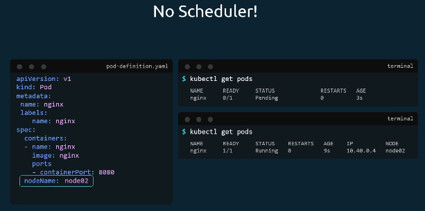
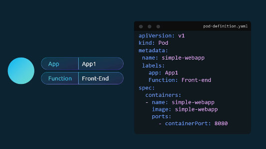
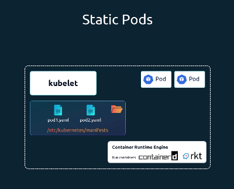
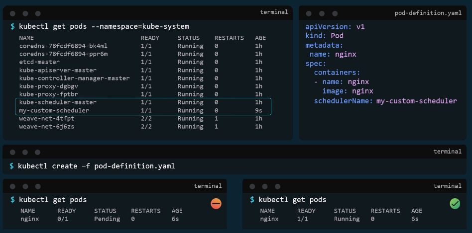
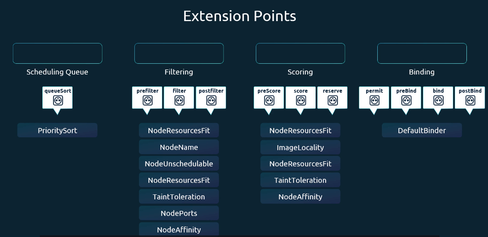
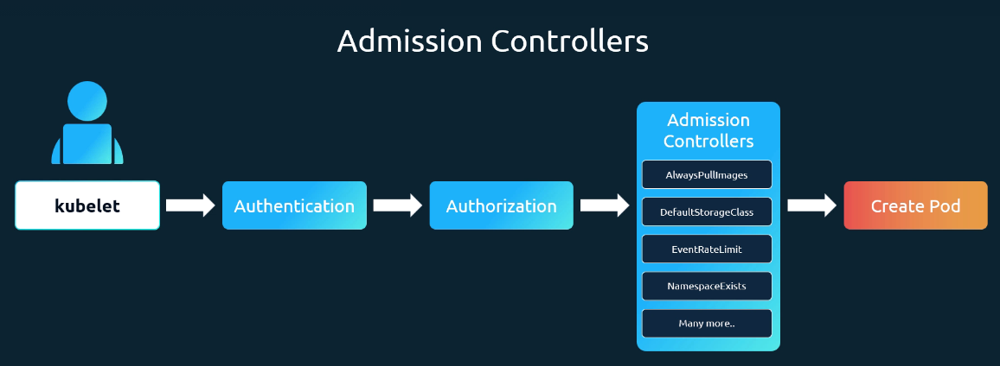

# Scheduling
스케줄러의 행동 방식을 사용자 지정하고 구성하는 다양한 옵션들에 대해 학습
## 1. Manual Scheduling
### 기본 스케줄링 방법  

- 기본 포드 정의 파일에 `nodeName:`(기본 지정 X), K8이 자동 추가
- 스케줄링 후보 :  속성 설정되어 있지 않는 파드
- 스케줄링 알고리즘에 따른 적합한 노드 식별 → 바인딩 오브젝트 생성 → `nodeName:`설정 → 노드에 파드 스케줄링
- 스케줄러가 없다면 파드는 보류 상태 → 수동으로 파드 할당 가능
### 수동 스케줄링 방법
  

1. 파드 생성시 `nodeName`를 지정하고 싶은 노드 이름으로 설정 (생성 시에만 지정 가능)


2. 바인딩 오브젝트 생성 → 파드 바인등 API로 포스트 요청 == 스케줄러의 작업 모방
   - `nodeName`으로 대상 노드 지정 → 바인딩 오브젝트의 데이터 세트가 JSON 형식으로 포함된 포스트 요청을 포드 바인딩 API로 전송
   - YAML 파일을 JSON 형식으로 변환 필요

## 2. Labels & Selectors
- 각 개체들을 그룹화하고 선택 가능 → 다양한 범주별로 여러 개체를 필터링하고 볼 수 있게 함


- `metadata:`의 `labels`에서 레이블 추가
- ```kubectl get pods --selector app=App1``` → 검색 가능
  
### + Taints(오염) and Tolerations(허용)
- 노드에서 스케줄할 수 있는 파드에 대한 제한을 설정하는데 사용
  → 노드의 taint와 맞는 toleration을 가진 pod가 해당 노드로 들어가지 않을 수도 있음

- Node1의 `Taint → Blue`면 `Tolerations → Blue`인 파드만 배치 가능
  
#### Taint → Node 적용
```bash
// 기본 틀
kubectl taint node node-name key=value:taint-effect

// 예시
kubectl taint nodes app=myapp:NoSchedule

- NoSchedule : 해당 노드에 파드 배치 X
- PreferNoSchedule : 해당 노드에 파드 배치(보장) X 
- NoExecute : 해당 노드에 새 파드 배치 X, 기존 파드도 toleration 확인 후 퇴출
```
#### Toleration → Pod 적용
```bash
apiVersion: v1
kind: Pod
metadate: 
  name: myapp-pod
  spec:
    containers:
    - name: nginx-container
      image: nginx
    // 이 부분
    tolerations:
      - key: "app"
        operator: "Equal"
        value: "blue"
        effect: "NoSchedule"
```
#### + Master Node
- K8 클러스터 처음 설정 시 마스터 노드에 텐트 자동 설정 → 파드 스케줄링 X
```bash
// 다음 명령어 통해서 확인 가능
kubectl describe node kubemaster | grep Taint
```

### + 최적 Node 탐색
- 최적의 효율로 워크로드를 적절한 노드에 할당할 수 있게 하는 방법
    1. Node selector 이용 (간단 요구사항)
    2. Node Affinity, Anti-Affinitiy 이용 (복잡 요구사항)

#### Node Selectors
```bash
apiVersion:
kind Pod
metadata:
  name: myApp-pod
spec:
  containers:
  - name: data-processor
    image: data-processor
  // 이 부분 → pod에 레이블
  nodeSelector:
    size: Large
```
- `size: Large` : key-value 쌍으로 노드에 할당된 레이블 → 스케줄러가 레이블을 사용해 파드 배치할 올바른 노드 식별/매칭
```bash
→ node에 레이블 
// 기본 틀
kubectl label nodes <node-name> <label-key>=<label-value>

// 예시
kubectl label nodes node-1 size=Large
```
- 위와 같이 노드에 레이블을 해주고 `nodeSelector:`에 레이블 지정한 파드를 생성하게 되면 자동으로 해당 노드에 파드가 배치
#### Node Affinity
- 보다 복잡한 요구 사항을 수행하기 위해 사용
- 특정 노드에 파드 호스팅
```bash
apiVersion:
kind: Pod
metadata:
  name: myapp-pod
spec:
  containers:
  - name: data-processsor
    image: data-processor
  // 이 부분
  affinity:
    nodeAffinity:
      requiredDuringSchedulingIgnoredDuringExecution:
        nodeSelectorTerms:
        - matchExpressions:
          - key: size
            operator: In/NotOn/Exists...
            values:
            - Small
            - medium..
```
- Node Affinity Types
- Available
  - `requiredDuringSchedulingIgnoredDuringExecution`
  - `preferredDuringSchedulingIgnoredDuringExecution`
- Planned
  - `reauiredDuringSchedulingRequiredDuringExecution`
  
- DuringScheduling → 처음 생성된 상태
  - Required : 지정된 선호도 규칙있는 곳에 지정. 없으면 해당 파드 예약 X
  - Preferred : 포드 배치보다 워크로드 실행이 더 중요할 떄, 적절한 노드를 찾아보지만 없다면, 선호도 규칙을 무시하고 사용 가능한 모든 노드에 파드 배치
- DuringExecution → 노드 선호도에 영향을 미치는 환경이 변경되는 경우
  - Ignored : 환경이 바뀌더라도 파드는 계속 실행. 선호도 변경 사항은 예약이 된 후에는 영향을 미치지 X

### + Node Affinity vs Taints and Tolerations
- Taints and Tolerations만 이용하면 아예 다른 node로 파드 배치 가능
- Node Affinity만 사용 시 해당 노드에 다른 파드 배치 가능
→ 따라서 두 가지 방법을 같이 사용해야 함

## 3. Resource Limits
- 스케줄러는 pod와 node의 리소스를 고려하여 배치
### CPU
 

> - 가장 이상적인 경우 → 4번 : Requests/No Limits
> - requests와 limits가 다 있는 경우에는 2번 파드가 실사용하지 않는 리소스를 1번에 할당하고 싶어도 그렇게 하지 못함 → 3번

- 리소스 limits를 걸고 싶으면 모든 파드가 설정되어 있는지 확인 해야함 → 다른 파드와 노드의 리소스에 영향을 미칠 수 있기 때문
### Memory
 
> requests, no limits인 경우 2번 파드가 더 많은 메모리를 요청하는 경우 해당 파드를 죽이고 메모리 확보

```bash
apiVersion: v1
kind: Pod
metadata:
  name: simple-webapp-color
  labels:
    name: simple-webapp-color
spec:
  container:
  - name: simple-webapp-color
    image: simple-webapp-color
    ports:
      - containerPort: 8080
    // 이 부분 
    resources:
      requests:
        memory: "4Gi"
        cpu: 2
      limits:
        memory: "2Gi"
        cpu: 2
```
- 1 CPU == 1 AWS vCPU, 1 GCP Core, 1 Azure Core, 1 Hyperthread → 1m~ 설정 가능
- 1 G(Gigabyte) = 1,000,000,000 bytes / 1 Gi(Gibibyte) = 1,073,741,824 bytes
- 컨테이너는 limits보다 많은 CPU 사용 X, memory는 사용 O
  - 파드가 더 많은 메모리 사용을 지속적으로 시도 → 파드 종료 → Out df Memory(OOM)
### + LimitRange
```bash
apiVersion: v1
kind: LimitRange
metedata:
  name: cpu-resource-constraint
spec:
  limits:
  - default:
      cpu: 500m
    defaultRequest:
      cpu: 500m
    max:
      cpu: "1"
    min:
      cpu: 100m
    type: Container
```
- K8은 requests나 limits이 자동 설정 X → 기본 값 확인 → limitrange 확인
- namespace 수준에서 적용 가능
- 이 limit는 파드 생성때 적용.
  - limitrange 생성, 변경해도 기존 파드에는 영향 X, 최신 파드에는 영향 O
### + ResourceQuota
```bash
apiVersion: v1
kind: ResourceQuota
metadata:
  name: my-resource-quota
apec:
  hard:
    requests.cpu: 4
    requests.memory: 4Gi
    limits.cpu: 10
    limits.memory: 10Gi
```
- K8 클러스터에 배포된 애플리케이션이 사용하는 총 리소스양 제한 방법 → ResourceQuota
  - namespace 수준에서 할당량 설정 가능

## 4. Daemon Sets
- 클러스터의 모든 노드에 항상 하나의 파드 사본이 있게 함 → 노드의 생성/삭제에 따라서 파드도 생성/삭제
-  e.g. kube-proxy, 모든 노드에 모니터링 에이전트/로그 수집기를 배포, calico(네트워킹 솔루션)
```bash
apiVersion: apps/v1
kind: DaemonSet
metedata:
  name: monitoring-daemon
spec:
  selector:
    matchLabels:
      app: monitoring-agent
  template:
    metadata:
      labels:
        app: monitoring-agent
    spec:
     containers:
     - name: monitoring-agent
       image: monitoring-agent
```
## + Static Pods
 
- apiserver나 K8의 다른 구성 요소의 개입 없이 Kubelet이 자체적으로 생성하는 파드
- 다른 구성 요소가 없더라도 지정된 디렉토리(mainifests)에 yaml 파일을 넣어서 pod 생성 가능
- yaml 파일을 지정 디렉토리에 넣어서 생성할 수 있는 건 오직 파드만! → replicasets, deployment, service는 안됨
```bash
ExecStart=/usr/local/bin/kubelet
  // 정적 파드 경로 확인 가능
  --pod-manifest-path=/etc/kubernetes/manifests
  or
  --config=kubeconfig.yaml

staticPodPath: /etc/kubernetes/manifests
```
- ```docker ps``` : 생성된 정적 파드 확인 → kubectl 명령어 X
- 정적 파드와 apiserver 통해서 만든 파드 2개가 동시에 만들어 질 수 있음 → master 노드에서 ```kube control get pods``` 명령어 실행 → 정적 파드가 다른 파드가 됨

- 정적 파드는 controlplane에 종속적이지 않음 → controlplane의 구성요소를 노드의 파드로 배포
- 마스터 노드에 다양한 제어 관련 요소를 Docker 이미지를 사용하여 yaml파일 생성 → 파일을 매니페스트 폴더에 배치 → kubelet이 구성 요소를 클러스터에 파드로 배포 → 이후에 kubelet이 자동으로 다시 시작
  - controlplane 구성요소가 파드로 표시되는 이유

| Static pods                     | DaemonSets                 |
| ------------------------------- | -------------------------- |
| Kubelet이 생성                  | kube-apiserver가 생성      |
| control plane의 구성요소의 배포 | 각 노드들의 모니터링 agent |
| kube-scheduler가 무시함         | kube-scheduler가 무시함    |

## + Priority Classes
 
- 우선 순위에 따라서 워크로드가 일정을 잡을 수 있는 방법
- 네임스페이스가 없는 객체. 특정 네임스페이스에 연결 X
- max 약 10억 ~ min 약 -2억 → 숫자가 클 수록 높은 우선 순위
- K8 components(system)은 max 약 20억까지
- 우선 순위가 높은 파드가 스케줄링이 불가능 → 우선 순위가 낮은 워크로드 종료 → 다시 스케줄링
```bash
// 현재 우선 순위 확인
kubectl get priorityclass
```
 
```bash
apiVersion: scheduling.k8s.io/v1
kind: PriorityClass
metadata:
  name: high-priority
value: 1000000000
description: "Priority class for mission critical pods"
// true 설정시  priorityClassName 설정 안했던 파드에 적용 가능
globalDefault: true
// PreemptLowerPriority → 우선 순위 낮은 작업들 kill
// never → 리소스 확보될 때까지 대기
preemptionPolicy : PreemptLowerPriority / never
```
- 위와 같이 우선순위 클래스 만들고 해당 파드 등의 ```priorityClassName```에 연결해야함

## 5. Multiple Schedulers
- 여러 스케줄러를 동시 사용
```bash
// yaml 파일
apiVersion: kubescheduler.config.k8s.io/v1
kind: KubeSchedulerConfiguration
profiles:
// or 지정 이름 설정
- schedulerName: default-scheduler
leaderElection:
  leaderElection: true
  resourceNamespqce: kube-system
  resourceName: lock-dbject-my-scheduler
```
- 동일한 스케줄러의 여러 복사본이 서로 다른 노드에서 실행중이라면 한번에 한번만 활성화 → leaderElection
- 해당 스케줄러의 yaml 파일을 pod의 yaml 파일을 command 부분에 연결 시켜야 함 → 스케줄러가 실행
- ```kubectl get pods --namespace=kube-system``` : 사용자 정의 스케줄러 실행 확인 가능

 
- 해당 스케줄러로 연결할 파드의 yaml 파일에 또 다시 연결해야 함 → ```schedulerName```
- ```kubectl get events -o wide``` : 현재 네임스페이스의 모든 이벤트 나열 → 확인 가능
- ```kubectl logs [스케줄러 이름] --namespace=kube-system``` : 스케줄러의 로그 확인 가능
## + Scheduler Profiles
[스케줄링 순서에 따른 Plugins]
1. Scheduling Queue : 우선 순위에 따라서 파드 순서 배치
   - PrioritySort : 우선순위 정렬
2. Filtering : 리소스에 따라 배치 할 수 없는 노드 필터링
   - NodePesourcesFit : 요구 리소스에 맞지 않으면 필터링
   - NodeName : 노드 네임 불일치시 필터링
   - NodeUnschesulable : 노드에 unschedulable:true시 필터링
3. Scoring : 파드 할당 후 노드에 남는 리소스에 따라서 채점 (여기서부터는 거부X)
   - NodeResourcesFit : 할당 후 사용 가능한 리소스 기반으로 채점
   - ImageLocality : 파드가 사용하는 이미지가 이미 있는 노드에 높은 점수 부여
4. Binding : 가장 높은 점수를 받는 노드에 파드 바인딩
   - DefaultBinder : 바인딩 메커니즘 제공하는 기본 바인더
### Extension Points

- 위와 같은 4가지 포인트 외에도 많은 확장 포인트들이 있음
  - 여러 포인트들에서, 혹은 걸쳐진 포인트에서 많은 플러그인들 사용 가능
### Mult Scheduler Profiles

## NEW. Admission Controllers
- API Server로 들어오는 요청을 최종적으로 검증/변형하는 단계
- 요청을 저장하기 전에 검증하거나(Validating), 수정하는(Mutating) 정책 엔진
  - 두 가지 종류가 있음 → validation controller, mutating controller
```ruby
kubectl / kubelet
   ↓
Authentication (너 누구야?)
   ↓
Authorization (너 이거 할 권한 있어?) / RBAC
   ↓
Admission Controllers (이 요청, 정책상 OK야?) / kube-apiserver
   ↓
etcd 저장 → Pod 생성
```
- apiserver에 요청(kubectl) 도달 → 인증 프로세스(인증서(kube config 파일) 통해)/사용자 식별, 유효 확인 → 승인 프로세스/작업 수행 권한 확인
```bash
// RBAC(역할 기반 엑세스 제어)를 통한 권한 부여
apiVersion: rbac.authorization.k8s.io/v1
kind: Role
metadata:
  name: developer
rules:
- apiGroups: [""]
  resources: ["pods"]
  // 이 중에 해당 되는게 있으면 요청 허용
  verbs: ["list", "get", "create", "update", "delete"]
```
- RBAC은 “누가 무엇을 할 수 있는지” 결정, Admission Controller는 “그 요청의 내용이 정책에 맞는지”를 판단
- 'admission controllers' 사용 이유 : 기존의 RBAC가 할 수 없는 사항이 있음


- AlwaysPullImages : 모든 Pod가 image를 항상 pull
- DefaultStorageClass : PVC에 storageClass 안 쓰면 자동 지정
- NamespaceExists : 존재하지 않는 namespace에 리소스 생성 불가

```bash
// 활성화된 admission controller 목록 보기
kube-apiserver -h | grep enable-admission-plugins
```
- 새 어드미션 컨트롤러 추가 → kube API server service에서 활성화 어드미션 플러그인 플래그 업데이트
```bash
// kubeAPIserver.service
--enable-admission-plugins=[플러그인 이름]
--disable-admission-plugins=[플러그인 이름]
```

## NEW. Validating and Mutating
- RBAC으로 제어할 수 없는 요청 내용(spec) 을 처리
> [일반적인 순서]
> 1. mutating admission controllers : 요청 변경 가능, YAML에 없는 필드를 자동으로 추가/변경
> 2. validating admission controllers : 유효성 검사해서 허용/거부 → 수정 불가능

| 구분    | Mutating            | Validating         |
| ----- | ------------------- | ------------------ |
| 요청 수정 | 가능                  | 불가능                |
| 실행 순서 | 먼저                  | 나중                 |
| 목적    | 기본값/정책 자동 적용        | 정책 위반 차단           |
| 대표 예  | DefaultStorageClass,  | NamespaceExists |

### Webhook
- Kubernetes API Server가 “외부 서버에게 판단을 위임”하기 위해 호출하는 HTTP API
  - admission controller의 정적 플러그인으로는 불가능한 판단을 위해 사용
  - 내가 원하는 로직을 코드로 작성, 외부 서버에서 자유롭게 판단, Kubernetes는 결과만 신뢰
- admission controller의 확장판, 같은 순서에서 진행
1. 자체 webhook 서버 배포
   - 변경 및 유효성 검사 API를 수락, 웹 서버가 예상하는 JSON 객체로 응답해야함
   - admission webhook server는 요청을 허용/거부하는 로직이나 코드를 포함/배포 서버.
   - 해당 웹훅이 기대하는 적절한 응답을 수신/응답 가능해야 함
2. webhook server hosting
   - 서버로 실행, K8 클러스터 자체에서 배포
   - → 자체 배포시에는 'webhook-service'필요
3. 서비스 연결, 요청 검사/변경 하도록 클러스터 구성
```bash
apiVersion: admissionregistration.k8s.io/v1
kind: ValidatingWebhookConfiguration
metadata:
  name: "pod-policy.example.com"
webhooks:
- name: "pod-policy.example.com"
  // 이 부분
  clientConfig:
    // 외부 서버라면
    url: [link]
    //or K8 클러스터 자체 배포라면
    service:
      namespace: "webhook-namespace"
      name: "webhook-service"
    caBundle: "Ci0tLS0tQk....tLS0K"
  rules:
  - apiGroups: [""]
    apiVersions: ["v1"]
    operations: ["CREATE"]
    resources: ["pods"]
    scope: "Namespaced"

```

## 6. Scheduler Events

---
## 실습 명령어
| 구분            | kubectl run | kubectl create |
| ------------- | ----------- | -------------- |
| 주 용도          | Pod 빠른 생성   | 모든 리소스 생성      |
| 기본 리소스        | Pod         | 지정한 타입         |
| YAML 자동 생성    | ⭐⭐⭐⭐        | ⭐⭐⭐            |
| command 지정    | 매우 편함       | 제한적            |
| Static Pod용   | ✅ 최고        | ❌ 부적합          |
| PriorityClass | ❌           | ✅ 필수           |

- apply replace 차이

### Manual Scheduling
- `kubectl get pods --namespace kube-system` : 스케줄러 확인
- `kubectl replace --force -f nginx.yaml` : 삭제 후, 재생성까지
### Lebels ans Selectors
- `kubectl get pods --selector app=App1` : 검색
- `kubectl get pods --selector env=prod,bu=finance,tier=frontend` : 다중 조건 검색
- replicaset yaml
  ```bash
  apiVersion: apps/v1
  kind: ReplicaSet
  metadata:
    name: replicaset-1
  spec:
    replicas: 2
    selector:
        matchLabels:
          tier: front-end
    template:
      metadata:
        labels:
          tier: front-end
      spec:
        containers:
        - name: nginx
          image: nginx
  ```
### Taints and Tolerations
- `kubectl run bee --image=nginx --dry-run=client -o yaml > bee.yaml` : 
- `kubectl get pods -o wide` : 파드가 어느 노드에 배치됐는지 확인
- `kubectl taint node [node이름] [taint이름]-` : node의 taint 제거
### Node Affinity
- 아돈노 Q8.
### Resource Limits
- ```kubectl edit pod [pod이름]``` : 이 명령어로 파드 resource limits 수정 불가능
  -  수정 시 임시 파일 생성 → 파일 경로 확인 → vi 편집기 확인 → 적용 되어 있음
  -  ```kubectl replace --force -f [파일명]``` : 삭제 후 재생성
### Daemon Sets
- ```kubectl describe daemonset kube-proxy --namespace=kube-system``` : daemonset 상세 설명 볼 때 항상 namespace 지정해줘야 함
  - ```kube-system```에 있는 요소 확인 시에는 항상 namespace 지정
- daemonset의 yaml파일 구조는 deployment와 구조가 흡사 → deployment로 생성 후, 수정이 쉬움
  ```bash
  // deployment로 생성
  kubectl create deployment [name] -n kube-system --image=[image_name] --dry-run=client -o yaml > [yaml_name].yaml

  // vi 편집기 이용
  vi [yaml_name].yaml

  // 편집 내용
  replicas, strategy, status 삭제
  ```
### Static Pods
- ```kubectl get pods --all-namespaces``` == ```kubectl get pods --A```
  - pod이름 뒤에 -<Node-Name> 있으면 static pod
  - or 상세 설명에서 ```ownerReferences``` 확인
- Static Pod 경로 : kubelet 설정에 정의
  1. kubelet 설정 파일 경로 찾기
     - ```ps aux | grep kubelet``` : 현재 실행 중인 모든 프로세스 중에서 kubelet이 포함된 프로세스 보여줘
     - ```--config=...kubelet/config.yaml``` : 경로 찾기
  2. kubelet config 파일 열기
     - ```less [파일 경로]``` : 보기 전용
     - ```cat [파일 경로]``` : 전체 보기
  3. staticPodPath 항목 찾기
      - less로 보는 경우 ```/staticPodPath``` 찾기 가능
      - 대표적인 경로 ```/etc/kubernetes/manifests```
- 폴더 확인 : ```ls /etc/kubernetes/manifests```
- Q10,,,,,,
### Priority Classes
- yaml 파일 사용하여 생성하는 2가지 방법
  1. ```vi [yaml_name].yaml```으로 생성 및 작성 → ```apply```
  2. 여러 조건 걸어서 ```--dry-run=client -o yaml > [yaml_name].yaml``` → ```vi [yaml_name].yaml``` → ```apply```
- ```kubectl get pods -o custom-columns="NAME:.metadata.name,PRIORITY:.spec.priorityClassName"```
- 단일 Pod에 대한 YAML파일이 없고, 파드는 있는 경우 (priority 수정 필요)
  1. ```kubectl get pod critical-app -o yaml > critical-app.yaml``` : yaml export
  2. 불필요한 필드 제거 → ```metadata.resourceVersion:```, ```metadata.uid:```, ```metadata.creationTimestamp:```, ```metadata.managedFields:```, ```status:``` (통째로 삭제)
  3. ```priorityClassName``` 수정
  4. ```delete/apply``` 또는 ```replace```
- 위 방법을 제일 빠르게 하는 방법
  ```bash
  kubectl delete pod critical-app
  kubectl run critical-app --image=nginx --dry-run=client -o yaml > critical-app.yaml
  // priorityClassName만 추가
  kubectl apply -f critical-app.yaml
  ```
### Multiple Schedulers
- ConfigMap 생성
```bash
kubectl create configmap my-scheduler-config --from-file=/root/my-scheduler-config.yaml
```