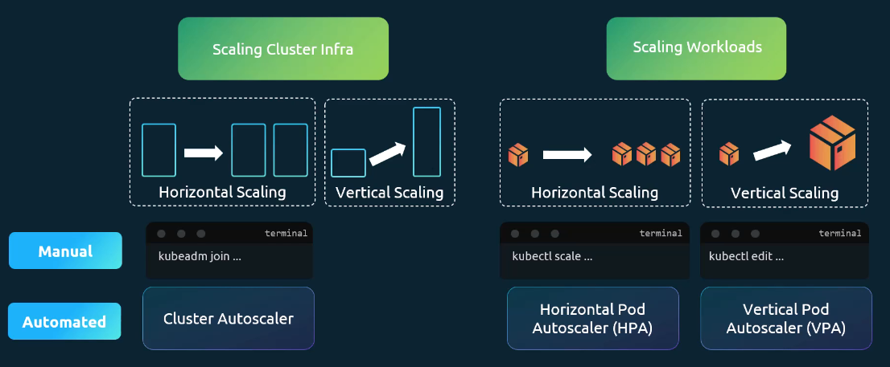

# Logging & Monitoring
## 1. Monitoring Cluster Components
- 모니터링 할 수 있는 것
  - 노드 수준 : 클러스터의 노드 수, 정상 노드 수
  - 성능 메트릭 : CPU, 메모리, 네트워크, 디스크 사용률
  - 파드 수준 메트릭 : 파드의 수, 각 파드의 CPU 및 메모리 사용량
- 모니터링 솔루션 : Metrics Server
  - K8 클러스터 하나당 metrics server 1개
  - 인메모리 모니터링 솔루션 → 디스크에 메모리를 저장하지 X (과거 실적 데이터를 볼 수 X)
- Kubelet의 C 어드바이저가 파드의 성능 메트릭 검색 → kubelet api를 통해 메트릭 서버에 노출
```bash
// metrics server 가져오기
git clone [metircs server url]

// 메트릭 활성화를 위해 포드, 서비스 및 역할 집합 배포 → 서버를 사용해서 클러스터이 노드에서 성능 메트릭 폴링
kubectl create -f deploy/1.8+/

// 클러스터의 성능 확인 가능
kubectl top node
```
## 2. Application Logs
```bash
// docker의 실시간 로그 추적 가능
docker logs -f ecf
```
```bash
kubectl logs -f event-simulator-pod event-simulator
```
# Application Lifecycle Management

## 1. Rolling Updates and Rollbacks in Deployments

- 처음 배포할 때 롤 아웃이 트리거 → 새 롤아웃은 새 replicaset 생성 → 새 배포 리비전이 만들어짐 → 배포에 대한 변경 사항 추적 가능
```bash
// 롤아웃 상태 확인 가능
kubectl rollout status deployment/myapp-deployemnt
// 히스토리 확인
kubectl rollout history deployment/myapp-deployment
```
- Rolling Update : 기본 배포 업데이트 전략
  - 컨테이너를 하나씩 내리고 올려서 업데이트 함
- Rollbacks : 업데이트를 되돌리고 싶을 때 사용 가능
  ```bash
  kubectl rollout undo deployment myapp-deployment
  ```
## 2. Configure Application

### Congigure Environment Variables in App

- env는 배열로 인식. key-value 형식으로 환경 변수 지정   
<br>  
- 환경 변수를 설정하는 방법
1. Plain Key Value
2. ConfigMap
3. Secrets     
<br>
  
- ConfigMap : 파드에 app 환경 변수로 key-value 주입
1. configmap 생성
   1. imperative
      `kubectl create configmap <config-name> --from-literal=<key>=<value>...`
      `kubectl create configmap <config-name> --from-file=<path-to-file>`
   2. declarative
      `kubectl create -f [name].yaml`
2. pod에 주입
   - pod yaml의 `configMapRef: name:config-name>`

- Secret
1. Secrets 생성
   1. imperative
      `kubectl create secret generic <secret-name> --from-literal=<key>=<value>...`
      `kubectl create secret generic <secret-name> --from-file=<path-to-file>`
   2. declarative
      `kubectl create -f [name].yaml`
      - 이 yaml파일에서 중요 내용은 인코딩 형식으로 작성
2. pod에 주입
   - pod yaml의 `secretRef: name:<secret-name>`
```bash
// encode
echo -n '[문자열]' | base64
// decode
echo -n '[문자열]' | base64 --decode
```
## 3. Multi Container Pods
- 하나의 pod에 여러개의 containers   
<br>
- 동일한 라이프사이클 공유 (APP인스턴스+웹서버) → 함께 생성/소멸
- 동일한 네트워크 공간 공유 → 서로가 로컬 호스트
- 동일한 스토리지 볼륨에 엑세스 가능   
→ 멀티 컨테이너 파드에 넣는다.
```bash
apiVersion: v1
kind: Pod
metadata:
  name: simple-webapp
  labels:
    name: simple-webapp
spec:
   // container 1
  containers:
  - name: web-app
    image: web-app
    ports:
      - containerPort: 8080
   // Container 2
  - name: main-app
    image: main-app
```
- `spec:` 아래의 컨테이너의 `name:`들은 배열. 여러개의 컨테이너에 사용할 수 있음.
### Multi Container Pods Design Patterns
디자인 패턴은 3가지
[사진 넣기]
1. `Co-located Containers` : 두 컨테이너가 전체 파드 수명 주기 동안 계속 실행
2. `Regular Init Containers` : 매인 APP 실행 전 초기화 컨테이너 먼저 실행. 종료되면 매인 APP 실행
3. `Sidecar Containers` : 매인 APP 실행 전 사이드카 컨테이너 먼저 실행. 주 앱과 같이 수명 주기 동안 계속 실행

```bash
// Regular Init Containers
spec:
  containers:
  - name: web-app
    image: web-app
    ports:
      - containerPort: 8080
  // 초기화 컨테이너 지정 지점. 여러개가 순차적 진행 가능
  initContainers:
  - name: main-app
    image: main-app
    command: 'wait-for-db-to-start.sh'
  - name: api-checker
    image: busybox
    command: 'wait-for-another-api.sh'
```
```bash
// Sidecar Containers
spec:
  containers:
  - name: web-app
    image: web-app
    ports:
      - containerPort: 8080
  // 초기화 컨테이너 설정으로 미리 실행
  initContainers:
  - name: main-app
    image: main-app
    command: 'wait-for-db-to-start.sh'
    // 재시작 정책이 '항상'이라 종료되지 않고 계속 실행
    restartPolicy: Always
```

## 4. Self-Healing Application
- ReplicaSet과 Replication Controller를 통해 자체 복구 기능 갖춘 App 지원
- Replication Controller가 pod 내의 app이 충돌할 때 pod 자동 생성하게 도와줌

## 5. Autoscaling
Vertical Scaling : 가진 리소스의 양을 수직적으로 늘림
→ 서버 잠시 종료 후, 리소스 늘리고 다시 실행
Horizontal Scaling: 서버를 추가하여 서버간의 부하를 공유
→ 서버를 종료하지 않아도 됨


Scaling Cluster Infra : 기본 클러스터 자체를 확장
   - 수직 : 클러스터의 기존 노드의 리소스 늘리기
   - 수평 : 클러스터에 노드 추가

Scaling Workloads : 클러스터에 컨테이너나 파드를 추가/제거하여 워크로드 확장
   - 수직 : 기존 파드의 리소스를 늘리기
   - 수평 : 파드 더 생성


→ __Cluster Autoscaler, HPA, VPA__

### HPA (Horizontal Pod Autoscaling)
```bash
// manual한 scale 방식
kubectl scale deployment my-app --replicas=3
→ 수시로 모니터링 해야함. 빠른 대응이 어려움.
```
그래서 HPA를 사용
- observes metrics : `top` command 사용해서 모니터링
- Adds pods : 배포셋, 레플리카셋을 사용해 파드 수를 늘리거나 줄임
- Balances thresholds : 리소스 사용량에 따라서 경로/파드 설정
- Tracks multiple metircs : 여러 유형 추적 가능
```bash
// cpu 사용량이 50%가 되면 autoscale. min/max 고려
kubectl autoscale deployment [name] --cpu-percent=50 --min=1 --max=10
// hpa 상태 확인
kubectl get hpa
// hpa 삭제
kubectl delete hpa [name]
```
```bash
// 선언적 방법
apiVersion: autoscaling/v2
kind: HorizontalPodAutoscaler
metadata:
  name: my-app-hpa
spec:
  scaleTargetRef:
    apiVersion: apps/v1
    kind: Deployment
    name: my-app
   minReplicas: 1
   maxReplicas: 10
   metircs:
     - type: Resource
       resource:
         name: cpu
         target:
           type: Utilization
           averageUtilization: 50
```
### VPA (Vertical Pod Autoscaling)

#### + In-Place Pod Resizing (베타)
파드를 scale하고 재시작하지 않더라도 적용되게 하는 방법
```bash
// 아직 임시 기능이라 해당 명령어로 명시적으로 켜줘야함
FEATURE_GATES=InPlacePodVerticalScaling=true
```
```bash
spec:
  containers:
    - name: my-app
      image: nginx
      // 이 부분
      resizePolicy:
      - resourceName: cpu
        restartPolicy: NotRequired
      - resourceName: memory
        restartPolicy : RestartContainer
      resource:
        requests:
          cpu: "1"
          memory: "256Mi"
        limits:
         cpu: "500m"
         memory: "512Mi"
```
  [한계]
- CPU, memory의 scale에만 적용 가능
- pod Qos class에는 적용 불가능
- init,Ephemeral 컨테이너에는 적용 불가능
- request, limits는 한번 설정하면 변경 불가능
- 메모리의 현재 사용량 이하로 limits 설정 불가능
- window pod resize 불가능

manually 수직 스케일링하는방법
- `kubectl top pod [name]` : 상태 확인
- `kubectl edit deployment my-app` : requests, limits 원하는 정도로 설정
- 기존 파드 죽고 새 파드 생성
→ 바람직하지 않음.

그래서 VPA 사용
- Observe metrics
- Adds pod resources
- Balance thresholds
```bash
// VPA는 기본 제공X. 따로 불러와서 사용
kubectl apply -f [url.yaml]
// VPA를 검색. 여러 컴포넌트 배포를 확인 가능
kubectl get pods -n kube-system | grep vpa
```
VPA를 구성하는 요소
- **VPA Recommender** : metrics server를 통해 확인한 내용 기반으로 리소스양 추천
- **VPA Updater** : 최적의 리소스로 실행중이지 않은 파드를 감지. recommender로 부터 추천 가져와서 업데이트 필요하면 파드 내보냄. 파드종료.
- **VPA Admission Controller** : recommender의 권장 사항을 적용하여 파드 사양 변경 후 생성
  - 파드가 죽으면 배포가 자동으로 파드 다시 생성하기 때문에 어드미션 컨트롤러가 개입해서 바꿔주는 것이 좋음
```bash
// VPA
apiVersion: autoscaling.k8s.io/v1
kind: VerticalPodAutoscaler
metadata:
  name: my-app-vpa
spec:
  targetRef:
    apiVersion: apps/v1
    kind: Deployment
    name: my-app
  // 정책 설정
  updatePolicy:
    updateMode: "Auto"
  resourcePolicy:
    containerPolicies:
      - containerName: "my-app"
        minAllowed:
          cpu: "250m"
        maxAllowed:
          cpu: "2"
        controlledResources: ["cpu"]
```
updatePolicy: updateMode: 종류
- Off : recommender만 동작
- Initial : 초기 생성에만 설정 사항 적용
- Recreate : 설정 범위 이상을 사용하면 파드 퇴출
- Auto : 현재는 recreate과 같은 동작. in-place resize를 사용한다는 전제에서는 파드를 죽이지 않고 설정 사항 적용 가능
```bash
// VPA 권장 사항 확인
kubectl describe vpa [name]
```
**Key Differences: VPA vs HPA**
| Feature                 | VPA (Vertical Pod Autoscaler)                             | HPA (Horizontal Pod Autoscaler)      |
| ----------------------- | --------------------------------------------------------- | ------------------------------------ |
| Scaling Method          | 기존 Pod의 **CPU / Memory 요청량(requests & limits)**을 증가 또는 감소 | 부하에 따라 **Pod 개수를 자동으로 증가/감소**        |
| Pod Behavior            | 새로운 리소스 값 적용을 위해 **Pod 재시작 발생**                           | 기존 Pod는 유지되며 **새 Pod를 추가/제거**        |
| Handles Traffic Spikes? | ❌ 불가<br>Pod 재시작이 필요하여 즉각 대응 어려움                           | ✅ 가능<br>즉시 Pod를 추가하여 트래픽 대응          |
| Optimizes Costs?        | ✅ CPU/Memory **과도한 프로비저닝 방지**                             | ✅ 불필요한 **Idle Pod 제거**               |
| Best For                | **상태 저장(Stateful) 워크로드**, CPU/메모리 집약적 애플리케이션. 리소스를 일시적으로 다르게 써야할 때 좋음              | **웹 애플리케이션**등 트래픽 변동을 처리하기 위해 빠른 확장이 필요한 상태 비 저장 서비스에 이상적 |
| Example Use Cases       | 데이터베이스(MySQL, PostgreSQL), JVM 기반 애플리케이션, AI/ML 워크로드      | 웹 서버(Nginx, API 서비스), 메시지 큐, 마이크로서비스 |

---
# Lab
## + Commands and Arguments in Docker