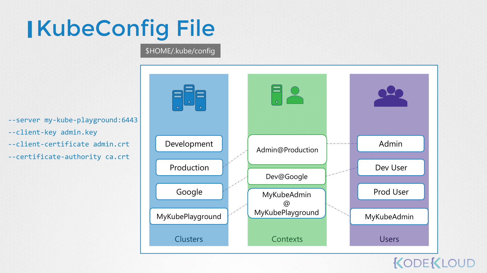

# CKA Security 핵심 정리

아래 내용은 기존 문서(1~4번)를 CKA 목차 기준으로 재구성한 통합 요약이다.

### 1. 여러 가지 인증 방법

쿠버네티스는 자체 사용자 DB가 없으며, 여러 인증/인가 메커니즘을 조합한다.

- **인증(Authentication) 방식**
  - Files - Username & Passwords / Tokens (현재는 deprecated)
  - **Certificates**: 관리자/노드/사용자에 가장 흔히 사용
  - External providers: LDAP, SAML 등
  - **Service Account**: Pod 내부 애플리케이션이 API 서버 접근 시 사용
- **인가(Authorization) 방식**
  - **RBAC**: 표준 인가 방식
  - **ABAC**: 정책 관리가 복잡해 현재는 잘 쓰지 않음
  - **Node Authorization**: 노드(Kubelet) 전용 요청 제한

> 핵심 질문: **누가 접근 가능한가(인증)?** 그리고 **무엇을 할 수 있는가(인가)?**

---

### 2. TLS 인증서

- **TLS가 필요한 이유**
  - 클러스터 내부/외부 통신은 모두 암호화되어야 하며, 특히 `kube-apiserver`는 모든 요청의 관문이다.
- **쿠버네티스 내 주요 TLS 통신 구간**
  - `kube-apiserver` ↔ `etcd`
  - `kube-apiserver` ↔ `kube-controller-manager` / `kube-scheduler`
  - `kube-apiserver` ↔ `kubelet`
  - 사용자(`kubectl`) ↔ `kube-apiserver`

- **CA (Certificate Authority)**
  - 인증서를 서명/검증하는 신뢰 루트
- **CSR (Certificate Signing Request)**
  - 개인키로 만든 인증서 발급 요청서
- **OpenSSL로 인증서 발급하는 이유**
  - 클러스터 내 사용자/컴포넌트 신원을 증명하기 위해 클라이언트/서버 인증서가 필요함

**예시: 사용자 인증서 발급 절차**

```bash
# 1) 개인 키 생성
openssl genrsa -out dev-user.key 2048

# 2) CSR 생성
openssl req -new -key dev-user.key -out dev-user.csr -subj "/CN=dev-user/O=development"

# 3) 클러스터 CA로 서명
openssl x509 -req -in dev-user.csr -CA /etc/kubernetes/pki/ca.crt \
  -CAkey /etc/kubernetes/pki/ca.key -CAcreateserial -out dev-user.crt -days 365
```

- **Root / Client / Server Certificate**
  - Root: CA 자체 인증서
  - Client: 사용자/컴포넌트가 자신을 증명할 때 사용
  - Server: 서버가 자신을 증명할 때 사용
- **Public/Private Key 기반 인증**
  - 개인키로 서명 → 공개키로 검증

---

### 3. Certificate

- **Server Certificate (서버용)**
  - 대표적으로 `kube-apiserver`가 서버 인증서를 사용
- **Client Certificate (클라이언트용)**
  - `kubectl`, `kubelet`, `kube-controller-manager`, `kube-scheduler` 등이 API 서버 접근 시 사용

---

### Cetrificate API

수동 발급 대신, 쿠버네티스 API를 통해 CSR을 제출/승인하는 방식.

```bash
# CSR 제출
kubectl apply -f dev-user-csr.yaml

# CSR 목록 확인
kubectl get csr

# CSR 승인
kubectl certificate approve dev-user-csr
```

**CSR 오브젝트 예시**

```yaml
apiVersion: certificates.k8s.io/v1
kind: CertificateSigningRequest
metadata:
  name: dev-user-csr
spec:
  request: <base64-encoded-csr>
  signerName: kubernetes.io/kube-apiserver-client
  usages:
  - client auth
```

---

### 4. KubeConfig

`kube-apiserver` 접근 정보를 파일로 저장하여 반복 입력을 줄인다.

- **구성 요소**
  - `clusters`: API 서버 주소 + CA 정보
  - `users`: 사용자 인증서/키 정보
  - `contexts`: 어떤 user가 어떤 cluster를 쓸지 묶음

- **관련 명령어**
  - `kubectl config view`
  - `kubectl config use-context <context-name>`
  - `kubectl config get-contexts`



---

### 5. Persistent KV Store

**etcd**는 클러스터의 모든 상태 정보를 저장하는 분산 Key-Value 저장소이다.

- 핵심 원칙: `etcd`와 다른 컴포넌트 간 통신은 **mTLS**로 보호
- 주요 플래그
  - `--cert-file`, `--key-file` (서버 인증서/키)
  - `--client-cert-auth=true`
  - `--trusted-ca-file`
  - `--peer-cert-file`, `--peer-key-file`, `--peer-trusted-ca-file`

**etcd 설정 확인 예시**

```bash
cat /etc/kubernetes/manifests/etcd.yaml
```

---

### 6. Authorization

- **RBAC**
  - `Role`: 네임스페이스 범위 권한
  - `ClusterRole`: 클러스터 전체 권한
  - `RoleBinding`: Role과 사용자/그룹/SA 연결
  - `ClusterRoleBinding`: ClusterRole과 사용자/그룹/SA 연결

- **Service Account**
  - Pod가 API 서버에 접근할 때 사용하는 ID
  - RBAC의 Subject로서 권한 부여 가능

**RBAC 실습 예시**

```bash
kubectl create role dev-role --verb=get,list,watch,create,delete --resource=pods -n development
kubectl create rolebinding dev-group-binding --role=dev-role --group=development -n development
kubectl auth can-i create pods --as dev-user --as-group=development -n development
```

---

### Image Security

1. **신뢰할 수 있는 Base Image 사용**
   - 최소 이미지 사용 (`distroless`, `alpine` 등)
2. **Private Registry 사용**
   - 검증된 이미지 사용 강제
3. **이미지 취약점 스캔**
   - `Trivy`, `Clair`, `Snyk` 등

**Private Registry 사용 예시**

```bash
kubectl create secret docker-registry private-reg-cred \
  --docker-server=<your-registry-server> \
  --docker-username=<your-username> \
  --docker-password=<your-password> \
  --docker-email=<your-email>
```

```yaml
apiVersion: v1
kind: Pod
metadata:
  name: private-pod
spec:
  containers:
  - name: private-container
    image: <your-registry-server>/<your-private-image>:tag
  imagePullSecrets:
  - name: private-reg-cred
```

---

### Network Policy

기본적으로 All Allow인 클러스터에서, 특정 트래픽만 허용하도록 방화벽 규칙을 정의한다.

- 구성 요소
  - `podSelector`
  - `policyTypes`
  - `ingress` / `egress` 규칙

**예시: DB 파드에 대한 Ingress 제한**

```yaml
apiVersion: networking.k8s.io/v1
kind: NetworkPolicy
metadata:
  name: api-allow-to-db
spec:
  podSelector:
    matchLabels:
      role: db
  policyTypes:
  - Ingress
  ingress:
  - from:
    - podSelector:
        matchLabels:
          app: api
    ports:
    - protocol: TCP
      port: 6379
```

> `NetworkPolicy`는 CNI 플러그인(Calico, Cilium, Weave 등)에서 실제로 구현된다.

---

### (2025 Update) CRD_Custom Resource Definition

- **CRD 보안 핵심**
  - 새로운 리소스에 대한 접근 권한을 RBAC으로 명시적으로 제어해야 함

**CRD 예시**

```yaml
apiVersion: apiextensions.k8s.io/v1
kind: CustomResourceDefinition
metadata:
  name: mywebapps.mycompany.com
spec:
  group: mycompany.com
  versions:
    - name: v1
      served: true
      storage: true
      schema:
        openAPIV3Schema:
          type: object
          properties:
            spec:
              type: object
              properties:
                image:
                  type: string
  scope: Namespaced
  names:
    plural: mywebapps
    singular: mywebapp
    kind: MyWebApp
    shortNames:
    - mwa
```

**CRD RBAC 예시**

```yaml
apiVersion: rbac.authorization.k8s.io/v1
kind: Role
metadata:
  namespace: default
  name: mywebapp-admin
rules:
- apiGroups: ["mycompany.com"]
  resources: ["mywebapps"]
  verbs: ["get", "list", "watch", "create", "update", "patch", "delete"]
```

#### Custom Controller

- Operator는 강력한 권한이 필요하므로 **최소 권한 원칙** 적용
- Service Account에 필요한 권한만 부여
- 이미지/보안 컨텍스트/취약점 스캔 등 기본 보안 강화 필수

