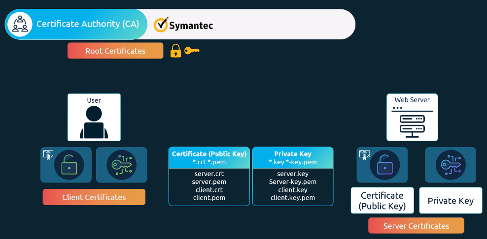
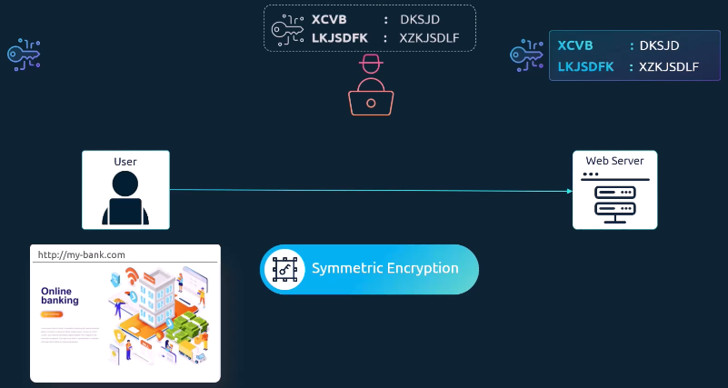
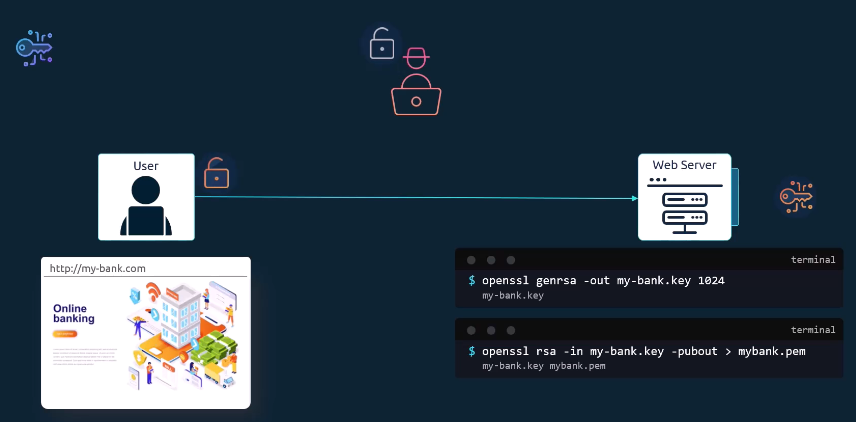
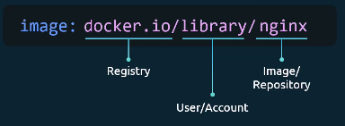
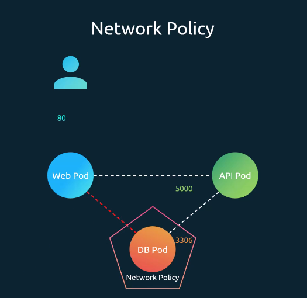
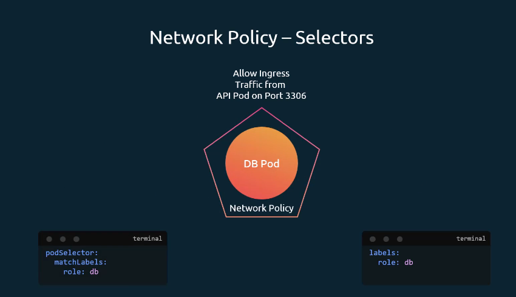
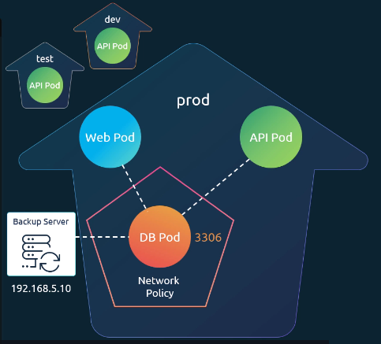
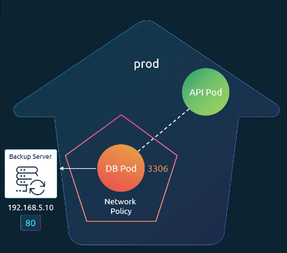
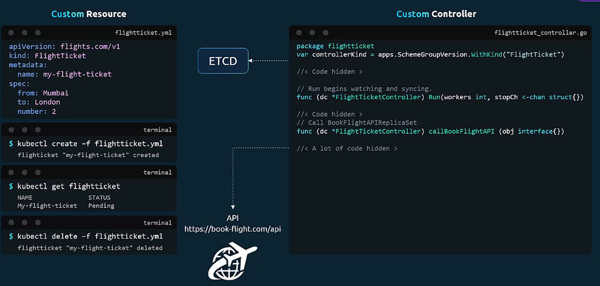
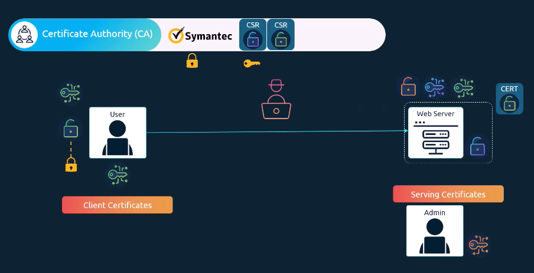

# Security
## 1. Kubernetes Security Primitives
Kubernetes 클러스터를 구성하는 모든 호스트에 대해 다음과 같은 보안 설정이 필요
- 루트(root) 직접 접근 비활성화
- 비밀번호 기반 인증 비활성화
- SSH 키 기반 인증만 허용

인프라 전반보다는 Kubernetes 자체의 보안에 초점

클러스터를 보호하기 위해 다음 질문
1. 어떤 위험(Risk) 이 존재하는가?
2. 이를 방지하기 위해 어떤 보안 조치(Action) 가 필요한가?

kube-apiserver는 모든 작업의 중심, 첫 번째 방어선(First Line of Defense)
1. API 서버에 접근할 수 있는 사용자는 인증 메커니즘(Authentication Mechanism) 으로 정의
2. 사용자가 무엇을 할 수 있는지는 권한 부여 메커니즘이 결정

통신 보안
1. 클러스터 구성 요소 간 통신 보안
   - etcd 클러스터, kube-apiserver, kube-controller-manager, kube-scheduler, 워커 노드의 Kubelet, kube-proxy
2. 파드 간 통신 보안
   - Network Policy를 통해 파드 간 통신을 세밀하게 제어

## A. Authentication : 인증
Kubernetes 클러스터의 인증(Authentication) 에 초점
클러스터에 접근하는 사용자 : 관리자, 개발자, 최종 사용자, Bot
→ Kubernetes 클러스터에 접근하는 사용자(관리자, 개발자) 관점 


모든 사용자 요청은 모두 kube-apiserver를 통해 전달 → API 서버는 요청을 처리하기 전에 반드시 인증(Authentication) 을 수행
kube-apiserver에서 사용할 수 있는 인증 방식
1. 정적 비밀번호 파일, 정적 토큰 파일
2. 인증서 기반 인증
3. LDAP, Kerberos 등 외부 인증 프로토콜 연동

### 1. 정적 인증 방식
- CSV 파일에 사용자 정보를 저장 → 그룹 정보를 추가해 사용자를 특정 그룹에 할당
- 정적 토큰 파일을 사용 → 비밀번호 대신 토큰을 사용 → API 요청 시 Bearer Token으로 전달

용자 이름, 비밀번호, 토큰을 일반 텍스트 파일에 저장하는 방식은 보안상 안전하지 않기 때문에 권장
### 2. 인증서 기반 인증
#### TLS in Kubernetes



## B. Authorization : 권한
권한 : 접근한 사용자가 무엇을 할 수 있는지를 정의

### 권한 부여 메커니즘
권한 부여 메커니즘
1. 노드 권한 부여자(Node Authorizer)
2. 속성 기반 액세스 제어(ABAC)
3. 역할 기반 액세스 제어(RBAC)
4. Webhook 방식
#### 1. 노드 권한 부여자(Node Authorizer)
- 클러스터 내부 통신에 사용
- Kubelet이 노드 권한 부여자에 의해 승인되는 조건 → `system:nodes` 그룹에 속하고 이름에 `system:node` 접두사가 붙어야 하며
- 클러스터 내부 컴포넌트 간 신뢰를 위한 권한 부여 방식
#### 2. 속성 기반 액세스 제어(ABAC)
- 외부 사용자(API 접근)에 대해서는 다른 방식이 사용
- JSON 정책 파일에 “이 사용자는 어떤 리소스에 어떤 동작을 할 수 있는지”를 정의
- 정책을 변경할 때마다 파일을 수정하고 API 서버를 재시작
#### 3. 역할 기반 액세스 제어(RBAC)  
- 역할(Role)에 권한 규칙을 정의한 뒤 사용자를 그 역할에 연결
- 역할만 수정해도 해당 역할에 연결된 모든 사용자에게 즉시 반영
- Kubernetes에서 가장 표준적이고 권장되는 권한 관리 방식
- 네임스페이스 범위 권한
```bash
[Role 정의 예시]
apiVersion: rbac.authorization.k8s.io/v1
kind: Role
metadata:
  name: developer
rules:
- apiGroups: [""] // ""는 core API 그룹을 의미
  resources: ["pods"]
  verbs: ["list", "get", "create", "update", "delete"]
  // 네임스페이스 지정 가능
  resourceNames: ["blue-pod", "red-pod"]
- apiGroups: [""]
  resources: ["configMap"]
  verbs: ["create"]

kubectl create -f [role-definition.yaml]
```
- Role에는 하나 이상의 규칙(rule) 이 포함
- 규칙 구성 요소 : apiGroups, resources, verbs, resourceNames(선택 사항)
```bash
[RoleBinding 정의 예시]
apiVersion: rbac.authorization.k8s.io/v1
kind: RoleBinding
metadata:
  name: devuser-developer-binding
subjects:
- kind: User
  name: dev-user
  apiGroup: rbac.authorization.k8s.io
roleRef:
  kind: Role
  name: developer
  apiGroup: rbac.authorization.k8s.io

kubectl create -f [role-binding.yaml]
```
- RoleBinding 객체는 특정 사용자(또는 그룹, 서비스 계정)를 특정 Role에 매핑

**[조회 및 권한 확인 명령어]**
- `kubectl get roles` : 클러스터 내 역할 목록 조회
- `kubectl get rolebindings` : 클러스터 내 역할 바인딩 목록 조회
```bash
kubectl auth can-i create deployments
// yes

kubectl auth can-i delete nodes
// no

// --as 플래그로 특정 사용자 권한 확인
kubectl auth can-i create deployments --as dev-user
// no

kubectl auth can-i create pods --as dev-user --namespace test
// no
```
관리자는 실제로 해당 사용자로 로그인하지 않아도, --as 옵션을 사용해 다른 사용자를 가장하여 권한을 테스트할 수 있다.
#### 4. Webhook 방식
- 권한 부여를 외부 시스템에 위임
- Kubernetes가 요청 정보를 외부 정책 엔진(예: Open Policy Agent)에 전달하고
그 엔진이 허용/거부 여부를 결정

**Kubernetes에는 기본적으로 다음과 같은 권한 부여 모드**
AlwaysAllow: 모든 요청 허용, AlwaysDeny: 모든 요청 거부, Node, RBAC, Webhook
- kube-apiserver 실행 옵션으로 설정
- 기본값은 AlwaysAllow
- 쉼표로 나열해 동시에 사용할 수 있으며, 요청은 지정된 순서대로 처리
### 클러스터 범위 권한 Cluster Roles
Kubernetes 리소스는 크게 두 가지
- 네임스페이스 리소스: Pod, Deployment, Service, ConfigMap, Secret 등
- 클러스터 범위 리소스: Node, PersistentVolume, Namespace 자체, CertificateSigningRequest 등
  - 클러스터 범위 리소스에 대한 권한은 ClusterRole과 ClusterRoleBinding을 사용

ClusterRole → 클러스터 전체에 적용되는 권한을 정의
```bash
# cluster-admin-role.yaml
apiVersion: rbac.authorization.k8s.io/v1
kind: ClusterRole
metadata:
  name: cluster-administrator
rules:
- apiGroups: [""]
  resources: ["nodes"]
  verbs: ["list", "get", "create", "delete"]
```
```bash
# cluster-admin-role-binding.yaml
apiVersion: rbac.authorization.k8s.io/v1
kind: ClusterRoleBinding
metadata:
  name: cluster-admin-role-binding
subjects:
- kind: User
  name: cluster-admin
  apiGroup: rbac.authorization.k8s.io
roleRef:
  kind: ClusterRole
  name: cluster-administrator
  apiGroup: rbac.authorization.k8s.io
```
- 클러스터 범위 리소스를 위해 주로 사용 → 네임스페이스 리소스에도 사용 가능 → 모든 네임스페이스에 걸쳐 권한이 적용
  - e.g. Pod에 대한 권한을 ClusterRole로 부여 → 사용자는 클러스터 내 모든 네임스페이스의 Pod에 접근 가능

```bash
// namespace의 모든 resources 읽기
kubectl api-resources --namespaced=true

// Cluster Scope resources 읽기
kubectl api-resources --namespaced=false
```

### C. Service Account
Kubernetes에는 두 가지 계정 유형
- 사용자 계정: 사람이 사용하는 계정 → 관리자 개발자
- 서비스 계정: 애플리케이션, 자동화된 프로세스 → 기계가 사용하는 계정
  → 클러스터와 상호작용하는 애플리케이션의 신원
    - Prometheus의 Kubernetes API를 폴링
    - Jenkins 같은 CI/CD 도구의 애플리케이션 배포
    - 커스텀 대시보드의 Kubernetes API를 호출

토큰(Token) : 서비스 계정의 신원을 나타내는 역할

**서비스 계정과 토큰의 기본 흐름**
클러스터가 생성 → 모든 네임스페이스에 기본 서비스 계정 생성 → 파드 생성될 때 기본 서비스 계정과 자동으로 연결 → Kubernetes가 토큰 생성 → 파드 내부의 볼륨 경로에 자동 마운트 → 파드 안의 애플리케이션이 토큰 파일을 읽어 Kubernetes API 호출

- `kubectl get serviceaccounts` : 기본 서비스 계정 조회
- `kubectl describe pod my-kubernetes-dashboard` : 파드에 연결된 서비스 계정 확인

특정 권한이 필요한 경우 사용자 정의 서비스 계정 생성

- `kubectl create serviceaccount dashboard-sa` : 서비스 계정 생성
- `kubectl get serviceaccounts` : 생성된 서비스 계정 조회
```bash
// ServiceAccount 정의 YAML
apiVersion: v1
kind: ServiceAccount
metadata:
  name: dashboard-sa
  namespace: default
// 토큰 자동 마운트 비활성화 (보안 이슈)
automountServiceAccountToken: false
```
```bash
apiVersion: v1
kind: Pod
metadata:
  name: my-kubernetes-dashboard
spec:
  containers:
  - name: my-kubernetes-dashboard
    image: my-kubernetes-dashboard
  // 이 pod에 dashboard-sa 서비스 계정 연결
  serviceAccountName: dashboard-sa
```
클러스터 외부에서 사용하는 경우 수동 생성 사용
```bash
// 서비스 계정 토큰 생성 (유효시간 24시간)
kubectl create token dashboard-sa --duration=24h
```
## D. Image Security

레지스트리(Registry) : 이미지가 저장되는 중앙 저장소
- 이미지 생성 및 업데이트 → 레지스트리에 푸시(push)
- 컨테이너 실행 → 레지스트리에서 이미지를 풀(pull)

기본 레지스트리 : Docker Hub(docker.io), GCR(Google Container Registry)
**사설 레지스트리(Private Registry)** : 회사 내부에서 운영하는 레지스트리
- 자격 증명을 통해서만 접근 가능 
- 파드 정의 파일에서 이미지 이름 = 프라이빗 레지스트리 전체 경로

Secret : Kubernetes가 컨테이너 런타임(Docker 등)에게 자격 증명하기 위해 사용
- 도커 레지스트리 타입의 Secret 생성
  - 레지스트리 서버 주소, 사용자 이름, 비밀번호, 이메일 주소
- 파드 정의 파일의 imagePullSecrets에 해당 Secret을 지정
```bash
apiVersion: v1
kind: Pod
metadata:
  name: nginx-pod
spec:
  containers:
  - name: nginx
    image: private-registry.io/apps/internal-app
  // 이 부분
  imagePullSecrets:
  - name: regcred
```
## E. Security Contexts
**Docker에서의 보안**
컨테이너 보안은 **프로세스 격리(namespace)** + **권한 제한(capabilities)** 조합으로 이루어짐.
→ Kubernetes **Security Context**는 이 개념을 Pod/Container 레벨에서 제어할 수 있도록 확장한 것.

Security Contexts: Kubernetes에서 Pod/컨테이너에 보안 관련 설정을 적용하는 기능
- 파드 수준 : 해당 파드 안의 모든 컨테이너에 공통 적용
- 파드, 컨테이너 모두 설정 : 컨테이너 수준 설정 우선
```bash
apiVersion: v1
kind: Pod
metadata:
  name: web-pod
spec:
  containers:
  - name: ubuntu
    image: ubuntu
    command: ["sleep", "3600"]
    // 이 부분
    securityContext:
      runAsUser: 1000
      // 컨테이너 레벨 지원
      capabilities:
        add: ["MAC_ADMIN"]
```

## F. Network Policies
Ingress & Egress

- **Ingress**: 외부에서 들어오는 트래픽 (예: 웹 서버가 사용자로부터 받는 요청)
- **Egress**: 외부로 나가는 트래픽 (예: 웹 서버가 API 서버로 요청을 보내는 것)

Kubernetes 네트워킹 : 모든 파드가 별도 설정 없이 서로 통신 가능
→ 모든 파드 간 트래픽을 허용하는 All-Allow 상태
→ 보안상 문제 (프런트엔드 파드가 데이터베이스 파드와 직접 통신)
→ **네트워크 정책(NetworkPolicy) 사용**


네트워크 정책
- Kubernetes의 또 하나의 오브젝트
- 특정 파드에 대해 허용할 트래픽만 명시하고 나머지는 차단


network policy와 pod에 각각 명시

DB pod의 입장에서 들어오는 트래픽 허용 : Ingress
→ 나가는 트래픽은 명시하지 않아도 허용

위에서 설명한 내용 및 그림을 YAML로 작성
```bash
apiVersion: networking.k8s.io/v1
kind: NetworkPolicy
metadata:
  name: db-policy
spec:
 // 이 네트워크 정책이 적용될 파드 선택
  podSelector:
    matchLabels:
      role: db
  // 허용 트래픽 방향 설정
  policyTypes:
  - Ingress
  ingress:
  - from:
    // 어떤 파드로부터 트래픽 허용할지 설정
    - podSelector:
        matchLabels:
          name: api-pod
      // 허용 네임스페이스 설정
      namespaceSelector:
        matchLabels:
          kubernetes.io/metadata.name: prod
    // 특정 IP 대역 허용
    - ipBlock:
        cidr: 192.168.5.10/32
    // 허용 포트 설정
    ports:
    - protocol: TCP
      port: 3306

// NetworkPolicy 생성 명령어
kubectl apply -f db-network-policy.yaml
```
→ `-`가 각각의 조건으로 적용 : OR 조건으로 작용
→ `-`안에서는 모든 조건을 만족해야하는 AND 조건으로 작용


DB 파드의 입장에서 나가는 트래픽(Egress) 허용
```bash
apiVersion: networking.k8s.io/v1
kind: NetworkPolicy
metadata:
  name: db-policy
spec:
  podSelector:
    matchLabels:
      role: db
  policyTypes:
  - Ingress
  - Egress
  ingress:
  - from:
    - podSelector:
        matchLabels:
          name: api-pod
    ports:
    - protocol: TCP
      port: 3306
  egress:
  - to:
    - ipBlock:
        cidr: 192.168.5.10/32
    ports:
    - protocol: TCP
      port: 80
```

네트워크 정책은 네트워크 플러그인이 지원해야 실제로 적용
- Calico, Cilium, Weave Net, Romana 등은 지원
- Flannel은(강의 기준 시점에서) 네트워크 정책을 지원 X
## NEW. CRD
- 복습
- K8에서 리소스(ETCD에 저장)와 컨트롤러가 있어야 동작
- 대부분의 컨트롤러는 K8에 기본 내장
- 아래와 같이 사용자 지정 리소스(CR)와 컨트롤러(CC)를 만들어 사용 가능


- `kubectl create -f flightticket.yml`로 생성 시도
→ `no matches for kind "FlightTicket" in version "flights.com/v1"`
→ FlightTicket이라는 리소스 타입을 Kubernetes가 모름
→ **CRD를 통해 새로운 리소스 타입 정의 필요**

CRD(Custom Resource Definition) : Kubernetes API에 새로운 리소스 타입 등록
```bash
apiVersion: apiextensions.k8s.io/v1
kind: CustomResourceDefinition
metadata:
  name: flighttickets.flights.com
spec:
  // 네임스페이스/클러스터 중 범위 선택
  group: flights.com
  // api 그룹
  scope: Namespaced
  names:
    kind: FlightTicket
    singular: flightticket
    plural: flighttickets
    shortNames:
    - ft
  versions:
  - name: v1
    // api서버에 제공
    served: true
    // ETCD에 제공
    storage: true
    schema:
      // 스키마 정의
      openAPIV3Schema:
        type: object
        properties:
          spec:
            type: object
            properties:
              from:
                type: string
              to:
                type: string
              number:
                type: integer
                minimum: 1
                maximum: 10
```
위 구성들을 모두 정의, 생성하면 동작 가능
1. CRD 생성
2. Custom Resource 생성
3. ETCD 저장
4. Custom Controller 추가

## NEW. Custom Controller (CC)
- Custom Controller : 사용자가 정의한 리소스 타입을 관리하는 컨트롤러
  - 객체 상태를 감시
  - 외부 API 호출
  - 기타 작업 수행

- 개발 언어
  - **Go** (Kubernetes Go client) : 추천
  - Python : API 호출 비용 비쌈, 어려움
- 개발 방법
  1. Go 언어 설치
  2. GitHub의 sample-controller 클론
  3. `controller.go` 로직 수정
  4. 빌드 및 실행 : 실행시 `kubeconfig` 파일 지정 → Kubernetes API 인증
- 배포 : 컨테이너 이미지로 빌드 후 pod나 deployment로 배포

## + Operator Framework
Operator Framework : CRD + Controller를 하나로 묶어 패키징/배포할 수 있는 툴킷
- 하는 일 : 사람 운영자(Human Operator)가 하던 작업을 자동화
  - 애플리케이션 설치, 유지보수 (백업/복원), 장애 대응 및 문제 해결, 업그레이드 관리

- e.g. etcd Operator
  - 역할 : Kubernetes에서 EtcdCluster 배포 및 관리
  - 구성 요소 : EtcdCluster CRD + EtcdCluster Controller
  - 기능 : - EtcdCluster 배포, 백업, 복구, CRD를 생성하는 것만으로 백업/복구 동작 실행

## + 보안 기본 개념
### SSH 보안
SSH = 원격 서버에 안전하게 접속하기 위한 통신 방식
사용자 인증(User Authentication) 중심 : **“이 서버에 접속하려는 사람이 진짜 사용자냐?”**
- 인증 방식
  - 비밀 번호 기반 인증
  - SSH 키 기반 인증 (비대칭키 기반 인증)
    ```bash
    사용자 ──(개인키로 증명)──> 서버
    ```
### HTTPS 보안
HTTPS = 웹이나 API에서 데이터를 안전하게 주고받는 통신 방식
서버 인증 + 통신 암호화 중심 : **“내가 접속한 이 서버가 진짜 맞아?” + “통신 내용이 안 새고 안 바뀌었어?”**
- 인증 방식 : TLS(Transport Layer Security)
  ```bash
  클라이언트 <───(서버 인증서)─── 서버
   │                             │
   └──(대칭키 교환)──>             │
         │                       │
   ──(대칭키 암호화 통신)──>        │
  ```
  - 서버가 인증서를 보냄
    - 인증서 : 서버 공개키 + 도메인 정보 + CA 서명
  - 인증서에 신뢰하는 CA 서명이 있으면 진짜 서버로 인정
### TLS
TLS (Transport Layer Security) : 네트워크에서 데이터를 암호화해서 안전하게 주고받는 통신 규칙
→ “통신이 암호화되었는지” + “상대가 진짜 서버인지” 보장 위해 필요
→ 기밀성 (Confidentiality), 무결성 (Integrity), 인증 (Authentication) 제공

**TLS 연결 시 동작 순서**
1. 서버 → 인증서 전달
2. 클라이언트 → CA 서명 검증
3. 서버 신원 확인 완료
4. 공개키로 세션키 안전하게 교환
5. 대칭키 기반 암호화 통신 시작

#### TLS 암호화 방식
- 기본적인 암호화 방식 : 대칭키 암호화
  → 대칭키만 사용하면 키 교환 문제 발생
  → 비대칭키로 세션키(대칭키) 교환
1. 서버가 Public/Private Key 쌍을 생성
2. 사용자가 HTTPS로 접속 시, 서버의 Public Key를 제공받음
3. 사용자는 Public Key로 대칭키를 암호화해 서버로 전송 (클라이언트가 대칭키 생성)
4. 서버는 Private Key로 이를 복호화해 대칭키 획득
5. 이제 사용자-서버는 이 대칭키로 안전한 통신 가능

하지만 해커가 서버를 가장해 Public Key를 제공하면?
→ 서버 신원 확인이 필요

#### 인증서와 CA
**인증서** : “이 공개키는 이 서버의 것이 맞다”는 증명서 (**발급 대상 + 공개키 + 도메인/위치정보 + 유효기간 + CA 서명 포함**)

**CA** (Certificate Authority) : 인증서를 발급하는 신뢰된 기관
(e.g. symantec, digicert, letsencrypt 등)
- 인증서에 서명(Sign)
- CA의 개인키를 가짐

**우리(브라우저)는!**
- 신뢰 가능한 CA 목록이 미리 들어 있음
- 각 CA의 공개키도 함께 들어 있음
1. 인증서의 서명 확인
2. 서명한 CA가 신뢰 목록에 있는지 확인
3. 있으면 → 서버 신뢰

> 신뢰 체인
> 암호화 → 인증서 → CA 서명 → 서버

조직 내부 서비스 보안
- 공인 CA 대신 사설 CA를 운영
- 직원 PC/브라우저에 사설 CA 공개키를 설치해 신뢰를 형성

### PKI

**PKI (Public Key Infrastructure) : 인증서(공개키) 기반 보안 인프라 전체**
- 구성 요소 : 서버/클라이언트 키 쌍, 인증 기관(CA), 인증서 발급, 서명, 검증 프로세스

| 구분      | TLS     | PKI       |
| ------- | ------- | --------- |
| 정체      | 통신 프로토콜 | 신뢰 인프라    |
| 역할      | 안전한 연결  | 누굴 믿을지 관리 |
| 언제 동작?  | 통신할 때   | 사전·사후 전부  |
| 핵심 키워드  | 암호화     | 신뢰        |
| 인증서 사용? | ⭕ 사용    | ⭕ 생성·관리   |
| CA 포함?  | ❌       | ⭕         |


### 키/인증서 파일 네이밍 주의점
#### 인증서 (Certificate = 공개키 포함)
| 파일명 예시       | 확장자    | 의미              | 절대 유출 위험 |
| ------------ | ------ | --------------- | -------- |
| `server.crt` | `.crt` | 서버 인증서 (공개키 포함) | ❌        |
| `server.pem` | `.pem` | 서버 인증서 (PEM 포맷) | ❌        |
| `client.crt` | `.crt` | 클라이언트 인증서       | ❌        |
| `client.pem` | `.pem` | 클라이언트 인증서       | ❌        |
| `ca.crt`     | `.crt` | CA 인증서 (신뢰용)    | ❌        |
#### 개인키 (Private Key)
| 파일명 예시           | 확장자    | 의미           | 보안 중요도 |
| ---------------- | ------ | ------------ | ------ |
| `server.key`     | `.key` | 서버 개인키       | 🔥🔥🔥 |
| `server-key.pem` | `.pem` | 서버 개인키 (PEM) | 🔥🔥🔥 |
| `client.key`     | `.key` | 클라이언트 개인키    | 🔥🔥🔥 |
| `client.key.pem` | `.pem` | 클라이언트 개인키    | 🔥🔥🔥 |
#### 확장자별 의미
| 확장자         | 의미      | 개인키 가능?      |
| ----------- | ------- | ------------ |
| `.crt`      | 인증서     | ❌            |
| `.key`      | 개인키     | ⭕            |
| `.pem`      | 컨테이너 포맷 | ⭕ / ❌ 둘 다 가능 |
| `.key.pem`  | 개인키     | ⭕            |
| `.cert.pem` | 인증서     | ❌            |
