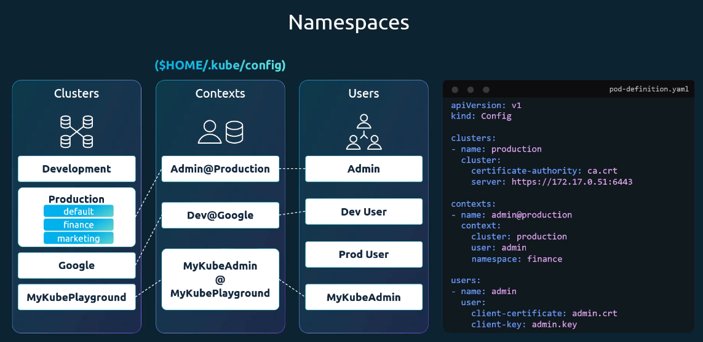
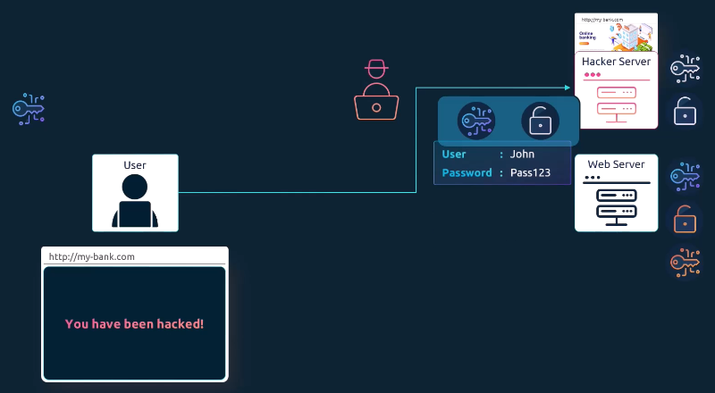
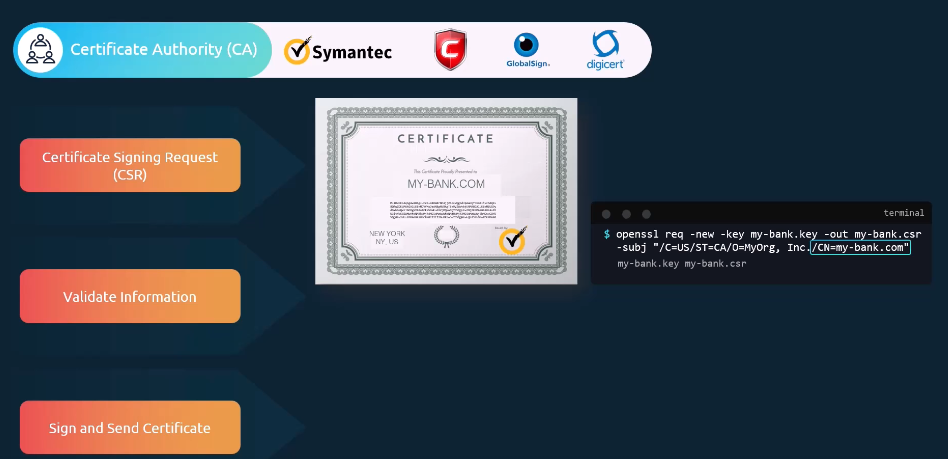

# Security
## 1. Kubernetes Security Primitives
Kubernetes 클러스터를 구성하는 모든 호스트에 대해 다음과 같은 보안 설정이 필요
- 루트(root) 직접 접근 비활성화
- 비밀번호 기반 인증 비활성화
- SSH 키 기반 인증만 허용

인프라 전반보다는 Kubernetes 자체의 보안에 초점

클러스터를 보호하기 위해 다음 질문
1. 어떤 위험(Risk) 이 존재하는가?
2. 이를 방지하기 위해 어떤 보안 조치(Action) 가 필요한가?

kube-apiserver는 모든 작업의 중심, 첫 번째 방어선(First Line of Defense)
1. API 서버에 접근할 수 있는 사용자는 인증 메커니즘(Authentication Mechanism) 으로 정의
2. 사용자가 무엇을 할 수 있는지는 권한 부여 메커니즘이 결정

통신 보안
1. 클러스터 구성 요소 간 통신 보안
   - etcd 클러스터, kube-apiserver, kube-controller-manager, kube-scheduler, 워커 노드의 Kubelet, kube-proxy
2. 파드 간 통신 보안
   - Network Policy를 통해 파드 간 통신을 세밀하게 제어

## A. Authentication : 인증
Kubernetes 클러스터의 인증(Authentication) 에 초점
클러스터에 접근하는 사용자 : 관리자, 개발자, 최종 사용자, Bot
→ Kubernetes 클러스터에 접근하는 사용자(관리자, 개발자) 관점 


모든 사용자 요청은 모두 kube-apiserver를 통해 전달 → API 서버는 요청을 처리하기 전에 반드시 인증(Authentication) 을 수행
kube-apiserver에서 사용할 수 있는 인증 방식
1. 정적 비밀번호 파일, 정적 토큰 파일
2. 인증서 기반 인증
3. LDAP, Kerberos 등 외부 인증 프로토콜 연동

### 1. 정적 인증 방식
- CSV 파일에 사용자 정보를 저장 → 그룹 정보를 추가해 사용자를 특정 그룹에 할당
- 정적 토큰 파일을 사용 → 비밀번호 대신 토큰을 사용 → API 요청 시 Bearer Token으로 전달

용자 이름, 비밀번호, 토큰을 일반 텍스트 파일에 저장하는 방식은 보안상 안전하지 않기 때문에 권장
### 2. 인증서 기반 인증

## B. Authorization : 권한
권한 : 접근한 사용자가 무엇을 할 수 있는지를 정의

### 권한 부여 메커니즘
권한 부여 메커니즘
1. 노드 권한 부여자(Node Authorizer)
2. 속성 기반 액세스 제어(ABAC)
3. 역할 기반 액세스 제어(RBAC)
4. Webhook 방식
#### 1. 노드 권한 부여자(Node Authorizer)
- 클러스터 내부 통신에 사용
- Kubelet이 노드 권한 부여자에 의해 승인되는 조건 → `system:nodes` 그룹에 속하고 이름에 `system:node` 접두사가 붙어야 하며
- 클러스터 내부 컴포넌트 간 신뢰를 위한 권한 부여 방식
#### 2. 속성 기반 액세스 제어(ABAC)
- 외부 사용자(API 접근)에 대해서는 다른 방식이 사용
- JSON 정책 파일에 “이 사용자는 어떤 리소스에 어떤 동작을 할 수 있는지”를 정의
- 정책을 변경할 때마다 파일을 수정하고 API 서버를 재시작
#### 3. 역할 기반 액세스 제어(RBAC)  
- 역할(Role)에 권한 규칙을 정의한 뒤 사용자를 그 역할에 연결
- 역할만 수정해도 해당 역할에 연결된 모든 사용자에게 즉시 반영
- Kubernetes에서 가장 표준적이고 권장되는 권한 관리 방식
- 네임스페이스 범위 권한
```bash
[Role 정의 예시]
apiVersion: rbac.authorization.k8s.io/v1
kind: Role
metadata:
  name: developer
rules:
- apiGroups: [""] // ""는 core API 그룹을 의미
  resources: ["pods"]
  verbs: ["list", "get", "create", "update", "delete"]
  // 네임스페이스 지정 가능
  resourceNames: ["blue-pod", "red-pod"]
- apiGroups: [""]
  resources: ["configMap"]
  verbs: ["create"]

kubectl create -f [role-definition.yaml]
```
- Role에는 하나 이상의 규칙(rule) 이 포함
- 규칙 구성 요소 : apiGroups, resources, verbs, resourceNames(선택 사항)
```bash
[RoleBinding 정의 예시]
apiVersion: rbac.authorization.k8s.io/v1
kind: RoleBinding
metadata:
  name: devuser-developer-binding
subjects:
- kind: User
  name: dev-user
  apiGroup: rbac.authorization.k8s.io
roleRef:
  kind: Role
  name: developer
  apiGroup: rbac.authorization.k8s.io

kubectl create -f [role-binding.yaml]
```
- RoleBinding 객체는 특정 사용자(또는 그룹, 서비스 계정)를 특정 Role에 매핑

**[조회 및 권한 확인 명령어]**
- `kubectl get roles` : 클러스터 내 역할 목록 조회
- `kubectl get rolebindings` : 클러스터 내 역할 바인딩 목록 조회
```bash
kubectl auth can-i create deployments
// yes

kubectl auth can-i delete nodes
// no

// --as 플래그로 특정 사용자 권한 확인
kubectl auth can-i create deployments --as dev-user
// no

kubectl auth can-i create pods --as dev-user --namespace test
// no
```
관리자는 실제로 해당 사용자로 로그인하지 않아도, --as 옵션을 사용해 다른 사용자를 가장하여 권한을 테스트할 수 있다.
#### 4. Webhook 방식
- 권한 부여를 외부 시스템에 위임
- Kubernetes가 요청 정보를 외부 정책 엔진(예: Open Policy Agent)에 전달하고
그 엔진이 허용/거부 여부를 결정

**Kubernetes에는 기본적으로 다음과 같은 권한 부여 모드**
AlwaysAllow: 모든 요청 허용, AlwaysDeny: 모든 요청 거부, Node, RBAC, Webhook
- kube-apiserver 실행 옵션으로 설정
- 기본값은 AlwaysAllow
- 쉼표로 나열해 동시에 사용할 수 있으며, 요청은 지정된 순서대로 처리
### 클러스터 범위 권한


### 


## 5. Security Contexts
## 6. TLS Certificates for Cluster Components
## 7. Images Securely
## 8. Network Policies

## + TLS/PKI 기본 개념
### TLS
: 통신 규칙
“통신이 암호화되었는지”뿐 아니라 “상대가 진짜 서버인지”까지 보장하기 위해 필요





진짜 이 서버가 인증된 서버(내가 원하는)인지 알기위해 인증서 안에 공개 키를 넣어서 보낸다.
인증서 == “내 공개키 + 이 공개키는 이 도메인의 것이 맞다고 CA가 보증함”
그 인증서의 진위 여부부터 이해가 잘 안됨.



검증 과정

서버 → 인증서 전달

브라우저 → 인증서 서명 확인

“이 서명, 내가 신뢰하는 CA가 했네?”

OK → 접속 허용

조직 내부 서비스는 공인 CA 대신 사설 CA를 운영하고, 직원 PC/브라우저에 사설 CA 공개키를 설치해 신뢰를 형성

방법:

회사가 자체 CA 운영

직원 PC / 브라우저에 사설 CA 공개키 설치

그 CA가 서명한 인증서는 신뢰됨
### PKI


전체 흐름 정리하기

### 키/인증서 파일 네이밍 주의점
#### 인증서 (Certificate = 공개키 포함)
| 파일명 예시       | 확장자    | 의미              | 절대 유출 위험 |
| ------------ | ------ | --------------- | -------- |
| `server.crt` | `.crt` | 서버 인증서 (공개키 포함) | ❌        |
| `server.pem` | `.pem` | 서버 인증서 (PEM 포맷) | ❌        |
| `client.crt` | `.crt` | 클라이언트 인증서       | ❌        |
| `client.pem` | `.pem` | 클라이언트 인증서       | ❌        |
| `ca.crt`     | `.crt` | CA 인증서 (신뢰용)    | ❌        |
#### 개인키 (Private Key)
| 파일명 예시           | 확장자    | 의미           | 보안 중요도 |
| ---------------- | ------ | ------------ | ------ |
| `server.key`     | `.key` | 서버 개인키       | 🔥🔥🔥 |
| `server-key.pem` | `.pem` | 서버 개인키 (PEM) | 🔥🔥🔥 |
| `client.key`     | `.key` | 클라이언트 개인키    | 🔥🔥🔥 |
| `client.key.pem` | `.pem` | 클라이언트 개인키    | 🔥🔥🔥 |
#### 확장자별 의미
| 확장자         | 의미      | 개인키 가능?      |
| ----------- | ------- | ------------ |
| `.crt`      | 인증서     | ❌            |
| `.key`      | 개인키     | ⭕            |
| `.pem`      | 컨테이너 포맷 | ⭕ / ❌ 둘 다 가능 |
| `.key.pem`  | 개인키     | ⭕            |
| `.cert.pem` | 인증서     | ❌            |
