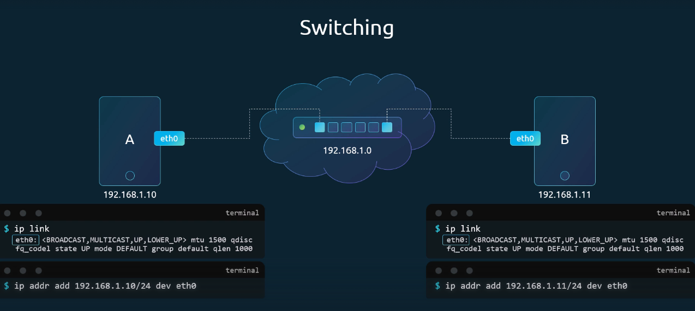
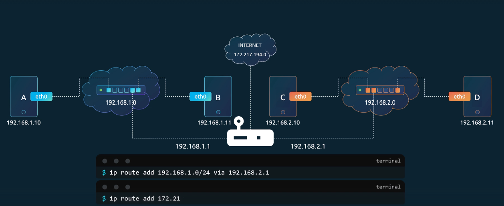
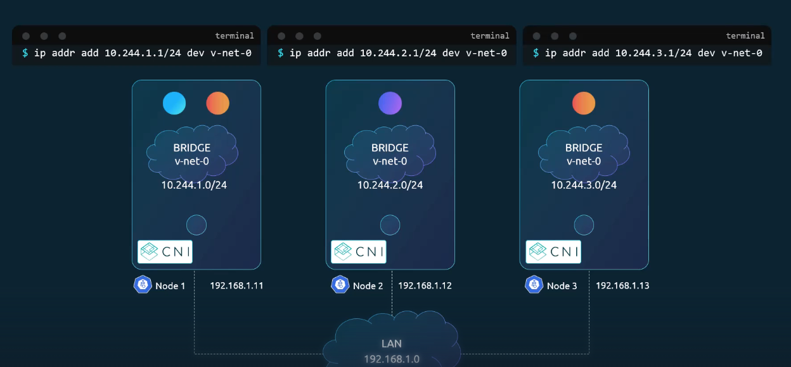
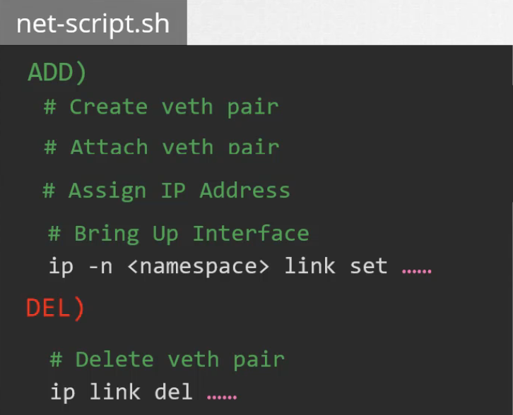

## 1. **Switching & Routing**

### 1-1. 스위치



컴퓨터 A와 B가 통신하려면 스위치를 통해 연결해야 한다. 이를 위해서는 우선 각 호스트에 네트워크 인터페이스가 있어야 한다. 그리고 A와 B에 같은 네트워크 대역의 IP 주소를 할당하면 두 컴퓨터는 스위치를 통해 서로 통신할 수 있다.

- `ip link`: 네트워크 인터페이스 확인
- `ip addr`: IP 주소 할당

### 1-2. 라우터



스위치는 같은 네트워크 안에서의 통신만 가능하다. 만약 두 컴퓨터가 다른 네트워크에 있다면 네트워크 간의 통신을 위해 라우터가 필요하다. 라우터는 두 네트워크를 연결하는 장치로 각 네트워크에서 IP를 하나씩 할당받는다.

- `ip route`: 현재 라우팅 테이블 확인
- `ip route add`: 라우트 추가

## 2. Gateway

### 2-1. **게이트웨이**

게이트웨이는 다른 네트워크로 나가는 관문의 역할을 한다. 컴퓨터 B가 C로 패킷을 보내려면 어떤 네트워크로 보내야 하는지를 알아야 한다. 이를 위해 게이트웨이에 관련 내용을 설정한다. 위와 같은 상황이라면 B의 라우팅 테이블에 `192.168.2.0` 네트워크는 `192.168.1.1` 게이트웨이를 통해, C의 라우팅 테이블에 `192.168.1.0` 네트워크는 `192.168.2.1` 게이트웨이를 통해 간다는 규칙을 설정해야 한다.

### 2-2. **기본 게이트웨이**

인터넷 접속이 필요하다면 라우터를 인터넷에 연결하고 라우팅 테이블에 기본 게이트웨이를 지정한다. 기본 게이트웨이는 알 수 없는 모든 네트워크로 가는 기본 출구를 의미한다. `default` 대신 `0.0.0.0`을 쓸 수도 있다.

### 2-3. **리눅스를 라우터로 사용**

기본적으로 리눅스는 보안상의 이유로 인터페이스 간 패킷 포워딩을 막고 있다. 따라서 리눅스를 라우터로 사용하기 위해서는 `/proc/sys/net/ipv4/ip_forward` 값을 1로 바꿔야 한다. 이 변경 사항은 재부팅 시 사라지므로 영구적으로 적용하려면 `/etc/sysctl.conf` 파일에 설정을 추가해야 한다.

## 3. DNS

### 3-1. **IP 주소와 호스트명 매핑**

IP 주소 대신 이름을 통해 다른 호스트에 접근하고 싶다면 `/etc/hosts` 파일에 IP 주소와 원하는 이름으로 엔트리를 추가하면 된다.

### 3-2. **DNS 서버**

서버가 많아지면 IP가 바뀔 때마다 모든 호스트의 파일을 업데이트하는 것은 비효율적이다. 이를 해결하기 위해 모든 정보를 중앙 서버에 모아 관리하는 것이 DNS 서버이다. 

호스트를 DNS 서버와 연결하려면 `/etc/resolv.conf` 파일을 수정하면 된다. 예를 들어 DNS 서버가 `192.168.1.100`이라면 `nameserver 192.168.1.100`을 추가한다. 이제 알 수 없는 호스트명을 만나면 DNS 서버에 질의한다. IP가 바뀌면 DNS 서버만 업데이트하면 되고, 각 호스트의 `/etc/hosts`를 수정할 필요가 없다.

### 3-3. **호스트명 해석 순서**

호스트명 해석 순서는 `/etc/nsswitch.conf` 파일의 `hosts` 항목에 정의되어 있다. 보통 `hosts: files dns`라고 되어 있으며 이는 먼저 /etc/hosts 파일을 보고, 없으면 DNS 서버를 확인한다는 의미이다. 순서는 바꾸거나 수정할 수 있다.

### 3-4. **레코드 타입**

DNS 서버에는 다음과 같은 레코드 타입이 있다.

- `A`: IPv4 주소 매핑
- `AAAA`: IPv6 주소 매핑
- `CNAME`: 별칭 매핑 (하나의 호스트에 여러 이름 부여 가능)

## 4. CoreDNS

### 4-1. CoreDNS 실행

CoreDNS는 하나의 호스트를 DNS 서버로 설정하기 위해 사용한다. `curl` 또는 `wget`으로 CoreDNS 바이너리를 다운로드하고 압축을 풀면 `coredns` 실행 파일을 얻을 수 있다. 이 실행 파일을 실행하면 DNS 서버가 시작된다. DNS 서버의 표준 포트 번호는 53번이다.

### 4-2. **IP 주소와 호스트명 매핑**

IP 주소와 호스트명 간 매핑을 위해 먼저 서버의 `/etc/hosts` 파일에 모든 엔트리를 기록한다. 그리고 `Corefile`에서 CoreDNS가 이 파일을 참조하도록 설정한다. 아래와 같이 설정하면 CoreDNS가 `/etc/hosts` 파일에서 IP 주소와 호스트명 매핑 정보를 읽어오도록 할 수 있다.


## 5. Network Namespace

### 5-1. **네임스페이스**

네임스페이스는 Docker와 같은 컨테이너에서 네트워크 격리를 구현하는 데 사용된다. 컨테이너는 호스트와 분리된 독립적인 환경을 가져야 하므로, 이를 위한 공간으로 네임스페이스가 제공된다.

### 5-2. 네임스페이스 생성과 확인

1. **새 네임스페이스 생성**
    
    ```bash
    ip netns add red
    ip netns add blue
    ```
    
2. **네임스페이스 목록 확인**
    
    ```bash
    ip netns
    ```
    
3. **네임스페이스 내부에서 명령 실행**
    
    ```bash
    ip netns exec red ip link
    ```
    

호스트는 자신만의 인터페이스, 라우팅 테이블, ARP 테이블을 가진다. 그리고 컨테이너는 이러한 정보를 보지 못해야 한다. 아래와 같이 호스트에서 `ip link` 명령을 실행하면 호스트의 eth0이 보이지만 네임스페이스 내부에서 실행하면 loopback 인터페이스만 보이고 호스트의 eth0은 보이지 않는다.


### 5-3. 네임스페이스 간 연결


1. **가상 이더넷 쌍 생성**
    
    ```bash
    ip link add veth-red type veth peer name veth-blue
    ```
    
2. **각각의 인터페이스를 네임스페이스에 연결**
    
    ```bash
    ip link set veth-red netns red
    ip link set veth-blue netns blue
    ```
    
3. **IP 할당 후 인터페이스 활성화**
    
    ```bash
    ip -n red addr add 192.168.15.1/24 dev veth-red
    ip -n blue addr add 192.168.15.2/24 dev veth-blue
    ip -n red link set veth-red up
    ip -n blue link set veth-blue up
    ```
    

### 5-4. 여러 네임스페이스 연결


1. **브리지 생성**
    
    두 개 이상의 네임스페이스를 연결할 때는 가상 스위치(브리지)가 필요하다.
    
    ```bash
    ip link add vnet0 type bridge
    ip link set vnet0 up
    ```
    
2. **네임스페이스와 브리지를 veth pair로 연결**
    
    ```bash
    ip link add veth-red type veth peer name veth-red-br
    ip link set veth-red netns red
    ip link set veth-red-br master vnet0
    ```
    

### 5-5. 호스트와 네임스페이스 간 연결

브리지를 만들 때 호스트 쪽에 `vnet0`라는 새 인터페이스가 생겼기 때문에 호스트 인터페이스에도 IP를 부여하면 호스트와 네임스페이스 간의 통신이 가능하다.

```bash
ip addr add 192.168.15.5/24 dev vnet0
```

### 5-6. 외부 네트워크와 연결

1. **라우트 추가**
    
    라우팅 테이블에 `192.168.1.0/24` 네트워크로 가려면 호스트(`192.168.15.5`)를 게이트웨이로 사용하라는 규칙을 추가한다. 호스트를 기본 게이트웨이로 지정하면 모든 외부 네트워크에 접근이 가능하다.
    
    ```bash
    ip netns exec blue ip route add 192.168.1.0/24 via 192.168.15.5
    ip netns exec blue ip route add default via 192.168.15.5
    ```
    
2. **NAT 설정**
    
    네임스페이스는 기본적으로 프라이빗 네트워크이기 때문에 외부 네트워크에 접근하려면 NAT가 필요하다. 호스트에 NAT(MASQUERADE) 규칙을 추가하면, 호스트가 네임스페이스의 출발지 IP를 자기 IP로 바꿔서 대신 외부와 통신해준다.
    
    ```bash
    iptables -t nat -A POSTROUTING -s 192.168.15.0/24 -j MASQUERADE
    ```
    

---

### 5-7. 외부에서 네임스페이스 접근

네임스페이스는 기본적으로 프라이빗 네트워크이기 때문에 외부에서 직접 접근할 수 없다. 따라서 다음과 두 가지 방법 중 하나를 사용해야 한다.

1. **외부 호스트의 라우팅 테이블에 네임스페이스 네트워크 추가**
2. **호스트에서 포트 포워딩 설정**
    
    외부에서 호스트 IP 주소에 80번 포트로 접근하면 네임스페이스로 전달된다.
    
    ```bash
    iptables -t nat -A PREROUTING -p tcp --dport 80 -j DNAT --to 192.168.15.2:80
    ```
    

## 6. Docker Networking

### 6-1. 네트워크 옵션

컨테이너를 실행할 때 선택할 수 있는 네트워크 옵션은 다음과 같다.

1. **None Network**
    
    컨테이너가 어떤 네트워크에도 연결되지 않는다. 외부나 다른 컨테이너와 통신이 불가능하다.
    
2. **Host Network**
    
    컨테이너가 호스트 네트워크에 직접 붙는다. 컨테이너 내부에서 80번 포트로 웹 애플리케이션을 실행하면 호스트의 80번 포트로 곧바로 접근 가능하다. 같은 포트를 사용하는 다른 컨테이너를 동시에 실행할 수 없다.
    
3. **Bridge Network**
    
    기본으로 사용되는 옵션이다. 내부 사설 네트워크(`172.17.0.0`)를 만들고, 호스트와 컨테이너를 여기에 붙인다. 각 컨테이너는 사설 IP를 할당받아 통신한다.
    

### 6-2. Docker Bridge

Docker 설치 시 기본적으로 `Bridge` 네트워크가 생성되고 호스트에서는 `docker0`라는 인터페이스로 확인할 수 있다. `docker0`의 기본 IP 주소는 `172.17.0.1`이다.

컨테이너가 생성되면 Docker는 해당 컨테이너에 네트워크 네임스페이스를 만들고, 가상 인터페이스 쌍을 생성한다. 그리고 한쪽 끝은 `docker0` 브리지에 연결하고 다른 쪽 끝은 컨테이너 네임스페이스에 연결한다.

### 6-3. 포트 매핑

브리지 네트워크는 사설망이므로 외부에서는 컨테이너에 직접 접근할 수 없다. 외부에서 접근하려면 다음과 같이 포트 매핑을 설정해야 한다. 이제 호스트의 8080번 포트로 접근하면 컨테이너의 80번 포트로 트래픽이 전달된다. 등록한 매핑 정보는 호스트에서 `iptables` 명령으로 확인할 수 있다.

```bash
docker run -p 8080:80 nginx
```

## 7. CNI

### 7-1. CNI 표준

CNI는 컨테이너 네트워킹을 위한 표준 인터페이스를 제공해, 다양한 런타임과 플러그인 간의 호환성을 보장한다.

- **컨테이너 런타임의 규약**
    - 각 컨테이너에 네트워크 네임스페이스 생성
    - 컨테이너가 연결해야 할 네트워크 식별
    - 컨테이너 생성 시 `add`, 삭제 시 `del` 명령으로 플러그인 호출
- **플러그인의 규약**
    - `add`, `del`, `check` 인자 지원
    - 컨테이너와 네트워크 네임스페이스를 입력받음
    - 컨테이너에 IP 주소 할당
    - 필요한 라우트와 네트워크 구성을 처리
    - 결과를 표준화된 출력 형식으로 반환

### 7-2. Docker와 네트워킹 표준

Docker는 CNI 대신 자체 표준인 CNM을 사용하며 이는 CNI와 호환되지 않는다. 그래서 Docker에서 직접 CNI 플러그인을 지정할 수 없고 다음과 같은 방법으로 우회해서 사용해야 한다.

1. Docker 컨테이너를 네트워크 없이 생성
2. 수동으로 CNI 플러그인을 실행해 네트워크를 설정

예전에는 Kubernetes도 이러한 과정을 거쳐야 했지만 더 이상 Docker 엔진을 기본 런타임으로 사용하지 않게 되면서 잘 쓰이지 않는다.

## 8. **Cluster Networking**

### 8-1. 클러스터 노드와 네트워크 인터페이스

쿠버네티스 클러스터는 마스터 노드와 워커 노드로 구성된다. 각 노드는 최소 하나 이상의 네트워크 인터페이스를 가져야 하며, 해당 인터페이스에는 IP 주소가 설정되어야 한다. 또한 각 호스트는 고유한 호스트 이름과 MAC 주소를 가져야 한다. 특히 가상 머신을 복제하여 생성한 경우, 중복된 호스트명이나 MAC 주소가 설정될 수 있으므로 주의해야 한다.

### 8-2. 필수 포트

다음은 각 노드의 구성 요소에서 사용하는 포트 번호들이다. 해당 포트들은 방화벽이나 네트워크 정책에서 열어두어야 한다.

- **마스터 노드**
    - 6443: API 서버
    - 10259: kube-scheduler
    - 10257: kube-controller-manager
    - 2379: etcd 서버
- **워커 노드**
    - 10250: kubelet
    - 30000–32767: 외부 서비스 노출용 포트
- **멀티 마스터 구성 시 추가**
    - 2380: etcd 클라이언트 간 통신

## 9. Pod Networking

### 9-1. Pod 네트워킹

Pod 네트워킹은 클러스터의 작동에 필수적인 또 하나의 네트워크 계층이다. 쿠버네티스는 Pod 네트워킹에 대한 구현 ****대신 Pod 네트워킹이 충족해야 할 요구사항만 정의해 두고, 실제 구현은 CNI 같은 네트워킹 솔루션에 맡긴다. 요구사항은 다음과 같다.

- 각 Pod는 고유한 IP 주소를 가져야 한다.
- 같은 노드 안의 Pod는 IP를 통해 서로 통신할 수 있어야 한다.
- 다른 노드의 Pod도 동일한 IP 주소를 이용해 통신할 수 있어야 한다.
- 특정 서브넷이나 주소 체계는 강제되지 않으며, 자동으로 IP를 할당하고 Pod 간 통신을 보장하면 된다.

---

### 9-2. 직접 구현



1. **클러스터 생성**
    
    3개의 노드를 가진 클러스터 생성한 뒤 각 노드는 외부 네트워크 `192.168.1.x`에 연결한다.
    
    - Node1: `192.168.1.11`
    - Node2: `192.168.1.12`
    - Node3: `192.168.1.13`
2. **브리지 네트워크 생성**
    
    각 노드에 브리지 네트워크를 생성하고 별도의 서브넷을 할당한다.
    
    - Node1: `10.240.1.0/24`
    - Node2: `10.240.2.0/24`
    - Node3: `10.240.3.0/24`
3. **컨테이너 연결**
    
    컨테이너가 생성되면, 네트워크 네임스페이스를 만들고 veth 쌍으로 브리지에 연결한다. 그리고 컨테이너에 IP 주소 할당하고 디폴트 게이트웨이를 추가한다. 이렇게 하면 같은 노드 내 Pod끼리 통신이 가능하다.
    
4. **노드 간 Pod 통신**
    
    서로 다른 노드 간 통신을 위해서는 라우팅 테이블에 규칙을 추가하면 된다.
    
    ```bash
    ip route add 10.240.2.0/24 via 192.168.1.12
    ```
    
    하지만 이 방식은 모든 노드에서 라우트를 추가해야 한다는 번거로움이 있다. 따라서 중앙 라우터에 라우트를 설정하고 모든 노드를 라우터로 향하게 하면 관리가 쉬워진다.
    

### 9-3. CNI로 자동화



CNI는 Pod 생성/삭제 시 자동으로 네트워크 설정을 실행할 수 있게 도와주는 표준 인터페이스다. 스크립트를 CNI 규격에 맞게 수정하면 컨테이너 런타임이 Pod를 만들 때 CNI 설정 파일을 확인하고, 지정된 CNI 플러그인을 찾아 `add`를 실행한다. 이를 통해 Pod 네트워킹을 자동으로 구성할 수 있다.

- `add`: Pod 네트워크 인터페이스 생성 및 IP 할당
- `del`: Pod 삭제 시 인터페이스 제거 및 IP 반환

## 10. CNI in Kubernetes

### 10-1. CNI의 역할

쿠버네티스는 Pod 네트워킹을 위해 CNI 플러그인을 사용한다. 컨테이너 런타임(Containerd, CRI-O)이 Pod 생성할 때 CNI 플러그인을 호출한다.

### 10-2. CNI 플러그인 위치

1. **플러그인 설치 위치**
    
    모든 CNI 플러그인은 실행 파일 형태로 `/opt/cni/bin`에 설치된다.
    
2. **플러그인 설정 위치**
    
    설정 파일은 `/etc/cni/net.d`에 위치한다. 런타임은 이 디렉토리에서 어떤 플러그인을 쓸지 확인하며, 설정 파일이 여러 개 있으면 알파벳순으로 가장 앞에 있는 파일이 선택된다.
    

### 10-3. CNI 설정 파일

```json
{
  "cniVersion": "0.3.1",
  "name": "mynet",
  "type": "bridge",
  "bridge": "cni0",
  "isGateway": true,
  "ipMasq": true,
  "ipam": {
    "type": "host-local",
    "subnet": "10.244.0.0/16",
    "routes": [
      { "dst": "0.0.0.0/0" }
    ]
  }
}
```

- **name**: 네트워크 이름
- **type**: 어떤 플러그인을 사용할지
- **isGateway**: 브리지 인터페이스가 게이트웨이 역할을 하도록 IP 할당 여부
- **ipMasq**: NAT(IP Masquerade) 규칙 추가 여부
- **ipam**: IP Address Management 설정
    - `host-local`: 호스트 로컬에서 IP 관리
    - `dhcp`: 외부 DHCP 서버를 이용

## 11. CNI weave

### 11-1. Weave CNI 플러그인

실제 현업에서는 CNI 스크립트를 직접 생성하지 않고 Weaveworks의 Weave CNI 플러그인 같은 솔루션을 사용한다. Weave는 단일 노드에 단순 라우트만 추가하는 방식과 달리, 대규모 클러스터에서도 확장 가능한 방식을 제공한다.

### 11-2. Weave CNI 아키텍처

- Weave 에이전트가 모든 노드에 배포됨
- 에이전트끼리 서로 통신하며 전체 Pod 토폴로지와 IP 정보를 공유
- Weave는 노드마다 자체 브리지(weave)를 만들고 Pod IP를 할당
- Pod는 여러 브리지(Docker 기본 브리지, Weave 브리지)에 동시에 붙을 수도 있음
- 패킷이 다른 노드로 갈 때 Weave가 캡슐화/디캡슐화를 처리해 올바른 Pod로 전달

### 11-3. Weave 배포 방식

1. **수동 배포**
    
    각 노드에 직접 Weave 서비스 실행
    
2. **쿠버네티스 배포**
    
    `kubectl apply -f <weave.yaml>`로 배포
    

Weave는 DaemonSet으로 배포되어 모든 노드에 Pod가 하나씩 올라가고 `kubectl logs`로 각 노드의 Weave Pod 로그를 확인할 수 있다.

### 11-4. Weave IPAM

- Weave는 기본적으로 `10.32.0.0/12` 대역을 Pod 네트워크로 사용
- 약 100만 개 IP를 제공하며, 각 노드의 에이전트가 이 범위를 분할해 관리
- 새 Pod가 생성되면 해당 노드에 할당된 범위에서 IP를 부여
- IP 풀은 Weave 배포 시 옵션으로 조정 가능

## 12. Service Networking

### 12-1. Service 네트워킹

Pod 네트워킹을 사용하면 Pod 간 통신이 가능하지만, 실제로는 Pod끼리 직접 통신하는 대신 Service를 통해 접근하는 것이 일반적이다. Service는 안정적인 IP와 이름을 제공하여 Pod에 접근할 수 있도록 한다.

### 12-2. Service 종류

1. **ClusterIP**
    
    클러스터 내부 전용 서비스로 모든 Pod에서 접근 가능하지만 외부에서는 접근이 불가능하다.
    
2. **NodePort**
    
    ClusterIP의 기능을 모두 포함하면서 클러스터 외부 접근이 가능하다. 모든 노드의 특정 포트를 열어 외부 요청을 Pod로 전달한다.
    

### 12-3. 동작 원리

1. **Service 생성**
    
    쿠버네티스가 Service에 가상 IP(ClusterIP)를 할당한다. 이 IP는 `-service-cluster-ip-range` 옵션으로 정의된 범위에서 선택되며 Pod 네트워크 CIDR과 겹치지 않아야 한다.
    
2. **kube-proxy 역할**
    
    각 노드에서 실행되며, API 서버를 감시하고 새로운 Service가 생성되면 iptables/ipvs 규칙을 갱신한다.
    

예를 들어 Pod(db) IP가 `10.244.1.2:3306`이고, Service(db-svc) IP가 `10.103.132.104:3306`라고 하자. 이때 kube-proxy는 iptables에 다음과 같은 규칙을 생성한다.

```
10.103.132.104:3306 → 10.244.1.2:3306
```

그리고 NodePort라면 추가적으로 `모든 노드IP:<NodePort>` 규칙을 생성해 Pod IP로 포워딩한다.

## 13. DNS in Kubernetes

### 13-1. 기본 DNS

쿠버네티스 클러스터에는 내장 DNS 서버(CoreDNS)가 기본적으로 배포된다. 이는 Pod와 Service가 서로를 이름으로 쉽게 찾을 수 있도록 지원한다.

### 13-2. Service DNS 레코드

Service를 생성하면, `서비스 이름 → 서비스 IP`로 매핑되는 DNS 레코드가 자동으로 생성된다. 모든 Pod는 서비스 이름을 통해 해당 서비스에 접근 가능하다.

### 13-3. Namespace와 DNS

네임스페이스마다 서브도메인이 생성된다. 같은 네임스페이스 내에서는 서비스 이름만으로 접근할 수 있지만 서로 다른 네임스페이스의 경우에는 풀네임이 필요하다. 서비스는 모두 `svc` 서브도메인에 묶이고 클러스터 전체 도메인은 기본적으로 `cluster.local`이기 때문에 풀네임은 다음과 같은 형태가 된다.

```
{서비스 이름}.{네임스페이스}.svc.cluster.local
```

### 13-4. Pod DNS 레코드

기본적으로 Pod에 대한 DNS 레코드는 생성되지 않으며 옵션을 켜면 IP 기반 이름으로 레코드 생성이 가능하다. 레코드 형식은 다음과 같다.

```
{Pod IP의 점을 대시로 바꾼 형태}.{네임스페이스}.pod.cluster.local
```

## 14. CoreDNS in Kubernetes

### 14-1. 기본 설정

쿠버네티스는 v1.12 이후 CoreDNS를 기본 DNS 서버로 사용한다. Pod/Service 간 통신 시 `/etc/hosts`에 수동으로 IP 매핑하는 방식은 불가능하기 때문에 CoreDNS가 중앙에서 관리한다. 또한 각 Pod의 `/etc/resolv.conf`는 CoreDNS 서비스를 nameserver로 사용하도록 자동 설정된다.

### 14-2. CoreDNS 동작 방식

1. **CoreDNS 배포**
    
    
    
    CoreDNS는 `kube-system` 네임스페이스에서 Pod로 실행된다. 설정 파일은  `/etc/coredns/Corefile`이고 configmap으로도 저장되어 있기 때문에 수정이 필요하면 이를 변경하면 된다.
    
2. **외부 DNS 연동**
    
    CoreDNS가 모르는 요청은 Pod 내 `/etc/resolv.conf`의 nameserver로 포워딩한다.
    

### 14-3. Pod와 CoreDNS 연결

Pod는 Service 이름을 DNS로 해석할 수 있도록 CoreDNS와 연결된다. CoreDNS는 클러스터 내부에서 `kube-dns`라는 서비스로 노출되며, 각 Pod가 생성될 때 kubelet이 Pod의 `/etc/resolv.conf` 파일에 CoreDNS 서비스의 IP 주소를 nameserver로 자동 등록한다.

기본적으로 `default.svc.cluster.local`, `svc.cluster.local`, `cluster.local`과 같은 검색 도메인이 추가되기 때문에 같은 네임스페이스 안에서는 단순히 `web-service`라고만 입력해도 접근이 가능하다. 하지만 Pod 자체에 대한 DNS 이름은 검색 도메인이 적용되지 않으므로 반드시 풀네임을 사용해야 한다.

## 15. Ingress

### 15-1. Ingress

Ingress는 클러스터 외부에서 들어오는 트래픽을 내부 서비스로 연결해 주는 리소스다. 단순히 한 서비스로만 포워딩할 수도 있고, URL 경로나 도메인에 따라 여러 서비스로 나눠 보낼 수도 있다. 다만 Ingress 리소스만으로는 동작하지 않고, 이를 실제로 처리할 Ingress Controller(Nginx 등)를 반드시 함께 배포해야 한다.

### 15-2. 리소스 구조


- `apiVersion`: ingress 리소스용 버전
- `kind`: Ingress
- `metadata`: 리소스 이름
- `spec`: 규칙과 backend 설정
    - `backend`: 트래픽이 라우팅될 서비스와 포트 지정

```bash
kubectl create -f ingress-wear.yaml     # 리소스 생성
kubectl get ingress                     # 리소스 확인
kubectl describe ingress                # 리소스 확인
```

### 15-3. Path 기반 라우팅

하나의 도메인에서 여러 경로별로 서비스를 연결한다.

- `/wear` → clothes 서비스
- `/watch` → video 서비스

### 15-4. Host 기반 라우팅

여러 도메인을 각각 다른 서비스로 연결한다.

- `wear.my-online-store.com` → wear 서비스
- `watch.my-online-store.com` → video 서비스

### 15-5. Default Backend

어떤 규칙에도 맞지 않는 요청은 default backend로 전달된다. 보통 404 not found 페이지를 제공하는 서비스로 설정한다.