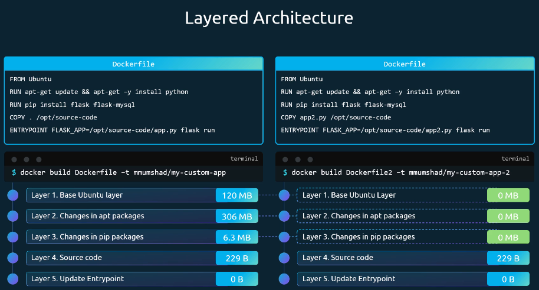

# Section 8: Storage

## Docker Storage

### Storage Drivers
**Docker 데이터 저장 위치**
- Docker 설치 시 기본 데이터 디렉터리:  
  **`/var/lib/docker`**
- 주요 하위 디렉터리
  - `images/` : 이미지 관련 데이터
  - `containers/` : 컨테이너 관련 데이터
  - `volumes/` : Docker 볼륨 데이터

→ **이미지·컨테이너·볼륨의 모든 실제 데이터는 여기 저장됨**

**Docker의 계층형(Layered) 아키텍처**
- Dockerfile의 **각 명령어 = 하나의 이미지 레이어**
- 예시 레이어 구조 (아래 → 위)
  1. Base Image (Ubuntu)
  2. OS 패키지 설치
  3. 언어/라이브러리 설치 (Python, Flask)
  4. 애플리케이션 소스 코드
  5. Entrypoint / CMD
- 특징
  - 각 레이어는 **변경된 내용만 저장**
  - 이미지 레이어는 **읽기 전용(Read-only)**

### Volume Drivers

# Section 9: Networking