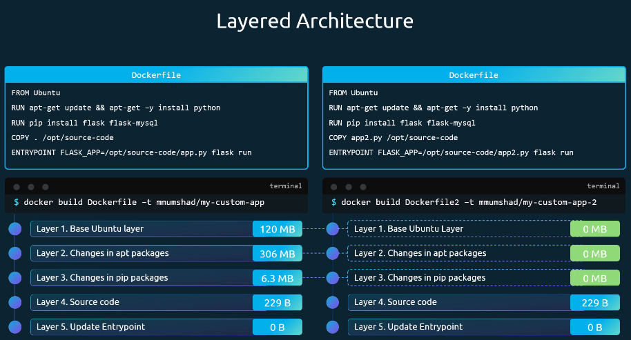
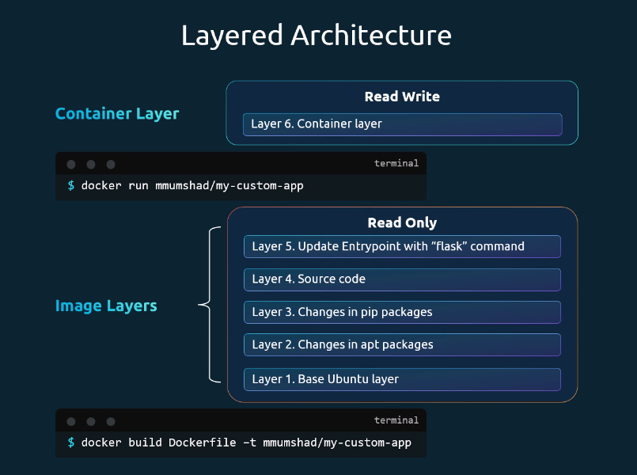
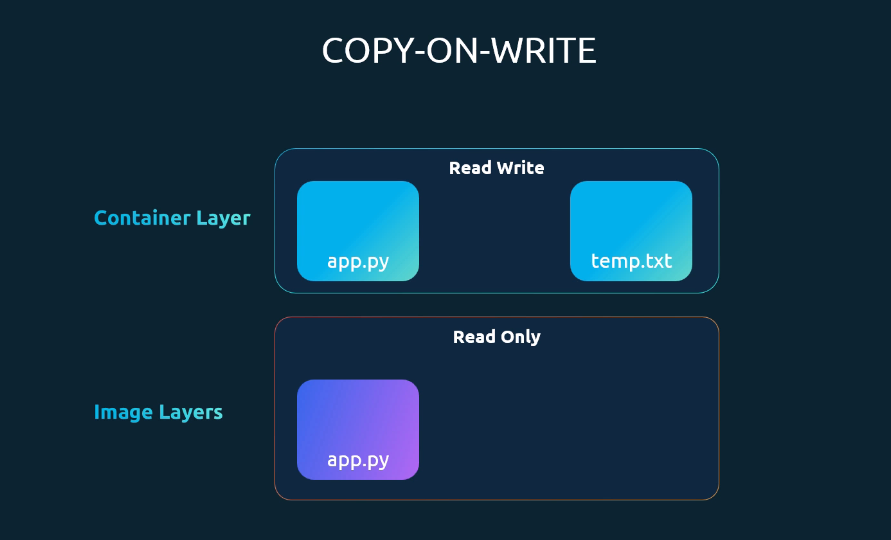
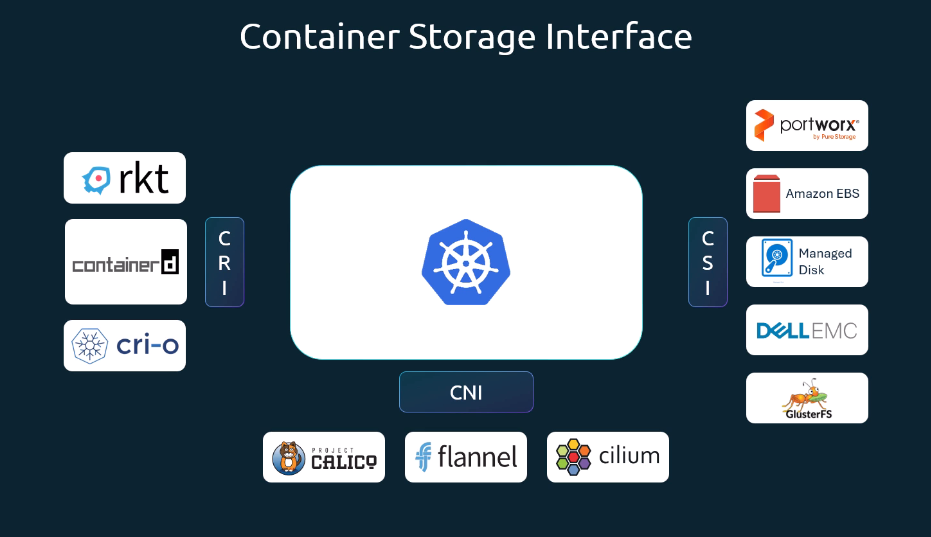
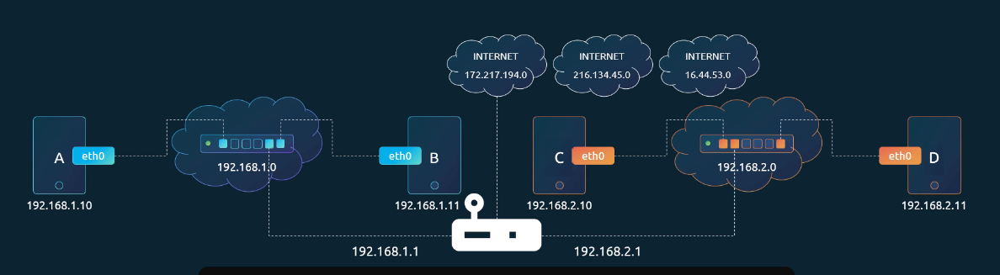
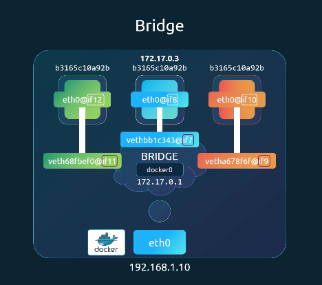
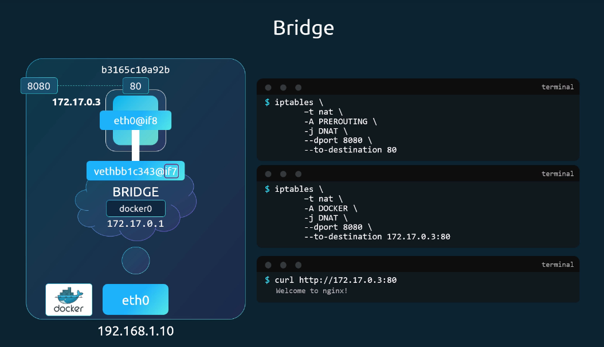
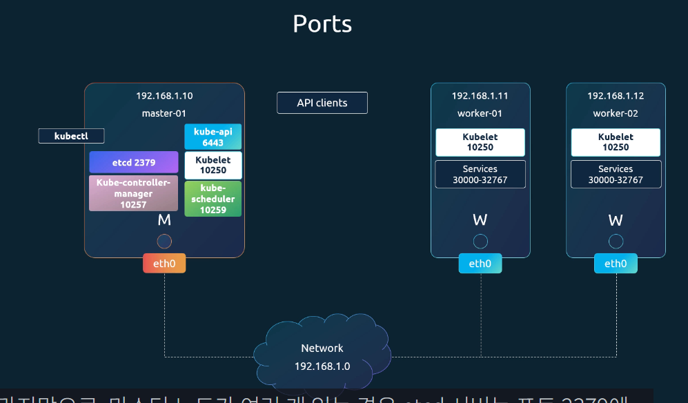
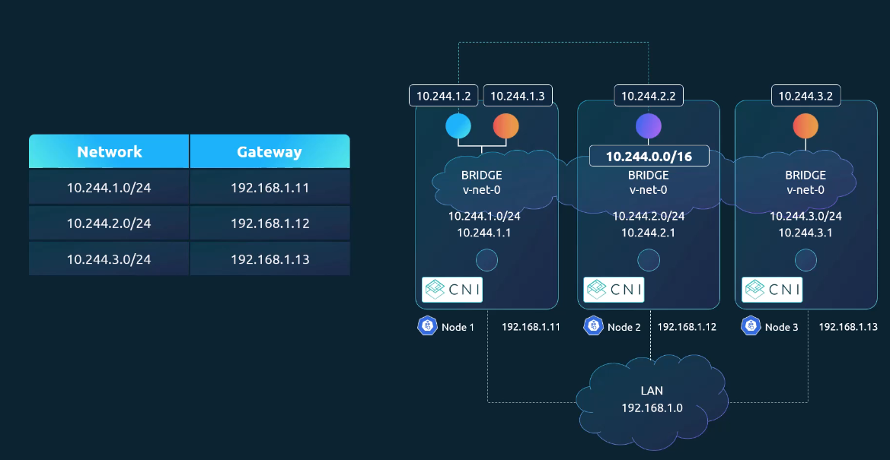

# Section 8: Storage

## Docker Storage
| 구분      | 스토리지 드라이버                 | 볼륨 드라이버                                 |
| --------- | --------------------------------- | --------------------------------------------- |
| 역할      | 이미지와 컨테이너의 스토리지 관리 | Docker 볼륨(영구 저장소) 관리                 |
| 대상      | Docker의 계층화 파일 시스템       | 데이터 영속성을 위한 외부 스토리지            |
| 예시      | AUFS, Overlay2, Device Mapper 등  | NFS, AWS EBS, Azure Disk 등 (플러그인 기반)   |
| 동작 방식 | 컨테이너 레이어 관리 중심         | 스토리지 드라이버와 별도로 동작               |
| 관리 주체 | Docker 엔진 내부                  | 볼륨 드라이버 플러그인(volume driver plugins) |
### Storage Drivers
모든 작업(레이어 유지, RW 레이어 관리, Copy-on-Write 등)을 수행하는 것이 바로 Storage Driver

- 주요 드라이버 : AUFS, BTRFS, ZFS, Device Mapper, Overlay, Overlay2
- Docker는 OS에 맞는 최적의 드라이버를 자동 선택
- 드라이버마다 성능/안정성 특성이 다르므로, 환경에 맞는 선택이 필요

**Docker 데이터 저장 위치**
- Docker 설치 시 기본 데이터 디렉터리:  
  **`/var/lib/docker`**
- 주요 하위 디렉터리
  - `images/` : 이미지 관련 데이터
  - `containers/` : 컨테이너 관련 데이터
  - `volumes/` : Docker 볼륨 데이터

→ **이미지·컨테이너·볼륨의 모든 실제 데이터는 여기 저장됨**




**Docker의 계층형(Layered) 아키텍처**
- Dockerfile의 **각 명령어 = 하나의 이미지 레이어**
- 예시 레이어 구조 (아래 → 위)
  1. Base Image (Ubuntu)
  2. OS 패키지 설치
  3. 언어/라이브러리 설치 (Python, Flask)
  4. 애플리케이션 소스 코드
  5. Entrypoint / CMD
- 특징
  - 각 레이어는 **변경된 내용만 저장**
  - 이미지 레이어는 **읽기 전용(Read-only)**
  

**이미지 계층 (읽기 전용)**
- Docker 빌드 완료 후 **수정 불가**
- `docker build` 명령어로만 변경 가능
- 여러 컨테이너가 공유

**컨테이너 계층 (읽기/쓰기)**

- 컨테이너 실행 시 이미지 위에 생성
- 로그 파일, 임시 파일, 사용자 수정 파일 저장
- **컨테이너 삭제 시 함께 삭제**


**Copy-on-Write**
- 이미지 레이어 파일은 **읽기 전용**
- 컨테이너에서 특정 파일 수정 시 RW 레이어에 복사, 수정은 RW 레이어에서 진행
→ 원본 이미지 레이어는 항상 동일하게 유지됨

#### Volume Mount vs Bind Mount
- Volume Mount : `/var/lib/docker/volumes` 하위의 Docker 관리 볼륨
- Bind Mount : 호스트 파일시스템의 특정 경로를 직접 연결
```bash
[Volume Mount]
# 볼륨 생성
docker volume create data_volume
# 볼륨 마운트
docker run -v data_volume:/var/lib/mysql mysql
# data_volume2가 없으면 Docker가 자동 생성
docker run -v data_volume2:/var/lib/mysql mysql

[Bind Mount]
# 호스트 디렉토리 직접 마운트
docker run -v /data/mysql:/var/lib/mysql mysql
```
**--mount : 추천 마운트 방식**
```bash
# --mount 옵션 사용 (더 명확함, Key=Value 형식)
# source: 호스트에서의 위치
# target : 컨테이너에서의 위치
docker run --mount type=bind,source=/data/mysql,target=/var/lib/mysql mysql
```

**+ Container Storage Interface (CSI)**



### Volume Drivers
#### Local Volume Driver
- Docker가 기본 제공하는 드라이버
  - 드라이버명: `local`
  - 저장위치: `/var/lib/docker/volumes/`
  - 용도: Docker 호스트 로컬 디스크에 데이터 저장
```bash
# 기본 로컬 볼륨 생성
docker volume create my_volume

ls /var/lib/docker/volumes/
```
#### Volumes
**Docker에서**
- Docker 컨테이너 : 일시적(transient)
  - 필요할 때 실행되어 데이터를 처리하고, 작업이 끝나면 제거됨
  - 컨테이너 내부 데이터도 컨테이너와 함께 삭제됨

→ 데이터를 유지하려면 컨테이너 실행 시 **볼륨(volume)** 을 붙여야 함

**Kubernetes에서**
- Kubernetes Pod : 일시적
    - Pod 생성 → 데이터 처리 → Pod 삭제 시 데이터도 삭제됨
→ 데이터를 유지하려면 Pod에 볼륨을 붙임
```yaml
# 환경: 단일 노드 Kubernetes 클러스터
apiVersion: v1
kind: Pod
metadata:
  name: random-number-generator
spec:
  containers:
  - name: alpine
    image: alpine
    command: ["/bin/sh", "-c"]
    args:
    - shuf -i 0-100 -n 1 >> /opt/number.out
    # 컨테이너 내부의 /opt 디렉토리에 볼륨 마운트
    volumeMounts:
    - name: data-volume
      mountPath: /opt
  volumes:
  - name: data-volume
    # 저장되는 데이터는 호스트의 /data 디렉토리에 저장됨
    hostPath:
      path: /data
      type: Directory
```
→ pod가 삭제되어도 호스트의 `/data` 디렉토리에 데이터는 남아있음

**외부 스토리지(Replicated Cluster Storage)**

- `hostPath`는 단일 노드에서만 적합
- 다중 노드 환경에서는 각 노드의 `/data` 디렉토리가 서로 다름

→ 동일 데이터 유지하려면 외부 스토리지(Replicated Cluster Storage) 필요
  - Kubernetes가 지원하는 다양한 스토리지 옵션: NFS, iSCSI, GlusterFS, CephFS, 클라우드 스토리지(AWS EBS, Azure Disk/File, Google Persistent Disk) 등

#### Persistent Volume
대규모 환경에서는 수많은 pod 배포 필요 → 모든 Pod 정의 파일에 해당 스토리지 구성을 직접 기입해야 함 → 비효율

**해결 방법**
- Persistent Volume (PV) : 클러스터 전역에서 사용 가능한 스토리지 풀
- 사용자는 Persistent Volume Claim(PVC) 을 통해 필요한 스토리지를 할당 받음
```yaml
# PV 기본 템플릿
apiVersion: v1
kind: PersistentVolume
metadata:
  name: pv-vol1
spec:
  # 접근 모드
  accessModes:
    - ReadWriteOnce
  capacity:
    # 스토리지 용량
    storage: 1Gi
  hostPath:
    path: "/tmp/data"
```
- accessModes (접근 모드):
  - `ReadOnlyMany` : 여러 노드에서 읽기 전용
  - `ReadWriteOnce`  : 단일 노드에서 읽기/쓰기 가능
  - `ReadWriteMany` : 여러 노드에서 읽기/쓰기 가능

- `kubectl create -f pv-definition.yaml` : PV 생성
- `kubectl get persistentvolume` : PV 조회

#### Persistent Volume Claims
- PVC는 사용자가 필요한 스토리지를 요청하는 방법
>관리자(Admin) → Persistent Volume을 생성 (스토리지 풀 제공)
>사용자(User) → Persistent Volume Claim을 생성 (스토리지 요청)

- PVC가 생성되면 K8은 PV 속성과 PVC 요청을 고려하여 1:1 바인딩
  - 고려되는 속성: 용량, 접근 모드, 볼륨 모드, 스토리지 클래스
  - 특정 PV를 선택하려면 Label + Selector 를 사용해 지정 가능
  - 적합한 PV가 없는 경우 : PVC는 `Pending` 상태 유지
```yaml
apiVersion: v1
kind: PersistentVolumeClaim
metadata:
  name: my-claim
spec:
  accessModes:
    - ReadWriteOnce
  resources:
    requests:
      storage: 500Mi
```
- `kubectl create -f pvc-definition.yaml` : PVC 생성
- `kubectl get persistentvolumeclaim`, `kubectl get pvc` : PVC 조회

**Reclaim Policy : PVC 삭제 시 PV 동작**

| Reclaim Policy       | Description                                                                       |
| -------------------- | --------------------------------------------------------------------------------- |
| Retain               | PV와 해당 데이터가 유지됨                                                         |
| Delete               | PV와 관련 스토리지 리소스가 삭제됨                                                |
| Recycle (Deprecated) | 데이터를 정리한 후 PV를 다시 사용 가능 상태로 만듦 (현재는 더 이상 사용되지 않음) |

#### Storage Classes
**정적 프로비저닝(Static Provisioning)**
PV 생성 전에 관리자가 PV를 미리 만들어야 하는 방식 → 비효율적
e.g. 애플리케이션에서 스토리지가 필요할 때마다
1. Google Cloud에서 디스크를 수동으로 생성
2. 동일한 이름으로 PV 정의 파일 작성

**동적 프로비저닝(Dynamic Provisioning)**
PVC가 생성될 때 K8이 자동으로 PV를 생성하는 방식 → 효율적
- StorageClass : 동적 볼륨 프로비저닝 지원
- PVC 생성 시
  - 스토리지 벤더 API 호출 → PV(디스크) 자동 생성
  - PV와 PVC 자동 바인딩

```yaml
# StorageClass 예시
apiVersion: storage.k8s.io/v1
kind: StorageClass
metadata:
  name: standard
# 스토리지 백엔드 지정
provisioner: kubernetes.io/gce-pd
# 옵션
parameters:
  type: pd-standard
  replication-type: none
```
```yaml
# PVC에서 StorageClass 사용
apiVersion: v1
kind: PersistentVolumeClaim
metadata:
  name: my-claim
spec:
  accessModes:
    - ReadWriteOnce
  resources:
    requests:
      storage: 1Gi
  # 여기서 어떤 StorageClass를 사용할지 지정
  storageClassName: standard
```
# Section 9: Networking
## Before Networking
### Switching and Routing
**스위칭(Switching) vs 라우팅(Routing) 비교**
| 구분 | 스위칭 (Switching) | 라우팅 (Routing) |
|------|--------------------|------------------|
| 계층 | L2 (Data Link) | L3 (Network) |
| 기준 주소 | MAC | IP |
| 통신 범위 | 같은 네트워크(브로드캐스트 도메인) 내부 | 서로 다른 네트워크 간 |
| 대표 구현 | 물리 스위치, Linux bridge (docker0, cni0) | 라우터, L3 스위치, 호스트 라우팅 (ip route) |



### DNS

### Network Namespaces

### Docker Networking




### CNI (Container Network Interface)

## Cluster Networking
- K8 클러스터는 마스터/워커 노드로 구성
- 각 노드는 반드시 최소 하나 이상의 네트워크 인터페이스
- 각 인터페이스에는 IP 주소가 설정되어 있어야 함
→ 각 호스트에 **고유한 호스트 이름(hostname)** 과 **고유한 MAC 주소**


**포트 설정**
- 클러스터의 올바른 동작을 위해 특정 포트를 열어둬야 함

**[Kubernetes 주요 포트 정리]**

| 구분 | 포트 | 컴포넌트 | 설명 |
|------|------|-----------|------|
| 마스터 노드 | 6443 | API Server | 워커 노드, kubelet, kubectl, 외부 사용자 및 컨트롤 플레인 컴포넌트들이 API 서버에 접근하는 포트 |
| 마스터 노드 | 10259 | Kube Scheduler | 스케줄러 컴포넌트 통신 포트 |
| 마스터 노드 | 10257 | Kube Controller Manager | 컨트롤러 매니저 통신 포트 |
| 마스터 노드 | 2379 | etcd | API 서버가 etcd와 통신하는 포트 |
| 마스터 노드 (멀티 마스터) | 2380 | etcd Peer 통신 | etcd 노드 간 내부 통신 포트 |
| 마스터 & 워커 공통 | 10250 | Kubelet API | kubelet API 포트 (API 서버가 노드와 통신) |
| 워커 노드 | 30000–32767 | NodePort 서비스 | 외부에서 NodePort 방식으로 서비스 접근 시 사용하는 포트 범위 |

**[멀티 마스터 환경 주의사항]**

| 항목 | 설명 |
|------|------|
| 마스터 노드가 여러 개일 경우 | 위 마스터 관련 포트를 모든 마스터 노드에서 개방해야 함 |
| etcd 클러스터 구성 시 | etcd 노드 간 내부 통신을 위해 2380 포트를 반드시 개방해야 함 |

## Pod Networking
**[Kubernetes Pod 네트워킹 요구사항]**
1. 각 Pod는 **고유한 IP 주소**를 가져야 한다.
2. 같은 노드 내의 모든 Pod는 서로의 IP로 통신할 수 있어야 한다.
3. 다른 노드에 있는 Pod끼리도 IP로 직접 통신할 수 있어야 한다.
4. NAT 규칙을 수동으로 설정하지 않고도 가능해야 한다.

위에서 말한 네트워킹 요구 사항을 **수동**으로 맞춰주기 위해서는
- 각 노드마다 브리지 네트워크 생성, 실행, ip 할당
```bash
# v-net-0 브리지 네트워크 생성
ip link add v-net-0 type bridge
# v-net-0 네트워크 활성화
ip link set v-net-0 up
# v-net-0 네트워크에 IP 주소 할당
ip addr add 10.244.1.1/24 dev v-net-0
```
- pod 생성 이후에는
  1. 컨테이너용 네임스페이스 생성
  2. veth pair(가상 케이블)로 Pod를 브리지에 연결
  3. Pod에 IP 할당 (예: 10.244.1.2)
  4. 기본 게이트웨이(브리지 IP)로 라우트 추가

→ 같은 노드 안의 Pod끼리 통신 가능

노드 간 pod 통신을 위해서는 라우트 추가 설정 필요
1. 라우팅 테이블에 라우트 추가
```bash
# add <node2의 bridge> via <node02의 ip>
ip route add 10.244.2.0/24 via 192.168.1.12
```
2. 외부 라우터에 경로를 등록
모든 노드에서 해당 라우터를 게이트웨이로 사용하게 하면 관리가 간편



**자동화**
CNI(Container Networking Interface)를 활용하여 자동화 가능
- CNI는 Kubernetes와 네트워크 플러그인을 연결해주는 표준
- Pod 생성 시, `kubelet`이 CNI 스크립트(플러그인)를 호출 → 자동으로 네트워크 연결
- CNI 스크립트는 ADD / DEL 명령 지원 → Pod 네트워크 자동 관리

## CNI (Container Network Interface)
- Kubernetes Pod 네트워킹의 핵심 표준
K8에서 CNI
- 컨테이너 런타임의 책임 : pod 네임 스페이스 생성, 올바른 네트워크 플러그인 호출 + 네임스페이스를 해당 네트워크에 연결
  - 컨테이너 런타임 : 컨테이너 생성 담당 → 플러그인 실행 담당
- K8은 직접 네트워크 설정을 하지 않고, CNI 플러그인에게 위임

- 플러그인 실행 파일 위치 : `/opt/cni/bin`
- 설정 파일 위치 : `/etc/cni/net.d` (설정 파일/JSON 형식)
  - 어떤 플러그인을 사용할지 설정
```JSON
{
  "name": "mynet",
  CNI 플러그인 종류
  "type": "bridge",
  브리지가 게이트웨이 역할 여부
  "isGateway": true,
  NAT Masquerading 여부
  "ipMasq": true,
  "ipam": {
    "type": "host-local",
    "subnet": "10.244.0.0/16",
    "routes": [
      { "dst": "0.0.0.0/0" }
    ]
  }
}
```
### CNI Weave
- 기존에는 라우팅 테이블에 네트워크-노드 매핑 추가, 대규모에서 관리 어려움
- **Weave 방식** : Pod 네트워크를 위해 자동 라우팅 + 캡슐화 전송을 수행하는 대표적인 CNI 플러그인
  - 각 노드에 Weave 에이전트(peer) 배포
  - 에이전트끼리 정보 교환
  - 패킷 캡슐화/디캡슐화 과정을 통해 안전하게 통신

1. Weave는 각 노드에 **weave0 브리지** 생성 및 IP 할당
2. Pod는 Weave Bridge에 연결됨
3. Pod → Pod 패킷 전송 시
    1. Weave 에이전트가 패킷 가로챔
    2. 새 패킷에 캡슐화 후 전송
    3. 대상 노드 에이전트가 디캡슐화
    4. 대상 Pod에 전달

### IPAM (IP Address Management) - Weave
- Weave는 IPAM 기능도 제공 → K8은 신경 X
- 관리 대상 : IP 주소 풀, 서브넷 등
- pod 네트워크 네임스페이스에 IP 주소 할당 → 중복 방지
- 설정 위치: `/etc/cni/net.d/` 의 CNI 설정 파일
```JSON
{
  "ipam": {
    "type": "host-local",
    "subnet": "10.244.0.0/16",
    "routes": [...]
  }
}
# host-local : 각 노드에서 로컬 파일 기반으로 관리
# dhcp : 외부 DHCP 서버를 통해 관리
```
- 기본 IP 범위: `10.32.0.0/12`
  - 사용 가능: `10.32.0.1 ~ 10.47.255.254`
  - 약 100만 개 Pod IP 지원
- Weave Peer들이 범위를 나누어 노드별로 관리
- 배포 시 옵션으로 범위 변경 가능

## Service Networking
pod끼리 직접 통신하는 경우는 거의 없고 보통 서비스를 통해 통신 → 서비스 네트워킹
### 서비스의 종류
####ClusterIP
- 클러스터 내부에서만 접근 가능한 가상 IP 제공 → 내부 전용 서비스에 적합
- 접근 하고 싶은 pod의 service 생성 → 해당 서비스는 고유 IP와 DNS 이름을 가짐 → 클러스터 내부에서 서비스 IP로 접근 가능

#### NodePort
- NodePort 타입의 Service를 생성하면 클러스터 내부 Pod 접근은 ClusterIP처럼 가능
- 동시에 모든 Node의 특정 포트를 열어 외부에서도 접근 가능

### kube-proxy
- kube-proxy는 각 노드에서 실행
- API Server를 감시하다가 Service가 생성되면 iptables 포워드 규칙을 설정
- 모드
  1. userspace 모드 : `kube-proxy`가 각 서비스마다 포트를 열고, 들어온 요청을 직접 프록시해서 Pod으로 전달
  2. IPVS 모드 : Linux의 IPVS를 사용해 더 효율적인 로드밸런싱 규칙 생성
  3. iptables 모드 : iptables 규칙을 생성해 DNAT 기반으로 트래픽을 Pod으로 전달
`--proxy-mode` : 옵션으로 모드 선택 가능 (기본 값 : iptables)

### iptables
> 서비스는 가상 IP일 뿐이고, 실제로는 iptables DNAT 규칙 덕분에 Pod으로 요청이 전달

- NodePort 서비스
  - kube-proxy가 모든 노드의 특정 포트(NodePort) 에 규칙을 추가
  - 들어오는 외부 요청(NodeIP:NodePort) → 해당 Pod으로 DNAT

## DNS
- CoreDNS를 배포 → Pod/Service 이름 해석 지원
- DNS 서버는 Service 생성 시 자동으로 DNS 레코드(Service 이름 → Service IP 매핑) 생성

| 구분 | 접근 방식 | 설명 |
|------|------------|------|
| 같은 네임스페이스 | `web-service` | 동일한 네임스페이스 내에서는 서비스 이름만으로 접근 가능 |
| 다른 네임스페이스 | `web-service.apps` | 다른 네임스페이스의 서비스에 접근할 때는 `서비스명.네임스페이스명` 형식 사용 |
| FQDN (완전한 도메인 이름) | `web-service.apps.svc.cluster.local` | 클러스터 내부의 전체 DNS 경로를 포함한 완전한 도메인 이름 |

`<service>.<namespace>.svc.cluster.local` : 완전한 형태
→ Cluster 내 어디서든 서비스 이름으로 접근 가능

- pod 레코드 는 필요시 옵션으로 활성화
  - IP 기반 : 10.244.1.5 → `10-244-1-5.default.pod.cluster.local`

### CoreDNS in Kubernetes
- CoreDNS : Kubernetes 클러스터에서 DNS 서비스를 제공하는 기본 컴포넌트
- 중앙 DNS 서버 구성, 각 pod의 `/etc/resolv.conf` 에 DNS 서버 IP를 설정
→ Pod가 생성될 때마다, 해당 Pod에 대한 레코드가 DNS 서버에 추가, Pod의 /etc/resolv.conf 가 DNS 서버를 보도록 자동 설정

- Pod 생성 시: `/etc/resolv.conf` → nameserver `10.96.0.10` 자동 설정
- CoreDNS 배포 시  kubernetes는 자동으로 `kube-dns` Service(ClusterIP)가 생성됨
    - Pod의 `/etc/resolv.conf` 파일에 이 Service IP가 자동 등록됨
    - `kubelet`이 Pod 생성 시, Pod 내부의 `/etc/resolv.conf` 에 DNS 서버 주소와 search 도메인 추가

- `/etc/coredns/Corefile`의 `Corefile` : 설정 파일
- `edit configmap coredns -n kube-system` : CoreDNS 설정 편집 명령어

**search domain**
- `host web-service` : FQDN(Fully Qualified Domain Name) 확인 명령어
- pod는 search 방식 접근 불가능 → Pod는 FQDN으로 찾아야함
## Ingress
- app을 외부에 노출하기 위해 NodePort 서비스 생성 → 외부에서 접근 가능
- 문제점 : 
  1. 사용자가 IP 주소와 포트를 기억해야 함
  2. NodePort는 30000 이상 포트만 사용 가능
  3. 외부 접근 시 Proxy나 LoadBalancer 필요
- proxt-server를 중간에 사용 → 도메인만으로 접근 가능
- 클라우드 환경에서는 LoadBalancer 사용 가능
  - 클라우드 API에 요청 → 외부 로드밸런서 생성
  - 외부 IP 할당 → DNS를 해당 IP로 설정 → 도메인으로 접근 가능

**문제 상황**
서비스를 늘려야 할 때,
- 각 서비스마다 LoadBalancer를 생성하면 비용이 크게 증가
- 여러 서비스를 URL 기반으로 분기하려면 추가 프록시 필요 (ex. Nginx, HAProxy)
- SSL/TLS 인증서 설정도 애플리케이션마다 따로 하면 관리 복잡

**[Ingress]**
- Kubernetes 네이티브 객체로 L7(애플리케이션 계층, HTTP기반) 로드밸런서 역할 수행
- 하나의 외부 URL → 여러 내부 서비스로 트래픽 분기 가능
- 기능 : URL Path 기반 라우팅, 도메인 기반 라우팅, SSL/TLS 인증서 적용

- 구성 요소
  - Ingress Resource : 라우팅 규칙 정의 (URL 경로, 대상 서비스 등)
  - Ingress Controller : 실제 동작하는 로드밸런서, Ingress 리소스 감시 → 실제 로드밸런서 설정 적용

**[Ingress Controller]**
- kubernetes 클러스터 모니터링, nginx를 추가 구성하기 위한 intelligence가 내장됨
- 필요 요소
  - Deployment (nginx-ingress-controller Pod)
  - Service (NodePort or LoadBalancer) → 외부 노출
  - ConfigMap (Nginx 설정 분리)
  - ServiceAccount + RBAC (Ingress 감시 권한)

**[Ingress Resource]**
- Ingress 리소스는 도메인(Host) 단위로 관리하는 게 일반적
- Ingress를 나눠서 정의하면 TLS 설정(SecretName)을 독립적으로 넣을 수 있음 → 간편

**[Routing]**
- Path 기반 라우팅 : 같은 도메인 내에서 URL 경로에 따라 다른 서비스로 라우팅
```bash
my-online-store.com/wear  → wear-service
my-online-store.com/watch → video-service
```
- Host 기반 라우팅 : 도메인 이름에 따라 다른 서비스로 라우팅
- spec.rules[].host 값을 다르게 지정해서 분기
```bash
wear.my-online-store.com  → wear-services
watch.my-online-store.com → video-service
```
**[Default Backend]**
- 규칙 외 요청 → default-http-backend 서비스로 전달 : 404 Not Found 응답

## Gateway API
**ingress 한계**
1. 멀티 테넌시 부족 : 하나의 ingress를 여러 팀이 공유 → 충돌 위험
2. 규칙 제한 : host/path 기반 HTTP 규칙만 지원
3. 컨트롤러 종속 어노테이션 : 특정 컨트롤러에 종속된 어노테이션 → 이식성 부족

**Gateway API**
- Kubernetes 네이티브 API로 Ingress의 한계를 극복하기 위해 설계
- L4 (TCP/UDP) 와 L7 (HTTP/gRPC) 라우팅 모두 지원
- 구성 요소
  - GatewayClass (인프라 제공자) : 어떤 로드밸런서/컨트롤러를 사용할지 정의
  - Gateway (클러스터 운영자) : 클러스터 내에서 Gateway 리소스를 관리
  - Routes (애플리케이션 개발자) : 트래픽 라우팅 규칙 정의 

**Ingress vs Gateway API 비교**
### Ingress vs Gateway API 비교

| 항목 | Ingress | Gateway API |
|------|---------|------------|
| 멀티테넌시 | 단일 Ingress 리소스만 존재 | GatewayClass, Gateway, Route로 역할 분리 |
| 규칙 지원 | host/path 기반 HTTP만 지원 | HTTP, TCP, UDP, gRPC, TLS 모두 지원 |
| TLS 처리 | `spec.tls` + 어노테이션 필요 | `listeners.tls`에서 네이티브 지원 |
| 트래픽 분할 | 어노테이션 (nginx.ingress.kubernetes.io/canary) 필요 | `backendRefs`에 `weight`로 네이티브 정의 |
| CORS/헤더 조작 | 컨트롤러별 어노테이션 필요 (NGINX/Traefik 종속) | filters (Request/ResponseHeaderModifier)로 표준화 |
| 이식성 | 컨트롤러 종속 | 컨트롤러 무관, 표준 스펙으로 동일 동작 |
| 가시성 | 어노테이션 때문에 불명확 | 모든 설정이 spec에 구조화되어 명확 |