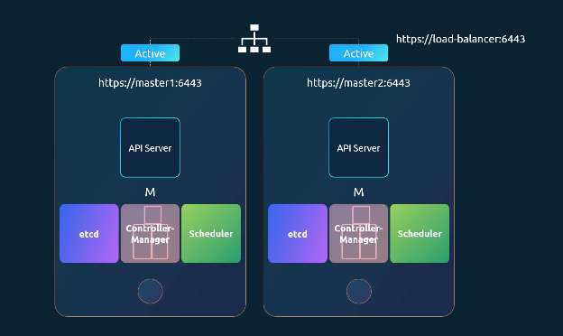
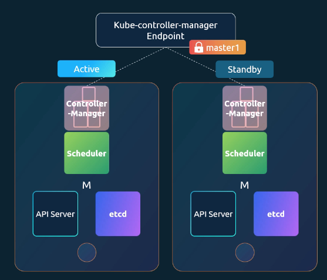
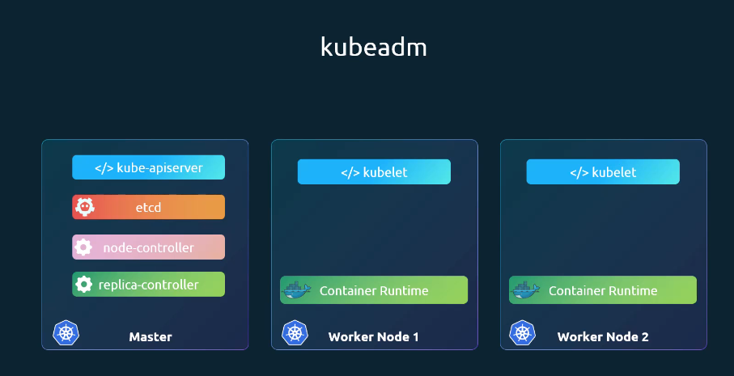
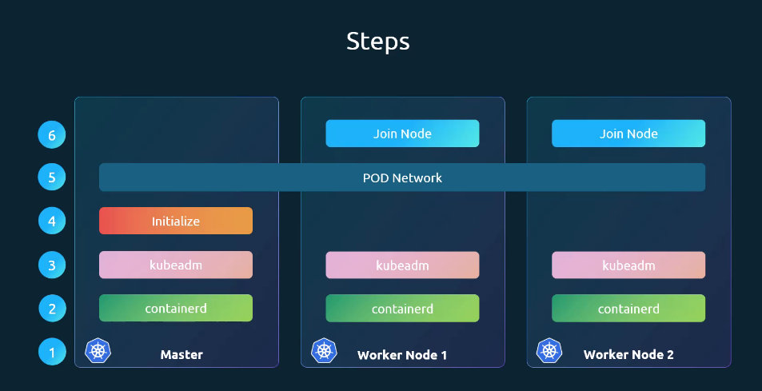
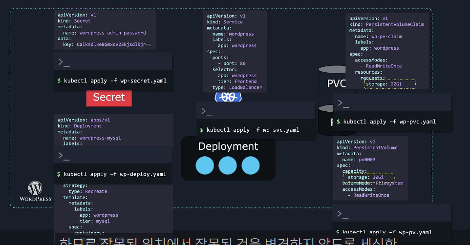
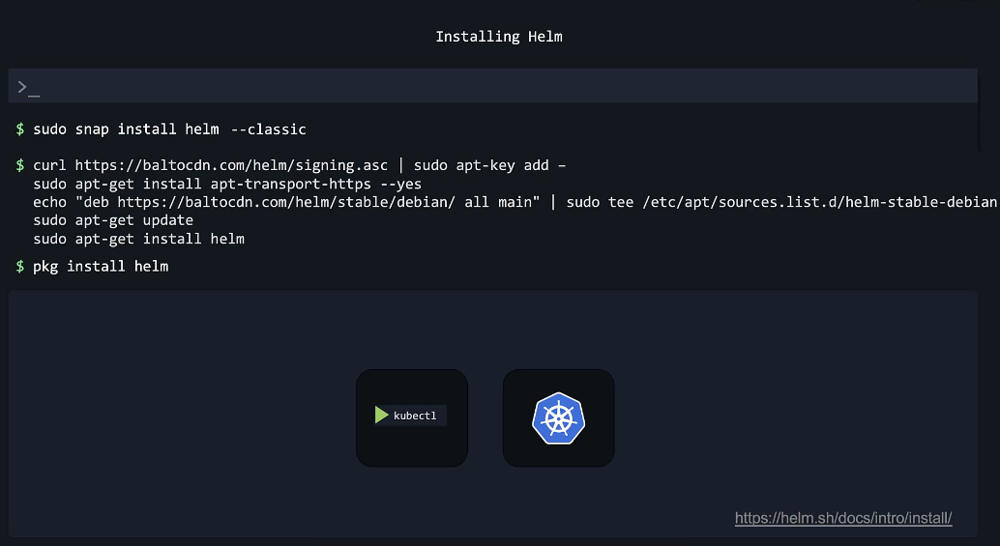
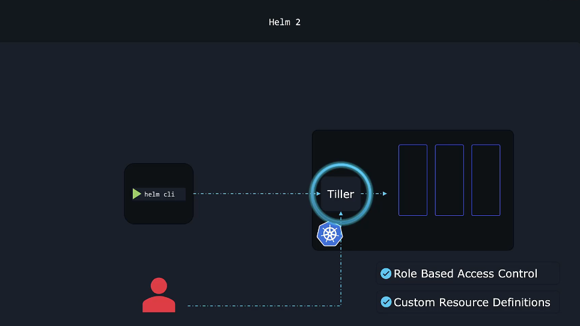
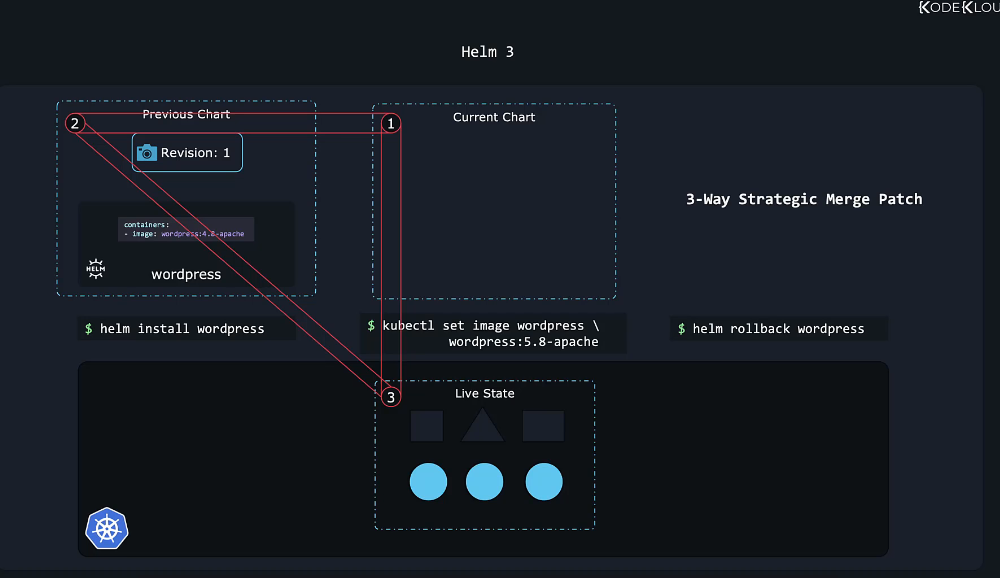

# Section 10: Design a Kubernetes Cluster

## Kubernetes cluster design guide

**[클러스터를 설계 전 정의]**

1. 클러스터의 목적
   - 학습 / 개발 / 테스트용 / 프로덕션급 서비스용
2. 클라우드 전략
   - 관리형(Managed) 서비스 / 자체 구축(Self-managed)
3. 어떤 워크로드를 실행
   - 웹 애플리케이션 / 빅데이터 / 분석 / 고성능 컴퓨팅
4. 몇 개의 애플리케이션을 운영
5. 예상 트래픽 패턴
   - 일정 트래픽 / 스파이크(급증) 트래픽

→ **목적에 따라 클러스터 구조와 규모가 달라진다**

### 목적별 클러스터 설계 전략

1. 학습 / 개발 / 테스트용

- 단일 노드 클러스터도 충분: Minikube, kubeadm 기반 단일 노드
- GCP / AWS 단일 VM
- 간단하고 빠르게 구축 가능

2. 개발 / 스테이징 환경
- 1 Master + 여러 Worker 노드
- kubeadm 활용

3. 프로덕션 환경

- 고가용성(HA) 구성 필수
- 다중 Master 노드 구성 권장
- etcd 클러스터 분리 고려
- 자동 업그레이드 및 운영 관리 고려
  - GCP, AWS, kubeadm, Azure AKS 등 선택

### 노드 설계 고려사항

1. 노드 구성

- 64비트 Linux OS 필수
- 물리 머신 또는 VM 가능
- 클라우드 환경 가능

2. 기본 구성 예시

- 1 Master + 2 Worker
- Master: kube-apiserver, etcd, controller-manager, scheduler
- Worker: 실제 워크로드 실행

3. 프로덕션 권장 사항

- Master 노드는 워크로드 실행 금지
- kubeadm은 기본적으로 Master에 taint 추가
- 대규모 환경에서는 etcd 클러스터 분리 가능

### 스토리지 설계 고려사항

워크로드 유형에 따라 다르게 설계해야 한다.

- 고성능 워크로드 : SSD 기반 스토리지
- 다중 Pod 공유 스토리지 : 네트워크 기반 스토리지
- Persistent Volume 사용 고려
  - StorageClass를 여러 개 정의하여 애플리케이션별로 적절한 스토리지 할당

### 클라우드 vs 온프레미스

| 구분                 | 장점                                                                                                                       |
| -------------------- | -------------------------------------------------------------------------------------------------------------------------- |
| GKE (GCP)            | 완전 관리형(Control Plane 관리 불필요), 자동 업그레이드 및 패치, 오토스케일링 기본 제공, Google Cloud 서비스와 강력한 통합 |
| kubeadm (On-Premise) | 인프라 및 네트워크 완전 제어 가능, 벤더 종속성 없음, 커스터마이징 자유도 높음, 비용 예측 가능                              |
| Kops (AWS)           | AWS 인프라에 최적화, EC2/ASG/ELB 자동 구성, 비교적 간편한 프로비저닝, 프로덕션 환경에 적합                                 |
| AKS (Azure)          | Control Plane 무료 관리, Azure AD 및 네트워크와 통합 용이, 자동 스케일링 지원, 운영 부담 감소                              |

### 설계 핵심 요약

Kubernetes 클러스터 설계는 다음 4가지를 중심으로 결정

1. 목적 (학습 vs 프로덕션)
2. 가용성 요구사항 (HA 여부)
3. 워크로드 특성 (CPU/Memory/Storage)
4. 운영 전략 (관리형 vs 직접 운영)

→ 설계는 “기술 선택”이 아니라 “요구사항 분석”에서 시작된다.

## Kubernetes 배포 옵션 상세 정리

**Kubernetes를 어디에, 어떻게 배포할 수 있는지**를 구체적으로 정리

### 로컬 환경 배포 (Laptop / Local Machine)

1. 수동 설치
- Linux 머신에 Kubernetes 바이너리 직접 설치
- 장점: 구조 이해에 도움
- 단점: 초보자에게 복잡하고 번거로움

2. Windows 환경
- Windows에는 Kubernetes 네이티브 바이너리 없음
- 반드시 가상화 도구 필요
  - Hyper-V, VMware, VirtualBox
- 내부적으로는 Linux VM에서 Kubernetes 실행

**로컬에서 쉽게 시작하는 방법**

- **Minikube**
  - 단일 노드 클러스터, VirtualBox 기반, 학습·테스트용으로 적합

- **kubeadm**
  - 단일 또는 멀티노드 클러스터 가능
  - 단점 : VM은 직접 프로비저닝해야 함
  - 장점 : 실제 프로덕션 환경과 유사한 구조

Minikube vs kubeadm 비교

| 구분          | Minikube | kubeadm        |
| ------------- | -------- | -------------- |
| 노드 수       | 단일     | 단일 / 멀티    |
| VM 프로비저닝 | 자동     | 직접           |
| 목적          | 학습     | 실제 구조 실습 |

---

### 프로덕션 환경 배포

1. 턴키(Turnkey) 솔루션
- VM은 직접 프로비저닝, 자동화 도구 활용
- 인프라 제어권은 사용자에게 있음, 업그레이드/패치 직접 관리
- 예시
  - AWS Kops : AWS에서 클러스터 배포
  - Red Hat OpenShift : Kubernetes 기반 컨테이너 플랫폼, GUI & CI/CD 통합 지원
  - Cloud Foundry Container Runtime (BOSH) : 고가용성 Kubernetes 클러스터 배포 지원
  - VMware Cloud PKS : VMware 환경과 연동
  - Vagrant : 다양한 클라우드에서 Kubernetes 배포 스크립트 제공

2. 관리형(Hosted / Managed) 솔루션
- 클러스터 + VM 모두 제공자가 관리
- 사용자는 Kubernetes 리소스만 관리
- 원클릭 클러스터 생성, 자동 업그레이드 지원, 인프라 관리 부담 감소

대표 서비스

| 플랫폼 / 도구    | 클라우드 | 특징                                                                 |
| ---------------- | -------- | -------------------------------------------------------------------- |
| GKE              | GCP      | 관리형 Kubernetes 서비스, 자동 업그레이드 및 운영 자동화 강점        |
| EKS              | AWS      | AWS 기반 관리형 Kubernetes 서비스                                    |
| AKS              | Azure    | Azure 기반 관리형 Kubernetes 서비스                                  |
| OpenShift Online | RedHat   | RedHat 기반 Kubernetes 플랫폼, GUI + CI/CD 통합, 엔터프라이즈 친화적 |
| kops             | AWS      | AWS에서 Kubernetes 클러스터 배포용 도구, HA 클러스터 구성 가능       |

### 전체 정리 (우리의 사용)

| 목적                    | 추천 방식  |
| ----------------------- | ---------- |
| 학습                    | Minikube   |
| 실습                    | kubeadm    |
| AWS 프로덕션            | kops / EKS |
| GCP 프로덕션            | GKE        |
| Azure                   | AKS        |
| 온프레미스 엔터프라이즈 | OpenShift  |


### 핵심 요약

- 로컬 학습 → Minikube
- 실전 구조 연습 → kubeadm
- 운영 간소화 → Managed Kubernetes
- 인프라 제어 필요 → Turnkey 방식

> Kubernetes 배포는 "기술 선택"이 아니라  
> **운영 전략 + 책임 범위 + 인프라 통제 수준의 선택 문제**

## Kubernetes 고가용성(HA) 

**마스터 노드 장애 시 문제점**

- 워커 노드가 살아있으면 기존 애플리케이션은 계속 실행
- 하지만 다음 문제가 발생:
  - Pod 충돌 시 → 재생성 불가 (Controller Manager 없음)
  - 새 Pod 스케줄링 불가 (Scheduler 없음)
  - kubectl / 외부 접근 불가 (API Server 없음)

→ 프로덕션 환경에서는 다중 마스터(고가용성) 구성 필수

### HA의 핵심 개념

**고가용성(HA)** : 모든 주요 구성요소에 대해 이중화를 구성하여 단일 장애 지점을 제거하는 것

### Control Plane 컴포넌트별 동작 방식

**1. API Server → Active-Active 구조**



- **로드 밸런서 앞단 배치**
- 여러 마스터에서 동시에 실행 가능
- 모든 API 서버가 요청 처리 가능
- 단, kubectl이 두 서버에 동시에 요청 보내면 안 됨
- kubectl → Load Balancer → 여러 API Server


**2. Scheduler & Controller Manager → Active-Passive 구조**

상태 감시 후 조치 수행하는 컨트롤러이므로 여러 인스턴스가 동시에 실행되면
  - Pod 중복 생성
  - 작업 중복 수행
  - 클러스터 이상 동작 발생

→ **리더 선출(Leader Election)** 필요

**[동작 흐름]**
1. 두 프로세스 모두 리더 되려고 시도
2. 먼저 Lock 획득한 프로세스 → Active
3. 나머지 → Standby
4. 리더 장애 시 → 대기 프로세스가 Lock 획득 후 리더 전환

→ Scheduler도 동일한 방식 사용



**멀티 컨트롤 플레인 환경에서 하나의 컨트롤러만 active 상태로 동작하도록 하는 설정**
```bash
# 멀티 마스터 환경에서 리더 선출 활성화
kube-controller-manager --leader-elect true [other options]
  # 리더 권한을 유지하는 최대 시간
  --leader-elect-lease-duration 15s
  # 리더가 갱신을 시도해야 하는 마감 시간
  --leader-elect-renew-deadline 10s
  # 리더 갱신 재시도 간격
  --leader-elect-retry-period 2s
```

### etcd 고가용성 토폴로지

Kubernetes에서 etcd 구성 방식은 2가지

1. 스택형(Stacked) 토폴로지
- etcd를 마스터 노드와 함께 실행
- 장점 : 설정 간단, 노드 수 적음, 관리 쉬움
- 단점 : 마스터 노드 장애 시 Control Plane + etcd 멤버 동시 손실

2. 외부 etcd 토폴로지
- etcd를 별도 서버로 분리
- 장점 : Control Plane 장애와 etcd 분리, 데이터 안정성 ↑
- 단점 : 설정 복잡, 노드 수 증가 (서버 2배 필요)

### API Server와 etcd 관계

- API Server만 etcd와 통신
- API Server 설정에서 etcd 서버 목록 지정
- etcd는 분산 시스템이므로 API Server는 여러 etcd 인스턴스 중 아무 곳이나 연결 가능

### 최종 HA 설계 구조

HA 적용 후:
```
2 Master + 2 Worker + 1 Load Balancer = 총 5 노드
```

구성:
- API Server → Active-Active
- Scheduler → Active-Passive (Leader Election)
- Controller Manager → Active-Passive
- etcd → 클러스터 구성
- API 앞단 → Load Balancer

### 정리

- 마스터 단일 구성은 프로덕션 환경에서 위험
- API 서버는 다중 활성 구조
- 컨트롤러 및 스케줄러는 리더 선출 기반
- etcd는 클러스터 구성 필수
- HA 환경에서는 최소 2개 이상의 마스터 + 로드 밸런서 필요
- 안정성 향상을 위해 전체 Control Plane을 이중화해야 함

## etcd in HA

### etcd
- **간단하고 안전하며 빠른 분산형 Key-Value 저장소**
- Kubernetes의 핵심 데이터(클러스터 상태 등)를 저장
- JSON/YAML 형식 등으로 복잡한 데이터 저장 가능

**[분산 클러스터]**
- 단일 서버: 장애 발생 시 전체 데이터 손실 위험
- HA 환경: 여러 서버에 동일 데이터 복제
- 예: 3개 노드 → 1개 장애 발생해도 2개 노드로 유지 가능

**[읽기(Read)와 쓰기(Write) 방식]**
- 읽기: 모든 노드에서 가능
- 쓰기: Leader 노드만 쓰기 처리
  - Follower는 Leader에게 요청 전달 → Leader가 처리 후 다른 노드에 복제 → 과반수(Quorum) 동의 시 쓰기 완료

**[Raft 프로토콜 (분산 합의 알고리즘)]**
- 리더 선출 방식 : Raft
  1. 각 노드가 랜덤 타이머 시작
  2. 가장 먼저 타이머 종료한 노드가 리더 후보 요청
  3. 리더는 주기적으로 하트비트 전송
  + 리더 장애 시 재선거 진행


### Quorum(정족수)
- 클러스터가 정상 동작하기 위한 최소 노드 수
- 공식:  
  ```
  Quorum = (전체 노드 수 / 2) + 1
  ```
- 예시:
  - 3노드 → 2
  - 5노드 → 3
  - 7노드 → 4

**왜 홀수 노드를 사용해야 할까?**

- 1노드: 장애 시 전체 중단
- 2노드: 1개 장애 시 quorum 미충족 → 의미 없음
- 짝수 노드:
  - 네트워크 분할 시 quorum 미충족 가능성 높음
- 홀수 노드:
  - 네트워크 분할 상황에서도 한 쪽이 quorum 확보 가능성 ↑

예: 6노드 클러스터
- 4:2 분할 → 4개 그룹은 quorum 만족
- 3:3 분할 → quorum(4) 미충족 → 클러스터 중단

예: 7노드 클러스터
- 4:3 분할 → 4개 그룹이 quorum(4) 만족 → 정상 유지

➡ 짝수보다 홀수 노드가 안정적


**[권장 구성]**
- 최소 3노드 (HA 최소 구성)
- 높은 내결함성 원하면 5노드
- 일반적으로 7 이상은 불필요


예: 6노드 클러스터
- 4:2 분할 → 4개 그룹은 quorum 만족
- 3:3 분할 → quorum(4) 미충족 → 클러스터 중단

예: 7노드 클러스터
- 4:3 분할 → 4개 그룹이 quorum(4) 만족 → 정상 유지

→ 짝수보다 홀수 노드가 안정적

### etcd 설치 및 구성
- 각 서버에 etcd 설치
- TLS 인증서 구성
- `initial-cluster` 옵션으로 피어 정보 설정
- etcdctl 명령어로 데이터 저장/조회 가능

```bash
etcdctl put name John
etcdctl get name
```

# Section 11: Install Kubeadm

## kubeadm을 이용한 Kubernetes 클러스터 부트스트랩

### kubeadm이란

- Kubernetes 클러스터를 모범 사례(Best Practice)에 따라 자동으로 구성해주는 도구
- Control Plane 구성 요소(API Server, etcd, Controller, Scheduler 등) 설치 및 설정 - 자동화
  - 인증서 생성, 구성 파일 설정, 컴포넌트 연결 작업을 자동 처리
  - 수동 설치의 복잡성을 크게 줄여줌



### kubeadm으로 클러스터 구성하는 전체 흐름



#### 1단계: 인프라 준비

- 여러 대의 서버 또는 VM 준비
- 노드 역할 지정:
  - 1개 이상 → Master Node
  - 나머지 → Worker Node

#### 2단계: 컨테이너 런타임 설치

- 모든 노드에 컨테이너 런타임(containerd) 설치
- Kubernetes는 컨테이너 런타임 위에서 동작

#### 3단계: kubeadm 및 관련 도구 설치

- 모든 노드에 설치 : kubeadm

#### 4단계: Master 노드 초기화

```
kubeadm init
```
이 과정에서:
- API Server 설치, etcd/Controller Manager/Scheduler 구성, 인증서 자동 생성, kubeconfig 파일 생성

#### 5단계: Pod 네트워크 구성

- Kubernetes는 **Pod Network** 필요
- CNI 플러그인 설치 필요
  - 예: Calico, Flannel 등
- 네트워크 설정 완료 후 Worker 조인 가능

#### 6단계: Worker 노드 조인

Master에서 출력된 토큰 사용:

```
kubeadm join <master-ip>:<port> --token ...
```
- Worker가 Master에 등록
- 스케줄링 가능 상태 됨

## kubeadm의 장점

| 항목   | 설명                             |
| ------ | -------------------------------- |
| 자동화 | 인증서 생성 및 구성 자동 처리    |
| 표준화 | Kubernetes 권장 구조로 구성      |
| 간편성 | 수동 설정 대비 작업량 대폭 감소  |
| 확장성 | 멀티노드 클러스터 쉽게 구성 가능 |

**[결론]**

- kubeadm은 Kubernetes 클러스터를 빠르고 안전하게 부트스트랩하는 공식 도구
- 컨트롤 플레인 구성과 인증서 설정을 자동 처리
- Pod 네트워크 구성 후 Worker 노드 조인
- 최소 구성만 완료하면 즉시 애플리케이션 배포 가능

→ kubeadm은 실습 환경뿐 아니라 프로덕션 초기 구성에도 널리 사용되는 핵심 도구이다.

# Section 12: Helm Basics

## What is Helm?



```bash
helm install wordpress

helm upgrade wordpress

helm rollback wordpress

helm uninstall wordpress

```
## Install Helm



## Helm2 vs Helm3

### Helm 2 vs Helm 3 비교

| 항목                             | Helm 2        | Helm 3        |
| -------------------------------- | ------------- | ------------- |
| Tiller 사용 여부                 | 사용함        | 사용하지 않음 |
| 3-Way Strategic Merge Patch 지원 | 지원하지 않음 | 지원함        |





##